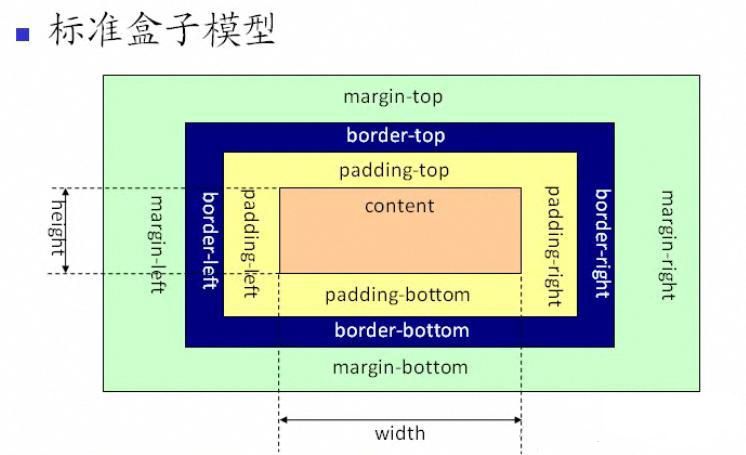
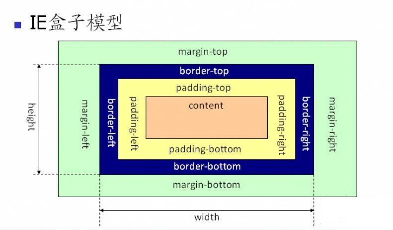
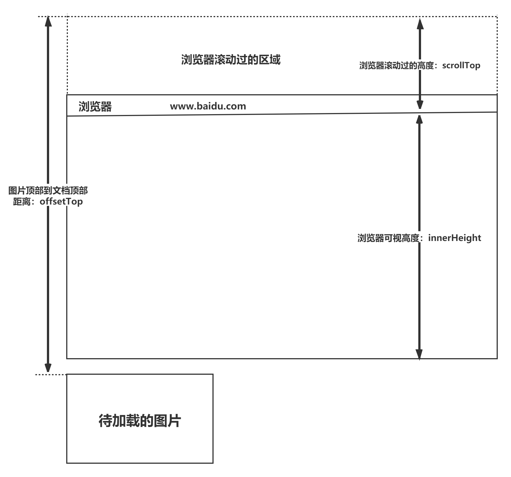
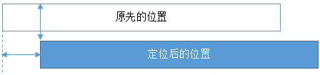
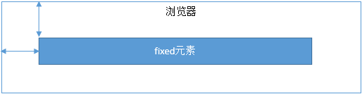
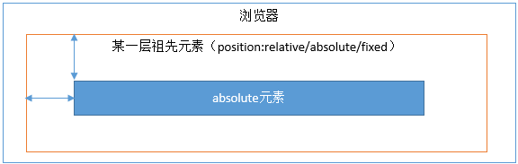
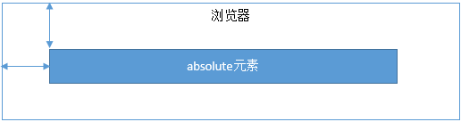

# CSS

## 一、CSS基础

### 1. CSS选择器及其优先级 

> 优先级权重的数字仅做大小比较以简化记忆，不能进位，叠加

| **选择器** | **格式** | **优先级权重** |
| :---: | :---: | :---: |
| id选择器 | #id | 100 |
| 类选择器 | .classname | 10 |
| 属性选择器 | a\[ref=“eee”] | 10 |
| 伪类选择器 | li:last-child | 10 |
| 标签选择器 | div | 1 |
| 伪元素选择器 | li::after | 1 |
| 相邻同胞选择器 | h1+p  (选中与h1有同个亲元素且紧跟h1之后的p) | 0 |
| 子选择器 | ul>li | 0 |
| 后代选择器 | li a | 0 |
| 通配符选择器 | * | 0 |

对于选择器的**优先级**：

* 标签选择器、伪元素选择器：1；
* 类选择器、伪类选择器、属性选择器：10；
* id 选择器：100；
* 内联样式：1000；

**内联样式>id选择器>类，属性，伪类选择器>标签，伪元素选择器**

**注意事项：**

* !important声明的样式的优先级最高；
* 如果优先级相同，则最后出现的样式生效；
* 继承得到的样式的优先级最低；
* 通用选择器（*）、子选择器（>）和相邻同胞选择器（+）并不在这四个等级中，所以它们的**权值都为 0** ；
* 样式表的来源不同时，优先级顺序为：内联样式 > 内部样式 、 外部样式 （两者平级，后解析覆盖先解析）> 浏览器用户自定义样式 > 浏览器默认样式。

### 2. display的属性值及其作用

| **属性值** | **作用** |
| :---: | :---: |
| none | 元素不显示，并且会从文档流中移除。 |
| block | 块类型。默认宽度为父元素宽度，可设置宽高，换行显示。 |
| inline | 行内元素类型。默认宽度为内容宽度，不可设置宽高，同行显示。 |
| inline-block | 默认宽度为内容宽度，可以设置宽高，同行显示。 |
| list-item | 像块类型元素一样显示，并添加样式列表标记。 |
| table | 此元素会作为块级表格来显示。 |
| inherit | 规定应该从父元素继承display属性的值。 |

### 3. display的block、inline和inline-block的区别

　（1）**block：**会独占一行，多个元素会另起一行，可以设置width、height、margin和padding属性；

　（2）**inline：**元素不会独占一行，设置width、height属性无效。但可以设置水平方向的margin和padding属性，不能设置垂直方向的padding和margin(其实是可以设置垂直上的padding，但是不会影响布局)；

　（3）**inline-block：**将对象设置为inline对象，但对象的内容作为block对象呈现，之后的内联对象会被排列在同一行内。

对于行内元素和块级元素，其特点如下：

**（1）行内元素**

* 设置宽高无效；
* 可以设置水平方向的margin和padding属性，不能设置垂直方向的padding和margin；
* 不会自动换行；

**（2）块级元素**

* 可以设置宽高；
* 设置margin和padding都有效；
* 可以自动换行；
* 多个块状，默认排列从上到下。

### 4. 隐藏元素的方法有哪些

* **display: none**：渲染树不会包含该渲染对象，因此该元素不**会在页面中占据位置**，也**不会响应绑定的监听事件**。
* **visibility: hidden**：元素在页面中仍**占据空间**，但是**不会响应绑定的监听事件**。
* **opacity: 0**：将元素的透明度设置为 0，以此来实现元素的隐藏。元素在页面中仍然**占据空间**，并且**能够响应元素绑定的监听事件**。
* **position: absolute**：通过使用绝对定位将元素**移除可视区域内**，以此来实现元素的隐藏。
* **z-index: 负值**：来使其他元素**遮盖**住该元素，以此来实现隐藏。
* **clip/clip-path** ：使用**元素裁剪**的方法来实现元素的隐藏，这种方法下，元素仍在页面中占据位置，但是**不会响应绑定的监听事件**。
* **transform: scale(0,0)**：将元素缩放为 0，来实现元素的隐藏。这种方法下，元素仍在页面中占据位置，但是**不会响应绑定的监听事件**。

### 5. display:none与visibility:hidden的区别

这两个属性都是让元素隐藏，不可见。**两者区别如下：**

（1）**在渲染树中**

* `display:none`会让元素完全**从渲染树中消失**，渲染时不会占据任何空间；
* `visibility:hidden`**不会让元素从渲染树中消失**，渲染的元素还会占据相应的空间，只是内容不可见。

（2）是否是**继承属性**

* `display:none`是非继承属性，**子孙节点会随着父节点从渲染树消失**，通过修改子孙节点的属性也无法显示；
* `visibility:hidden`是继承属性，子孙节点消失是由于继承了`hidden`，通过设置`visibility:visible`可以让子孙节点显示；

（3）修改常规文档流中元素的 `display` 通常会造成文档的重排，但是修改`visibility`属性只会造成本元素的重绘；

（4）如果使用读屏器，设置为`display:none`的内容不会被读取，设置为`visibility:hidden`的内容会被读取。

### 6. 伪元素和伪类的区别和作用？

* 伪元素：在内容元素的前后插入**额外的元素或样式**，但是这些元素实际上并不在文档中生成。它们**只在外部显示可见**，但不会在文档的源代码中找到它们，因此，称为“伪”元素。例如：

```css
p::before {content:"第一章：";}
p::after {content:"Hot!";}
p::first-line {background:red;}
p::first-letter {font-size:30px;}
```

* 伪类：将**特殊的效果**添加到特定选择器上。它是已有元素上添加类别的，不会产生新的元素。例如：

```css
a:hover {color: #FF00FF}
p:first-child {color: red}
```

**总结：**伪类是通过在元素选择器上加⼊伪类改变元素状态，⽽伪元素通过对元素的操作进行对元素的改变。 

### 7. 对requestAnimationframe的理解

HTML5 提供一个专门用于请求动画的API，那就是 requestAnimationFrame，顾名思义就是**请求动画帧**。

MDN对该方法的描述：

> window.requestAnimationFrame() 告诉浏览器——你希望执行一个动画，并且要求浏览器在下次重绘之前调用指定的回调函数更新动画。该方法需要传入一个回调函数作为参数，该回调函数会在浏览器下一次重绘之前执行。

**语法：** `window.requestAnimationFrame(callback);`  该回调函数会被传入DOMHighResTimeStamp参数，它表示requestAnimationFrame() 开始去执行回调函数的时刻。

**取消动画：**使用cancelAnimationFrame()来取消执行动画，该方法接收一个参数——requestAnimationFrame默认返回的id，只需要传入这个id就可以取消动画了。

**优势：**

* **CPU节能**：使用SetInterval 实现的动画，当页面被隐藏或最小化时，SetInterval 仍然在后台执行动画任务，完全是浪费CPU资源。
  而RequestAnimationFrame，当页面处理未激活的状态下，该页面的屏幕刷新任务也会被系统暂停，因此跟着系统走的RequestAnimationFrame也会停止渲染，当页面被激活时，动画就从上次停留的地方继续执行，有效节省了CPU开销。
* **函数节流**：在高频率事件( resize, scroll 等)中，为了防止在一个刷新间隔内发生多次函数执行，RequestAnimationFrame可保证每个刷新间隔内，函数只被执行一次，既能保证流畅性，也能更好的节省函数执行的开销，一个刷新间隔内函数执行多次时没有意义的，因为多数显示器每16.7ms刷新一次，多次绘制并不会在屏幕上体现出来。
* **减少回流/重排**：requestAnimationFrame 会把每一帧中的所有DOM操作集中起来，在一次重绘或回流中就完成。

### 8. 对盒模型的理解

CSS3中的盒模型有以下两种：标准盒子模型、IE盒子模型





盒模型都是由四个部分组成的，分别是margin、border、padding和content。

标准盒模型和IE盒模型的区别在于设置width和height时，所对应的范围不同：

* 标准盒模型的width和height属性的范围只包含了content，
* IE盒模型的width和height属性的范围包含了border、padding和content。

可以通过修改元素的box-sizing属性来改变元素的盒模型：

* `box-sizing: content-box`表示标准盒模型（默认值）
* `box-sizing: border-box`表示IE盒模型（怪异盒模型）


### 9. CSS3中有哪些新特性

* 新增各种CSS选择器 （: not(.input)：所有 class 不是“input”的节点）

  结构伪类：
  `:nth-child(n)` : 第n个子元素
  `:nth-child(2n)` : 选择偶数排序的子元素
  否定伪类：

  `:not(.input)`:所有class不是 input 的节点

* 圆角 （border-radius:8px）

  ```css
  border-radius:50%;
  /*正圆形*/
  ```

  

* 多列布局 （multi-column layout）

  ```css
  column-count:3;
  column-gap:20px;
  column-rule: 1px solid #ccc;
  /*分为三列,间隔20px,分割线隔开*/
  ```

  纯CSS实现瀑布流布局

  ```css
  /* 父容器 */
  .waterfall {
    column-count: 3; /* 几列 */
    column-gap: 16px; /* 列间距 */
  }
  
  /* 子卡片 */
  .card {
    break-inside: avoid; /* 不被切断 */
  }
  ```

  

* 阴影 （box-shadow）

* 文字特效 （text-shadow）

* 文字渲染 （Text-decoration）:CSS3中不仅可以加下划线underline/删除线line-through，还可以控制线的形状和颜色

  ```css
  text-decoration: underline wavy red;
  /*下划线,波浪线,红色*/
  ```

* 渐变 （gradient）
  分为线性渐变（`linear-gradient`，比如从上到下颜色过渡）和径向渐变（`radial-gradient`，从中心向四周发散）

* transform : 在不影响页面其他元素布局的情况下,对元素进行空间变换:
  `translate(x,y)` 平移

  ```css
  position:absolute;
  top:50%;
  left:50%;
  transform:translate(-50%,-50%);
  /*实现绝对居中*/
  ```

  `scale(x,y)`缩放大小
  `rotate(deg)`旋转角度
  `skew(deg,deg)`倾斜拉伸

* 多背景 : 
   CSS3 允许给同一个元素贴好几层背景图，用逗号隔开即可：
  `background: url(bg1.png), url(bg2.png);`，前面的图层会盖在后面的图层上。

* animation 关键帧动画

### 10. 单行、多行文本溢出隐藏

**文本溢出：** 容器内的**文本内容超过了容器本身设定的宽度/高度（块级，行内块元素）**。 默认情况下，CSS处理方式为 “溢出显示”,

* 单行文本溢出（表格，导航栏欢迎用户xxx...）

```css
overflow: hidden;            // 溢出隐藏
text-overflow: ellipsis;      // 溢出用省略号显示
white-space: nowrap;         // 规定段落中的文本不进行换行
```

* 多行文本溢出（文章摘要，用户评论...）

```css
overflow: hidden;            // 溢出隐藏
text-overflow: ellipsis;     // 溢出用省略号显示
display:-webkit-box;         // 作为弹性伸缩盒子模型显示。
-webkit-box-orient:vertical; // 设置伸缩盒子的子元素排列方式：（每行）从上到下垂直排列
-webkit-line-clamp:3;        // 显示的行数
```

`-webkit-box`是 `flex`弹性盒子的旧版，目前只用于多行文本截断

### 11. 对媒体查询的理解？

媒体查询由 一个可选的媒体类型 和 零个或多个限制媒体功能的表达式组成，例如宽度、高度和颜色。
媒体查询，添加自CSS3，允许内容的呈现针对⼀个特定范围的输出设备而进行裁剪，而不必改变内容本身，适合web网页应对不同型号的设备而做出对应的响应适配。

媒体查询包含一个可选的媒体类型和满足CSS3规范的条件下，包含零个或多个表达式，这些表达式描述了媒体特征，最终会被解析为true或false。如果媒体查询中指定的媒体类型匹配展示⽂档所使⽤的设备类型，并且**所有的表达式的值都是true**，那么该媒体查询的结果为true。那么媒体查询内的样式将会⽣效。

```javascript
<!-- link元素中的CSS媒体查询 --> 
<link rel="stylesheet" media="(max-width: 800px)" href="example.css" /> 
<!-- 样式表中的CSS媒体查询 --> 
<style> 
@media (max-width: 600px) { 
  .facet_sidebar { 
    display: none; 
  } 
}
</style>
```

简单来说，使用 @media 查询，可以针对不同的媒体类型定义不同的样式。@media 可以针对不同的屏幕尺寸设置不同的样式，特别是需要设置设计响应式的页面，@media 是非常有用的。当重置浏览器大小的过程中，页面也会根据浏览器的宽度和高度重新渲染页面。

### 12. 如何判断元素是否到达可视区域

* 内容达到显示区域的：`img.offsetTop < window.innerHeight + window.scrollY;`



**问题**： 这套计算逻辑绑定在浏览器的 `scroll` 事件上。而滚动事件触发得极度频繁，不断地读取 `offsetTop` 等属性会触发浏览器反复计算布局，导致页面卡顿。

现代解决方案：现代浏览器提供了 `IntersectionObserver` 的 API。

#### **图片懒加载**

```js
//html部分
<!-- src 里放一个极小的占位图，甚至不写 src -->
<!-- data-src 里藏着真正的图片地址 -->


//js部分
// 1. 定义回调函数：当目标元素和视口发生“交叉”变化时触发
const callback = (entries, observer) => {
  entries.forEach(entry => {
    // entry.isIntersecting 是一个布尔值，为 true 表示元素进入了视口
    if (entry.isIntersecting) {
      const img = entry.target;
      img.src = img.dataset.src; // 替换真实的图片地址（懒加载逻辑）
      
      // 重点：图片加载后，取消观察，节省内存
      observer.unobserve(img); 
    }
  });
};

// 2. 创建观察者实例
const observer = new IntersectionObserver(callback, {
  root: null, // 默认是视口 (viewport)
  rootMargin: '100px', // 可以在视口外围增加一个“缓冲带”，比如提前 100px 加载
  threshold: 0.1 // 交叉比例，0.1 表示元素有 10% 进入视口就触发回调
});

// 3. 选中所有需要懒加载的图片，开始观察
const imgs = document.querySelectorAll('.lazy-load-img');
imgs.forEach(img => observer.observe(img));
```


### 13. CSS的回流（重排）,重绘

**回流（重排）**: 当**元素的尺寸,位置或结构**发生改变,浏览器需要重新计算页面元素的几何属性,并重新排列它们的位置
代价极高,会导致整个页面/部分页面的重新布局

**重绘**: 当元素的**外观样式**发生改变,但没有改变几何尺寸和位置时,浏览器只需将新的样式画上去即可，代价低

重排必定引起重绘,但重绘不一定引发重排

## 二、页面布局

### 1. 常见的CSS布局单位

常用的布局单位包括像素（`px`），百分比（`%`），`em`，`rem`，`vw/vh`。

**（1）像素**（`px`）是页面布局的基础，一个像素表示终端（电脑、手机、平板等）屏幕所能显示的最小的区域，像素分为两种类型：CSS像素和物理像素：

* **CSS像素**：为web开发者提供，在CSS中使用的一个抽象单位；
* **物理像素**：只与设备的硬件密度有关，任何设备的物理像素都是固定的。

**（2）百分比**（`%`），当浏览器的宽度或者高度发生变化时，通过百分比单位可以使得浏览器中的组件的宽和高随着浏览器的变化而变化，从而实现响应式的效果。**元素的百分比是以它的“包含块（Containing Block）”或“自身特定属性”为基准来计算的**。

> *`width/height` 通常相对于包含块的宽高；`margin/padding` 统一相对于包含块的宽度；`transform` 的 translate 相对于自身宽高；而字体排版属性则相对于字体大小。*

**（3）em和rem**相对于px更具灵活性，它们都是相对长度单位，且是参照父/根元素的 `font-size`，它们之间的区别：**em相对于父元素，rem相对于根元素。**

* **em：** 相对长度单位。用在`font-size`上时，相对于**父元素**的 `font-size`；如果父元素没设置，则相对于浏览器默认字体大小（通常 16px）。
  用在其他属性上（如 `padding`、`margin`、`width`）时，相对于**当前元素自身**的 `font-size`。
* **rem：** rem是CSS3新增的一个相对单位，相对于根元素（html元素）的font-size的倍数。**作用**：利用rem可以实现简单的响应式布局，可以利用html元素中字体的大小与屏幕间的比值来设置font-size的值，以此实现当屏幕分辨率变化时让元素也随之变化。

**（4）vw/vh**是与视图窗口有关的单位，vw表示相对于视图窗口的宽度，vh表示相对于视图窗口高度，除了vw和vh外，还有vmin和vmax两个相关的单位。

* vw：相对于视窗的宽度，视窗宽度是100vw；
* vh：相对于视窗的高度，视窗高度是100vh；
* vmin：vw和vh中的较小值；
* vmax：vw和vh中的较大值；

**vw/vh** 和百分比很类似，两者的区别：

* 百分比（`%`）：大部分相对于祖先元素，也有相对于自身的情况比如（border-radius、translate等)
* vw/vm：相对于视窗的尺寸

### 2. px、em、rem的区别及使用场景

**三者的区别：**

* px是固定的像素，一旦设置了就无法因为适应页面大小而改变。
* em和rem相对于px更具有灵活性，他们是相对长度单位，其长度不是固定的，更适用于响应式布局。
* em用在font-size上时，是相对于其父元素来设置字体大小，这样就会存在一个问题，进行任何元素设置，都有可能需要知道他父元素的大小。而rem是相对于根元素，这样就意味着，只需要在根元素确定一个参考值。

### 3. 两栏布局的实现

一般两栏布局指的是**左边一栏宽度固定，右边一栏宽度自适应**，两栏布局的具体实现：

* 利用浮动，将左边元素宽度设置为200px，并且设置向左浮动。将右边元素的margin-left设置为200px，宽度设置为auto（默认为auto，撑满整个父元素）。

```css
.outer {
  height: 100px;
}
.left {
  float: left;
  width: 200px;
  background: tomato;
}
.right {
  margin-left: 200px;
  width: auto;
  background: gold;
}
```

* 利用浮动，左侧元素设置固定大小，并左浮动，右侧元素设置overflow: hidden; 这样右边就触发了BFC，BFC的区域不会与浮动元素发生重叠，所以两侧就不会发生重叠。

```css
.left{
     width: 100px;
     height: 200px;
     background: red;
     float: left;
 }
 .right{
     height: 300px;
     background: blue;
     overflow: hidden;
 }
```

* 利用flex布局，将左边元素设置为固定宽度200px，将右边的元素设置为flex:1。

*  flex: 1 浏览器实际上将其解析为：

  flex-grow: 1;（拉伸）

  flex-shrink: 1;（压缩）

  flex-basis: 0%;（基准）

  ① flex-grow: 1 (决定如何分配剩余空间)
  意义：当父容器还有剩余空间时，该项目是否参与拉伸。

  1 的含义：表示该项目将占据剩余空间的“1 份”。如果所有子元素都设为 flex: 1，它们将平分剩余空间。

  ② flex-shrink: 1 (决定空间不足时如何压缩)
  意义：当父容器空间不足以放下所有子元素时，该项目是否参与缩小。

  1 的含义：允许缩小以适应容器。如果设为 0，则该项目即使溢出也不会变小。

  ③ flex-basis: 0% (决定项目的初始大小)
  意义：在分配多余空间之前，项目占据的主轴大小。

  0% 的含义：不看原本内容有多宽，直接当成 0 看待，然后去参与剩余空间的分配。

```css
.outer {
  display: flex;
  height: 100px;
}
.left {
  width: 200px;
  background: tomato;
}
.right {
  flex: 1;
  background: gold;
}
```

* 利用绝对定位，将父级元素设置为相对定位。左边元素设置为absolute定位，并且宽度设置为200px。将右边元素的margin-left的值设置为200px。

```css
.outer {
  position: relative;
  height: 100px;
}
.left {
  position: absolute;
  width: 200px;
  height: 100px;
  background: tomato;
}
.right {
  margin-left: 200px;
  background: gold;
}
```

* 利用绝对定位，将父级元素设置为相对定位。左边元素宽度设置为200px，右边元素设置为绝对定位，左边定位为200px，其余方向定位为0。

```css
.outer {
  position: relative;
  height: 100px;
}
.left {
  width: 200px;
  background: tomato;
}
.right {
  position: absolute;
  top: 0;
  right: 0;
  bottom: 0;
  left: 200px;
  background: gold;
}
```

### 4. 三栏布局的实现

三栏布局一般指的是页面中一共有三栏，**左右两栏宽度固定，中间自适应的布局**，三栏布局的具体实现：

* 利用**绝对定位**，左右两栏设置为绝对定位，中间设置对应方向大小的margin的值。

```css
.outer {
  position: relative;
  height: 100px;
}

.left {
  position: absolute;
  width: 100px;
  height: 100px;
  background: tomato;
}

.right {
  position: absolute;
  top: 0;
  right: 0;
  width: 200px;
  height: 100px;
  background: gold;
}

.center {
  margin-left: 100px;
  margin-right: 200px;
  height: 100px;
  background: lightgreen;
}
```

* 利用flex布局，左右两栏设置固定大小，中间一栏设置为flex:1。

```css
.outer {
  display: flex;
  height: 100px;
}

.left {
  width: 100px;
  background: tomato;
}

.right {
  width: 100px;
  background: gold;
}

.center {
  flex: 1;
  background: lightgreen;
}
```

* 利用浮动，左右两栏设置固定大小，并设置对应方向的浮动。中间一栏设置左右两个方向的margin值，注意这种方式**，中间一栏必须放到最后：**

```css
.outer {
  height: 100px;
}

.left {
  float: left;
  width: 100px;
  height: 100px;
  background: tomato;
}

.right {
  float: right;
  width: 200px;
  height: 100px;
  background: gold;
}

.center {
  height: 100px;
  margin-left: 100px;
  margin-right: 200px;
  background: lightgreen;
}
```

* 圣杯布局，利用浮动和负边距来实现。父级元素设置左右的 padding，三列均设置向左浮动，中间一列放在最前面，宽度设置为父级元素的宽度，因此后面两列都被挤到了下一行，通过设置 margin 负值将其移动到上一行，再利用相对定位，定位到两边。

```css
.outer {
  height: 100px;
  padding-left: 100px;
  padding-right: 200px;
}

.left {
  position: relative;
  left: -100px;

  float: left;
  margin-left: -100%;

  width: 100px;
  height: 100px;
  background: tomato;
}

.right {
  position: relative;
  left: 200px;

  float: right;
  margin-left: -200px;

  width: 200px;
  height: 100px;
  background: gold;
}

.center {
  float: left;

  width: 100%;
  height: 100px;
  background: lightgreen;
}
```

* 双飞翼布局，双飞翼布局相对于圣杯布局来说，左右位置的保留是通过中间列的 margin 值来实现的，而不是通过父元素的 padding 来实现的。本质上来说，也是通过浮动和外边距负值来实现的。

```css
.outer {
  height: 100px;
}

.left {
  float: left;
  margin-left: -100%;

  width: 100px;
  height: 100px;
  background: tomato;
}

.right {
  float: left;
  margin-left: -200px;

  width: 200px;
  height: 100px;
  background: gold;
}

.wrapper {
  float: left;

  width: 100%;
  height: 100px;
  background: lightgreen;
}

.center {
  margin-left: 100px;
  margin-right: 200px;
  height: 100px;
}
```

### 5. 水平垂直居中的实现

* 利用绝对定位，先将元素的左上角通过top:50%和left:50%定位到页面的中心，然后再通过translate来调整元素的中心点到页面的中心。该方法需要**考虑浏览器兼容问题。**

```css
.parent {
    position: relative;
}
 
.child {
    position: absolute;
    left: 50%;
    top: 50%;
    transform: translate(-50%,-50%);
}
```

* 利用绝对定位，设置四个方向的值都为0，并将margin设置为auto，由于宽高固定，因此对应方向实现平分，可以实现水平和垂直方向上的居中。该方法适用于**盒子有宽高**的情况：

```css
.parent {
    position: relative;
}
 
.child {
    position: absolute;
    top: 0;
    bottom: 0;
    left: 0;
    right: 0;
    margin: auto;
}
```

* 利用绝对定位，先将元素的左上角通过top:50%和left:50%定位到页面的中心，然后再通过margin负值来调整元素的中心点到页面的中心。该方法适用于**盒子宽高已知**的情况

```css
.parent {
    position: relative;
}
 
.child {
    position: absolute;
    top: 50%;
    left: 50%;
    width: 100px;          
    height: 100px;  
    margin-top: -50px;     /* 自身 height 的一半 */
    margin-left: -50px;    /* 自身 width 的一半 */
}
```

* 使用flex布局，通过align-items:center和justify-content:center设置容器的垂直和水平方向上为居中对齐，然后它的子元素也可以实现垂直和水平的居中。该方法要**考虑兼容的问题**，该方法在移动端用的较多：

```css
.parent {
    display: flex;
    justify-content:center;
    align-items:center;
}
```

### 6. 对Flex布局的理解及其使用场景

Flex是FlexibleBox的缩写，意为"弹性布局"，用来为盒状模型提供最大的灵活性。任何一个容器都可以指定为Flex布局。行内元素也可以使用Flex布局。注意，设为Flex布局以后，**子元素的float、clear和vertical-align属性将失效**。采用Flex布局的元素，称为Flex容器（flex container），简称"容器"。它的所有子元素自动成为容器成员，称为Flex项目（flex item），简称"项目"。容器默认存在两根轴：水平的主轴（main axis）和垂直的交叉轴（cross axis），项目默认沿水平主轴排列。

以下6个属性设置在**容器上**：

* flex-direction属性决定主轴的方向（即项目的排列方向）。
* flex-wrap属性定义，如果一条轴线排不下，如何换行。
* flex-flow属性是flex-direction属性和flex-wrap属性的简写形式，默认值为row nowrap。
* justify-content属性定义了项目在主轴上的对齐方式。
* align-items属性定义项目在交叉轴上如何对齐。
* align-content属性定义了多根轴线的对齐方式。如果项目只有一根轴线，该属性不起作用。

以下6个属性设置在**项目上**：

* order属性定义项目的排列顺序。数值越小，排列越靠前，默认为0。
* flex-grow属性定义项目的放大比例，默认为0，即如果存在剩余空间，也不放大。
* flex-shrink属性定义了项目的缩小比例，默认为1，即如果空间不足，该项目将缩小。
* flex-basis属性定义了在分配多余空间之前，项目占据的主轴空间。浏览器根据这个属性，计算主轴是否有多余空间。它的默认值为auto，即项目的本来大小。
* flex属性是flex-grow，flex-shrink和flex-basis的简写，默认值为0 1 auto。
* align-self属性允许单个项目有与其他项目不一样的对齐方式，可覆盖align-items属性。默认值为auto，表示继承父元素的align-items属性，如果没有父元素，则等同于stretch。

**简单来说：**

flex布局是CSS3新增的一种布局方式，可以通过将一个元素的display属性值设置为flex从而使它成为一个flex容器，它的所有子元素都会成为它的项目。一个容器默认有两条轴：一个是水平的主轴，一个是与主轴垂直的交叉轴。可以使用flex-direction来指定主轴的方向。可以使用justify-content来指定元素在主轴上的排列方式，使用align-items来指定元素在交叉轴上的排列方式。还可以使用flex-wrap来规定当一行排列不下时的换行方式。对于容器中的项目，可以使用order属性来指定项目的排列顺序，还可以使用flex-grow来指定当排列空间有剩余的时候，项目的放大比例，还可以使用flex-shrink来指定当排列空间不足时，项目的缩小比例。

### 7. flex:1 表示什么

flex属性是flex-grow，flex-shrink和flex-basis的简写，默认值为0 1 auto。**flex:1 表示 flex: 1 1 0%**

* 第一个参数表示: **flex-grow 定义项目的放大比例，默认为0，即如果存在剩余空间，也不放大**
* 第二个参数表示:**flex-shrink 定义了项目的缩小比例，默认为1，即如果空间不足，该项目将缩小；**
* 第三个参数表示:**flex-basis给上面两个属性分配多余空间之前, 计算项目是否有多余空间, 默认值为 auto, 即项目本身的大小**

## 三、定位与浮动

### 1. 为什么需要清除浮动？清除浮动的方式

**浮动的定义：** 非IE浏览器下，容器不设高度且子元素浮动时，容器高度不能被内容撑开。 此时，内容会溢出到容器外面而影响布局。这种现象被称为浮动（溢出）。

**浮动的工作原理：**

* 浮动元素脱离文档流，不占据空间（引起“高度塌陷”现象）
* 浮动元素碰到包含它的边框或者其他浮动元素的边框停留

浮动元素可以左右移动，直到遇到另一个浮动元素或者遇到它外边缘的包含框。浮动框不属于文档流中的普通流，当元素浮动之后，不会影响块级元素的布局，只会影响内联元素布局。此时文档流中的普通流就会表现得该浮动框不存在一样的布局模式。当包含框的高度小于浮动框的时候，此时就会出现“高度塌陷”。

**浮动元素引起的问题？**

* 父元素的高度无法被撑开，影响与父元素同级的元素
* 与浮动元素同级的非浮动元素会跟随其后
* 若浮动的元素不是第一个元素，则该元素之前的元素也要浮动，否则会影响页面的显示结构

**清除浮动的方式如下：**

* 给父级div定义`height`属性
* 最后一个浮动元素之后添加一个空的div标签，并添加`clear:both`样式
* 包含浮动元素的父级标签添加`overflow:hidden`或者`overflow:auto`
* 使用 :after 伪元素。

```css
.clearfix:after{
    content: "";
    display: table; 
    clear: both;
  }
```

### 2. 对BFC的理解，如何创建BFC

先来看两个相关的概念：

* Box: Box 是 CSS 布局的对象和基本单位，⼀个⻚⾯是由很多个 Box 组成的，这个Box就是我们所说的盒模型。
* Formatting context：块级上下⽂格式化，它是⻚⾯中的⼀块渲染区域，并且有⼀套渲染规则，它决定了其⼦元素将如何定位，以及和其他元素的关系和相互作⽤。

块格式化上下文（Block Formatting Context，BFC）是Web页面的可视化CSS渲染的一部分，是布局过程中生成块级盒子的区域，也是浮动元素与其他元素的交互限定区域。

通俗来讲：BFC是一个独立的布局环境，可以理解为一个容器，在这个容器中按照一定规则进行物品摆放，并且不会影响其它环境中的物品。如果一个元素符合触发BFC的条件，则BFC中的元素布局不受外部影响。

**创建BFC的条件：**

* 根元素：body；
* 元素设置浮动：float 除 none 以外的值；
* 元素设置绝对定位：position (absolute、fixed)；
* display 值为：inline-block、table-cell、table-caption等；
* overflow 值为：hidden、auto、scroll；

**BFC的特点：**

* 垂直方向上，自上而下排列，和文档流的排列方式一致。
* 在BFC中上下相邻的两个容器的margin会重叠
* 计算BFC的高度时，需要计算浮动元素的高度
* BFC区域不会与浮动的容器发生重叠
* BFC是独立的容器，容器内部元素不会影响外部元素
* 每个元素的左margin值和容器的左border相接触

**BFC的作用：**

* **解决margin的重叠问题**：由于BFC是一个独立的区域，内部的元素和外部的元素互不影响，将两个元素变为两个BFC，就解决了margin重叠的问题。
* **解决高度塌陷的问题**：在对子元素设置浮动后，父元素会发生高度塌陷，也就是父元素的高度变为0。解决这个问题，只需要把父元素变成一个BFC。常用的办法是给父元素设置`overflow:hidden`。
* **创建自适应两栏布局**：可以用来创建自适应两栏布局：左边的宽度固定，右边的宽度自适应。

```css
.left{
     width: 100px;
     height: 200px;
     background: red;
     float: left;
 }
 .right{
     height: 300px;
     background: blue;
     overflow: hidden;
 }
 
<div class="left"></div>
<div class="right"></div>
```

左侧设置`float:left`，右侧设置`overflow: hidden`。这样右边就触发了BFC，BFC的区域不会与浮动元素发生重叠，所以两侧就不会发生重叠，实现了自适应两栏布局。

### 3. 什么是margin重叠问题？如何解决？

**问题描述：**

两个块级元素的上外边距和下外边距可能会合并（折叠）为一个外边距，其大小会取其中外边距值大的那个，这种行为就是外边距折叠。需要注意的是，**浮动的元素和绝对定位**这种脱离文档流的元素的外边距不会折叠。重叠只会出现在**垂直方向**。

**计算原则：**

折叠合并后外边距的计算原则如下：

* 如果两者都是正数，那么就去最大者
* 如果是一正一负，就会正值减去负值的绝对值
* 两个都是负值时，用0减去两个中绝对值大的那个

**解决办法：**

对于折叠的情况，主要有两种：**兄弟之间重叠**和**父子之间重叠**

（1）兄弟之间重叠

* 底部元素变为行内盒子：`display: inline-block`
* 底部元素设置浮动：`float`
* 底部元素的position的值为`absolute/fixed`

（2）父子之间重叠

* 父元素加入：`overflow: hidden`
* 父元素添加透明边框：`border:1px solid transparent`
* 子元素变为行内盒子：`display: inline-block`
* 子元素加入浮动属性或定位。

### 4. position的属性有哪些，区别是什么

position有以下属性值：

| 属性值 | 概述 |
| :---: | --- |
| absolute | 生成绝对定位的元素，相对于static定位以外的一个父元素进行定位。元素的位置通过left、top、right、bottom属性进行规定。 |
| relative | 生成相对定位的元素，相对于其原来的位置进行定位。元素的位置通过left、top、right、bottom属性进行规定。 |
| fixed | 生成绝对定位的元素，指定元素相对于屏幕视⼝（viewport）的位置来指定元素位置。元素的位置在屏幕滚动时不会改变，⽐如回到顶部的按钮⼀般都是⽤此定位⽅式。 |
| static | 默认值，没有定位，元素出现在正常的文档流中，会忽略 top, bottom, left, right 或者 z-index 声明，块级元素从上往下纵向排布，⾏级元素从左向右排列。 |
| inherit | 规定从父元素继承position属性的值 |

前面三者的定位方式如下：

* **relative：**元素的定位永远是相对于元素自身位置的，和其他元素没关系，也不会影响其他元素。



* **fixed：**元素的定位一般情况下是相对于 浏览器视口的。会让元素完全脱离正常的文档流。



* **absolute：**会使元素完全脱离文档流。如果为 absolute 设置了 top、left，浏览器会以 **最近的、非static定位的祖先元素** 或者 **设置了transform/filter 等属性的祖先元素** 为基准定位，如果没找到，就以 整个HTML文档的根部 定位。如下两个图所示：





### 5. **display、float、position的关系**

（1）首先判断display属性是否为none，如果为none，则position和float属性的值不影响元素最后的表现。

（2）然后判断position的值是否为absolute或者fixed，如果是，则float属性失效，并且display的值应该被设置为table或者block，具体转换需要看初始转换值。

（3）如果position的值不为absolute或者fixed，则判断float属性的值是否为none，如果不是，则display的值则按上面的规则转换。注意，如果position的值为relative并且float属性的值存在，则relative相对于浮动后的最终位置定位。

（4）如果float的值为none，则判断元素是否为根元素，如果是根元素则display属性按照上面的规则转换，如果不是，则保持指定的display属性值不变。

总的来说，可以把它看作是一个类似优先级的机制，"position:absolute"和"position:fixed"优先级最高，有它存在的时候，浮动不起作用，'display'的值也需要调整；其次，元素的'float'特性的值不是"none"的时候或者它是根元素的时候，调整'display'的值；最后，非根元素，并且非浮动元素，并且非绝对定位的元素，'display'特性值同设置值。
