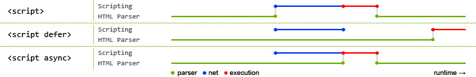

# HTML

## 1. src 和 href 的区别

**src 用于替换当前元素，href 用于在当前文档和引用资源之间确立联系。**

### src

src (source)，指向外部资源的位置，指向的内容将会嵌入到文档中当前标签所在位置；在请求 src 资源时会将其指向的资源下载并应用到文档内，例如 js 脚本、img 图片等元素。

```html
<script src="js.js"></script>
```
  当浏览器解析到该元素时，**会暂停其他资源的下载和处理，直到将该资源加载、编译、执行完毕**，图片和框架等元素也如此，类似于将所指向资源嵌入当前标签内。这也是为什么将 js 脚本放在底部而不是头部。

### href

href 是 Hypertext Reference (超文本引用) 的缩写，用于指定链接的目标地址，指向网络资源所在位置。它建立**当前元素或当前文档**与**目标资源**之间的引用关系：用在 `<a>` 标签上时，指向跳转目标（可以是外部页面、当前文档内的锚点、邮件或电话等协议链接）；用在 `<link>` 标签上时，则把当前文档与外部资源（如 CSS 文件）关联起来。

```html
<link href="common.css" rel="stylesheet">
```

浏览器会识别该文档为 css 文件，会**并行下载资源并且不会停止对当前文档的处理**。这也是为什么建议使用 link 方式来加载 css，而不是使用 @import 方式。

## 2. 对HTML语义化的理解

**语义化是指** **根据内容的结构化（内容语义化），选择合适的标签（代码语义化）**。

语义化的优点：

* 对机器友好，更适合搜索引擎的爬虫爬取有效信息，**有利于SEO**。除此之外，语义类还支持读屏软件，根据文章可以自动生成目录；
* 对开发者友好，使用语义类标签增强了**可读性**，结构更加清晰，开发者能清晰的看出网页的结构，便于团队的**开发与维护**。

常见的语义化标签：

```html
<header></header>  头部

<nav></nav>  导航栏

<section></section>  区块（有语义化的div）

<main></main>  主要区域

<article></article>  主要内容

<aside></aside>  侧边栏

<footer></footer>  底部


```

示例：


```html
<body>

  <header>
    <h1>网站标题</h1>
    <nav>
      <a href="/">首页</a>
      <a href="/about">关于</a>
    </nav>
  </header>

  <main>

    <section>
      <h2>最新文章</h2>

      <article>
        <h3>文章标题</h3>
        <p>作者：<strong>张三</strong>，发布于 <time datetime="2026-09-29">2026年9月29日</time></p>
        <p>正文段落……</p>
      </article>

      <article>
        <h3>另一篇文章</h3>
        <p>正文……</p>
      </article>

    </section>

    <aside>
      <h2>相关推荐</h2>
      <ul>
        <li><a href="/post/1">推荐文章一</a></li>
      </ul>
    </aside>

  </main>

  <footer>
    <p>&copy; 2026 示例网站</p>
  </footer>

</body>
```


## 3. script标签中defer和async的区别

如果没有 `defer` 或 `async` 属性，浏览器遇到 `<script>` 就会**暂停解析 HTML**，先**下载并执行**该脚本，执行完才继续解析后面的内容。因此，普通 `<script>` 会**阻塞后续 HTML 的解析**。

下图可以直观的看出三者之间的区别:



*其中蓝色代表 js 脚本网络加载时间，红色代表 js 脚本执行时间，绿色代表 html 解析。*

**`defer` 和 `async` 都是异步（不在同一时间节奏，互不等待）加载外部 JS 脚本的方式，下载阶段都不会阻塞 HTML 解析。** 区别如下：

**执行顺序**

- **多个 `async` 脚本**：不保证执行顺序，谁先下载完谁先执行。
- **多个 `defer` 脚本**：按在 HTML 中出现的顺序执行。

**下载与执行的行为**

- **`async`**：脚本的**下载**与后续 HTML 的解析**并行进行**；下载完成后**立刻执行**，执行时会**短暂阻塞 HTML 解析**。
- **`defer`**：脚本的**下载**与后续 HTML 的解析**并行进行**；但脚本**不会立刻执行**，而是等 HTML **全部解析完成**后、**`DOMContentLoaded` 事件触发之前**，按顺序执行。

## 4. 常⽤的meta标签有哪些

`meta` 标签**用来描述网页文档的元数据**，常见形式有三种：

- `name` + `content`：描述文档属性，如作者、描述等
- `http-equiv` + `content`：模拟 HTTP 响应头，如刷新、缓存控制
- `charset`：声明文档编码

常用的meta标签：

（1）`charset`，用来描述HTML文档的编码类型：

```html
<meta charset="UTF-8" >
```

（2）`description`，页面描述：

```html
<meta name="description" content="页面描述内容" />
```

用于搜索结果摘要展示

（3）`refresh`，页面重定向和刷新：

```html
<meta http-equiv="refresh" content="0;url=" />
```

`content` 格式为 `秒数;url=目标地址`。计时从**页面完全加载后**开始，而不是从解析到该标签时开始。

（5）`viewport`，适配移动端，可以控制视口的大小和比例：

```html
<meta name="viewport" content="width=device-width, initial-scale=1, maximum-scale=1">
```

其中，`content` 参数有以下几种：

* `width` ：宽度(数值/device-width)
* `height` ：高度(数值/device-height)
* `initial-scale` ：初始缩放比例
* `maximum-scale` ：最大缩放比例
* `minimum-scale` ：最小缩放比例
* `user-scalable` ：是否允许用户缩放(yes/no）

（6）搜索引擎索引方式：

```html
<meta name="robots" content="index,follow" />
```

`content` 常用取值：

* `all`：文件将被检索，且页面上的链接可以被查询；
* `none`：文件将不被检索，且页面上的链接不可以被查询；
* `index`：文件将被检索；
* `follow`：页面上的链接可以被查询；
* `noindex`：文件将不被检索；
* `nofollow`：页面上的链接不可以被查询。
  `index, follow` 是默认行为，无需显式声明；多个指令冲突时，最严格的规则优先。

## 5. HTML5有哪 些更新

#### 1. 语义化标签

[对HTML语义化的理解](#_2-对html语义化的理解)

主要有：header nav main section article aside footer

#### 2. 媒体标签

（1） audio：音频

```html
<audio src='' controls autoplay loop='true'></audio>
```

controls 控制面板  autoplay 自动播放  loop='true' 循环播放

（2）video视频

```html
<video src='' poster='imgs/aa.jpg' controls></video>
```

poster：封面。默认显示当前视频的第一帧画面，也可以指定

（3）source标签

因为浏览器对视频格式支持程度不一样，为了能够**兼容**不同的浏览器，可以通过source来指定视频源。浏览器从上往下找，用第一个能用的

```html
<video>
  <source src='aa.flv' type='video/x-flv'>
  <source src='aa.mp4' type='video/mp4'>
</video>
```

#### 3. 表单

**表单类型：**

* email ：校验邮箱地址格式
* url ： 校验URL格式
* number ： 只能输入数字，自带上下增减箭头，max设最大值，min设最小值，value为默认值，step设步长
* search ： 搜索框，会提供一个小叉，可以删除输入的内容
* range ： 滑动条选择范围，可以设置max，min，value，step
* color ：颜色拾取器
* time ： 选择时分秒
* date ： 日期选择年月日
* datetime-local ：日期时间控件
* week ：选择周
* month：选择月

**表单属性：**

* placeholder ：提示信息
* autofocus ：自动获取焦点
* autocomplete="on" 或者 autocomplete="off" 使用这个属性需要有两个前提：
  * 表单必须提交过
  * 必须有name属性。
* required：要求输入框不能为空，必须有值才能够提交。
* pattern=" " 里面写入想要的正则模式，例如手机号patte="^(+86)?\d{10}$"
* multiple：可以选择多个文件或者多个邮箱
* form="form表单的ID"

**表单事件：**

* oninput 每当input里的输入框内容发生变化都会触发此事件。
* oninvalid 当验证不通过时触发此事件。

#### 4. 进度条、度量器

* progress标签：用来表示任务的进度，max用来表示任务的总工作量，value表示已完成多少
* meter属性：用来显示剩余容量或剩余库存（磁盘容量，考试分数等）
  * high/low：规定被视作高/低的范围（影响显示颜色）
  * max/min：规定最大/小值（整个总范围）
  * value：规定当前度量值

设置规则：min < low < high < max

#### 5. Web存储

HTML5 提供了两种在客户端存储数据的新方法：

* localStorage - 没有时间限制的数据存储
* sessionStorage - 针对一个 session 的数据存储，关闭标签页即删除

#### 6. 其他

* 拖放：拖放是一种常见的特性，即抓取对象以后拖到另一个位置。设置元素可拖放：

```html

```

* 画布（canvas ）： canvas 元素使用 JavaScript 在网页上绘制图像。画布是一个矩形区域，**可以控制其每一像素**。canvas 拥有多种绘制路径、矩形、圆形、字符以及添加图像的方法。

```html
<canvas id="myCanvas" width="200" height="100"></canvas>
```

* SVG：可伸缩矢量图形，用于定义用于网络的基于矢量的图形，使用 XML 格式定义图形，**图像在放大或改变尺寸的情况下其图形质量不会有损失**，它是万维网联盟的标准
* 地理定位：Geolocation（地理定位）用于定位用户的位置。‘

## 6.  行内元素有哪些？块级元素有哪些？ 空(void)元素有那些？

#### 行内元素:

**不会独占一行**，直到这一行的宽度排满，才会自动换行
**不能设置宽度和高度**，它的**宽高完全靠里面的文本或内容撑开**。

行内元素里面只能嵌套其他行内元素或纯文本，**一般不能嵌套块级元素**。（特例：`<a>` 标签里面可以嵌套块级元素实现整块点击，但前提是不要在 `<a>` 里再嵌套另一个 `<a>`）

* **行内元素有**：`a b span strong label em i code 等`；

#### 块级元素

**独占一行**。不管内容有多少，默认情况下它都会把所在容器的整行宽度占满，后面的元素必须另起一行排版。
可以**随意设置宽度（`width`）、高度（`height`）、内边距（`padding`）和外边距（`margin`）。**

* **块级元素有**：`div ul ol li dl（Definition List） dt(Definition Term) dd(Definition Description) h1~h6 p`；

> ```html
> <dl>
>   <dt>HTML</dt>
>   <dd>超文本标记语言，用于描述网页结构。</dd>
> 
>   <dt>CSS</dt>
>   <dd>层叠样式表，用于控制网页外观。</dd>
> </dl>
> ```

还有一类特殊的元素:

#### **行内块级元素 inline-block**

特殊的行内元素。既能同行显示，又能设置宽高和内外边距。

常见：`img`、`input`、`select`、`textarea`、`button`

#### 空元素

即没有内容的HTML元素。空元素是在开始标签中关闭的，也就是自闭合元素：

常见：`br`、`hr`、`img`、`input`、`link`、`meta`、`source`

#### 转换

通过设置 `display ` 为 `inline , block, inline-block` 来改变

## 7.title与h1的区别、b与strong的区别、i与em的区别？

* strong标签有语义，是起到加重语气的效果，而b标签是没有的，只是一个简单加粗标签。搜索引擎更侧重strong标签。
* title属性没有明确意义,只表示是个标题，H1则表示层次明确的标题，对页面信息的抓取有很大的影响
* **i内容展示为斜体，em表示强调的文本**

