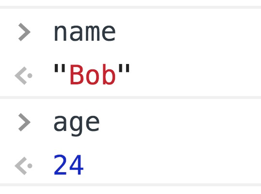

# ES6

## 1. let、const、var的区别

**（1）块级作用域：**块作用域由 `{ }`包括，let和const具有块级作用域，var不存在块级作用域。块级作用域解决了ES5中的两个问题：

* 内层变量可能覆盖外层变量
* 用来计数的循环变量泄露为全局变量

**（2）变量提升：**var存在变量提升，let和const虽然存在变量提升，但会进入暂时性死区，即在变量在声明之前使用会报错。

**（3）给全局添加属性：**浏览器的全局对象是window，Node的全局对象是global。var声明的变量会挂到全局对象上，但是let和const变量不会挂在全局对象上。

**（4）重复声明：**var声明变量时，可以重复声明变量，后声明的同名变量会覆盖之前声明的遍历。const和let不允许重复声明变量。

**（6）初始值设置：**在变量声明时，var 和 let 可以不用设置初始值。而const声明变量必须设置初始值。

**（7）重新赋值：** let创建的变量可以重新赋值。但const声明的变量是不能重新赋值。

|      **区别**      | **var** | **let** | **const** |
| :----------------: | :-----: | :-----: | :-------: |
|  是否有块级作用域  |    ×    |    ✔️    |     ✔️     |
| 是否能在声明前访问 |    ✔️    |    ×    |     ×     |
|  是否添加全局属性  |    ✔️    |    ×    |     ×     |
|  能否重复声明变量  |    ✔️    |    ×    |     ×     |
| 是否必须设置初始值 |    ×    |    ×    |     ✔️     |
|  能否改变指针指向  |    ✔️    |    ✔️    |     ×     |

## 2. const创建的变量是否可以修改

const保证的并不是变量的值不能改动，而是**变量绑定不能改动**。对于基本类型的数据（数值、字符串、布尔值），值就是绑定本身，因此const创建的基本类型数据等同于常量。

但对于引用类型的数据（主要是对象和数组）来说，变量绑定指向一个对象，`const` 只能保证**这个绑定不变**（不能重新指向别的对象），至于它指向的对象内部结构是否可变，`const` 完全不能控制。


## 3. 箭头函数与普通函数的区别

**（1）箭头函数比普通函数更加简洁**

* 如果没有参数，就直接写一个空括号即可
* 如果只有一个参数，可以省去参数的括号
* 如果有多个参数，用逗号分割
* 如果函数体的返回值只有一句，可以省略大括号
* 如果函数体不需要返回值，且只有一句话，可以给这个语句前面加一个void关键字。最常见的就是调用一个函数：

```javascript
let fn = () => void doesNotReturn();
```

**（2）箭头函数没有自己的this**

箭头函数不会创建自己的this， 所以它没有自己的this，它只会在自己作用域的上一层继承this。所以箭头函数中this的指向在它在定义时已经确定了，之后不会改变。

**（3）箭头函数继承来的this指向永远不会改变**

```javascript
var id = 'GLOBAL';
var obj = {
  id: 'OBJ',
  a: function(){
    console.log(this.id);
  },
  b: () => {
    console.log(this.id);
  }
};
obj.a();    // 'OBJ'
obj.b();    // 'GLOBAL'
new obj.a()  // undefined
new obj.b()  // Uncaught TypeError: obj.b is not a constructor
```

对象obj的方法b是使用箭头函数定义的，这个函数中的this就永远指向它定义时所处的全局执行环境中的this，即便这个函数是作为对象obj的方法调用，this依旧指向Window对象。需要注意，定义对象的大括号`{}`是无法形成一个单独的执行环境的，它依旧是处于全局执行环境中。

**（4）call()、apply()、bind()等方法不能改变箭头函数中this的指向**

```javascript
var id = 'Global';
let fun1 = () => {
    console.log(this.id)
};
fun1();                     // 'Global'
fun1.call({id: 'Obj'});     // 'Global'
fun1.apply({id: 'Obj'});    // 'Global'
fun1.bind({id: 'Obj'})();   // 'Global'
```

**（5）箭头函数不能作为构造函数使用**

构造函数在new的步骤在上面已经说过了，实际上第二步就是将函数中的this指向该对象。 但是由于箭头函数时没有自己的this的，且this指向外层的执行环境，且不能改变指向，所以不能当做构造函数使用。

**（6）箭头函数没有自己的arguments**

箭头函数没有自己的arguments对象。在箭头函数中访问arguments实际上获得的是它外层函数的arguments值。

**（7）箭头函数没有prototype**

**（8）箭头函数不能用作Generator函数，不能使用yeild关键字**


## 7. 对对象与数组的解构的理解

解构是 ES6 提供的一种新的提取数据的模式，这种模式能够从对象或数组里有针对性地拿到想要的数值。

**1）数组的解构**

在解构数组时，以元素的位置为匹配条件来提取想要的数据的：

```javascript
const [a, b, c] = [1, 2, 3]
```

最终，a、b、c分别被赋予了数组第0、1、2个索引位的值：


还可以通过给左侧变量数组设置空占位的方式，实现对数组中某几个元素的精准提取：

```javascript
const [a,,c] = [1,2,3]
```

通过把中间位留空，可以顺利地把数组第一位和最后一位的值赋给 a、c 两个变量：


**2）对象的解构**

在解构对象时，是以属性的名称为匹配条件，来提取想要的数据的。现在定义一个对象：

```javascript
const stu = {
  name: 'Bob',
  age: 24
}
```

假如想要解构它的两个自有属性，可以这样：

```javascript
const { name, age } = stu
```

这样就得到了 name 和 age 两个和 stu 平级的变量：



注意，对象解构严格**以属性名作为定位依据**，所以就算调换了 name 和 age 的位置，结果也是一样的：

```javascript
const { age, name } = stu
```

**提取高度嵌套的对象里的指定属性**

```javascript
const { classes: { stu: { name } }} = school
       
console.log(name)  // 'Bob'
```

可以在解构出来的变量名右侧，通过冒号+{目标属性名}这种形式，进一步解构它，一直解构到拿到目标数据为止。


## 10. ES6中模板语法与字符串处理

ES6 提出了“模板语法”的概念。在 ES6 以前，拼接字符串是很麻烦的事情：

```javascript
var name = 'css'   
var career = 'coder' 
var hobby = ['coding', 'writing']
var finalString = 'my name is ' + name + ', I work as a ' + career + ', I love ' + hobby[0] + ' and ' + hobby[1]
```

有了模板字符串，拼接难度直线下降：

```javascript
var name = 'css'   
var career = 'coder' 
var hobby = ['coding', 'writing']
var finalString = `my name is ${name}, I work as a ${career} I love ${hobby[0]} and ${hobby[1]}`
```

模板字符串的第一个优势——允许**用${}的方式嵌入变量**。但这还不是问题的关键，模板字符串的关键优势有两个：

* 在模板字符串中，**空格、缩进、换行都会被保留**
* 模板字符串完全**支持“运算”式的表达式**，可以在${}里完成一些计算

基于第一点，可以在模板字符串里无障碍地直接写 html 代码：

```javascript
let list = `
	<ul>
		<li>列表项1</li>
		<li>列表项2</li>
	</ul>
`;
console.log(message); // 正确输出，不存在报错
```

基于第二点，可以把一些简单的计算和调用丢进 ${} 来做：

```javascript
function add(a, b) {
  const finalString = `${a} + ${b} = ${a+b}`
  console.log(finalString)
}
add(1, 2) // 输出 '1 + 2 = 3'
```

除了模板语法外， ES6中还新增了一系列的字符串方法用于提升开发效率：

* **存在性判定**：在过去，当判断一个字符/字符串是否在某字符串中时，只能用 indexOf > -1 来做。现在 ES6 提供了三个方法：includes、startsWith、endsWith，它们都会返回一个布尔值来告诉你是否存在。
  * **includes**：判断字符串与子串的包含关系：

```javascript
const son = 'haha' 
const father = 'xixi haha hehe'
father.includes(son) // true
```

- **startsWith**：判断字符串是否以某个/某串字符开头：

```javascript
const father = 'xixi haha hehe'
father.startsWith('haha') // false
father.startsWith('xixi') // true
```

- **endsWith**：判断字符串是否以某个/某串字符结尾：

```javascript
const father = 'xixi haha hehe'
  father.endsWith('hehe') // true
```

* **自动重复**：可以使用 repeat 方法来使同一个字符串输出多次（被连续复制多次）：

```javascript
const sourceCode = 'repeat for 3 times;'
const repeated = sourceCode.repeat(3) 
console.log(repeated) // repeat for 3 times;repeat for 3 times;repeat for 3 times;
```
