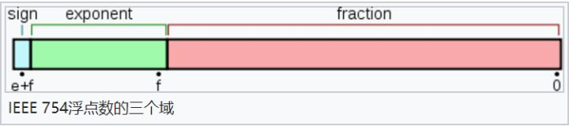
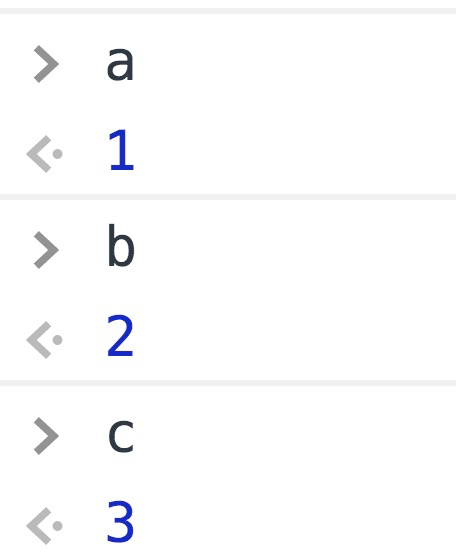
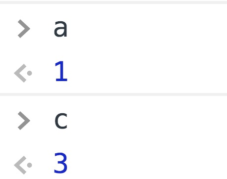
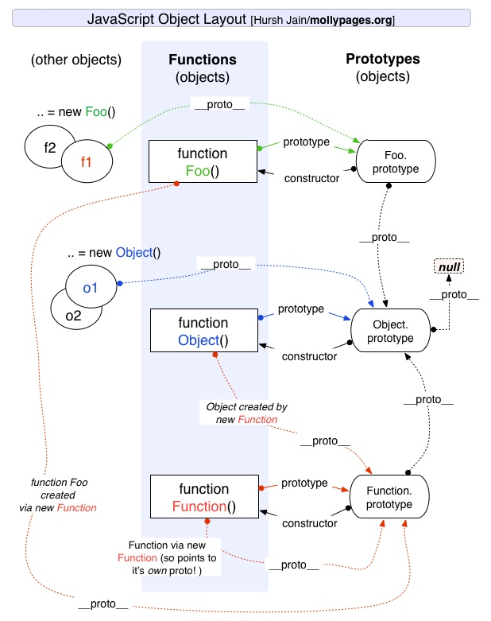
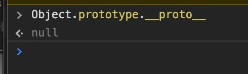
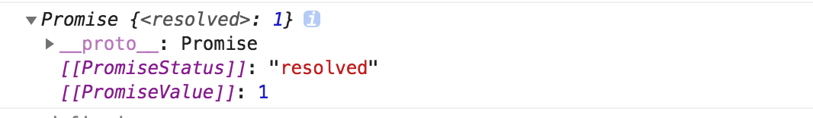
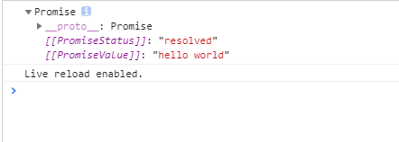

# JavaScript

## 一、数据类型

### 1. JavaScript有哪些数据类型，它们的区别？

JavaScript共有八种数据类型，分别是 Undefined、Null、Boolean、Number、String、Object、Symbol、BigInt。

其中 Symbol 和 BigInt 是ES6 中新增的数据类型：

* Symbol 代表创建后独一无二且不可变的数据类型，它主要是为了解决可能出现的全局变量冲突的问题。
* BigInt 是一种数字类型的数据，它可以表示任意精度格式的整数，使用 BigInt 可以安全地存储和操作大整数，即使这个数已经超出了 Number 能够表示的安全整数范围。

这些数据可以分为原始数据类型和引用数据类型：

* 存储在栈：原始数据类型（Undefined、Null、Boolean、Number、String）
* 存储在堆：引用数据类型（对象、数组和函数）

两种类型的区别在于**存储位置的不同：**

* 原始数据类型直接存储在栈（stack）中的简单数据段，占据空间小、大小固定，属于被频繁使用数据，所以放入栈中存储；
* 引用数据类型存储在堆（heap）中的对象，占据空间大、大小不固定。如果存储在栈中，将会影响程序运行的性能；引用数据类型在栈中存储了指针，该指针指向堆中该实体的起始地址。当解释器寻找引用值时，会首先检索其在栈中的地址，取得地址后从堆中获得实体。

堆和栈的概念存在于数据结构和操作系统内存中，在数据结构中：

* 在数据结构中，栈中数据的存取方式为先进后出。
* 堆是一个优先队列，是按优先级来进行排序的，优先级可以按照大小来规定。

在操作系统中，内存被分为栈区和堆区：

* 栈区内存由编译器自动分配释放，存放函数的参数值，局部变量的值等。其操作方式类似于数据结构中的栈。
* 堆区内存一般由开发者分配释放，若开发者不释放，程序结束时可能由垃圾回收机制回收。

### 2. 数据类型检测的方式有哪些

**（1）typeof**

```javascript
console.log(typeof 2);               // number
console.log(typeof true);            // boolean
console.log(typeof 'str');           // string
console.log(typeof []);              // object    
console.log(typeof function(){});    // function
console.log(typeof {});              // object
console.log(typeof undefined);       // undefined
console.log(typeof null);            // object
```

其中数组、对象、null都会被判断为object，其他判断都正确。

**（2）instanceof**

`instanceof`可以正确判断对象的类型，**其内部运行机制是****判断在其原型链中能否找到该类型的原型**。

```javascript
console.log(2 instanceof Number);                    // false
console.log(true instanceof Boolean);                // false 
console.log('str' instanceof String);                // false 
 
console.log([] instanceof Array);                    // true
console.log(function(){} instanceof Function);       // true
console.log({} instanceof Object);                   // true
```

可以看到，`instanceof`**只能正确判断引用数据类型**，而不能判断基本数据类型。`instanceof` 运算符可以用来测试一个对象在其原型链中是否存在一个构造函数的 `prototype` 属性。

**（3） constructor**

```javascript
console.log((2).constructor === Number); // true
console.log((true).constructor === Boolean); // true
console.log(('str').constructor === String); // true
console.log(([]).constructor === Array); // true
console.log((function() {}).constructor === Function); // true
console.log(({}).constructor === Object); // true
```

`constructor`有两个作用，一是判断数据的类型，二是对象实例通过 `constrcutor` 对象访问它的构造函数。需要注意，如果创建一个对象来改变它的原型，`constructor`就不能用来判断数据类型了：

```javascript
function Fn(){};
 
Fn.prototype = new Array();
 
var f = new Fn();
 
console.log(f.constructor===Fn);    // false
console.log(f.constructor===Array); // true
```

**（4）Object.prototype.toString.call()**

`Object.prototype.toString.call()` 使用 Object 对象的原型方法 toString 来判断数据类型：

```javascript
var a = Object.prototype.toString;
 
console.log(a.call(2));
console.log(a.call(true));
console.log(a.call('str'));
console.log(a.call([]));
console.log(a.call(function(){}));
console.log(a.call({}));
console.log(a.call(undefined));
console.log(a.call(null));
```

同样是检测对象obj调用toString方法，obj.toString()的结果和Object.prototype.toString.call(obj)的结果不一样，这是为什么？

这是因为toString是Object的原型方法，而Array、function等**类型作为Object的实例，都重写了toString方法**。不同的对象类型调用toString方法时，根据原型链的知识，调用的是对应的重写之后的toString方法（function类型返回内容为函数体的字符串，Array类型返回元素组成的字符串…），而不会去调用Object上原型toString方法（返回对象的具体类型），所以采用obj.toString()不能得到其对象类型，只能将obj转换为字符串类型；因此，在想要得到对象的具体类型时，应该调用Object原型上的toString方法。

### 4. null和undefined区别

首先 Undefined 和 Null 都是基本数据类型，这两个基本数据类型分别都只有一个值，就是 undefined 和 null。

undefined 代表的含义是**未定义**，null 代表的含义是**空对象**。一般变量声明了但还没有定义的时候会返回 undefined，null主要用于赋值给一些可能会返回对象的变量，作为初始化。

undefined 在 JavaScript 中不是一个保留字，这意味着可以使用 undefined 来作为一个变量名，但是这样的做法是非常危险的，它会影响对 undefined 值的判断。我们可以通过一些方法获得安全的 undefined 值，比如说 void 0。

当对这两种类型使用 typeof 进行判断时，Null 类型化会返回 “object”，这是一个历史遗留的问题。当使用双等号对两种类型的值进行比较时会返回 true，使用三个等号时会返回 false。

### 5. typeof null 的结果是什么，为什么？

typeof null 的结果是Object。

在 JavaScript 第一个版本中，所有值都存储在 32 位的单元中，每个单元包含一个小的 **类型标签(1-3 bits)** 以及当前要存储值的真实数据。类型标签存储在每个单元的低位中，共有五种数据类型：

```javascript
000: object   - 当前存储的数据指向一个对象。
  1: int      - 当前存储的数据是一个 31 位的有符号整数。
010: double   - 当前存储的数据指向一个双精度的浮点数。
100: string   - 当前存储的数据指向一个字符串。
110: boolean  - 当前存储的数据是布尔值。
```

如果最低位是 1，则类型标签标志位的长度只有一位；如果最低位是 0，则类型标签标志位的长度占三位，为存储其他四种数据类型提供了额外两个 bit 的长度。

有两种特殊数据类型：

* undefined的值是 (-2)<sup>30</sup>(一个超出整数范围的数字)；
* null 的值是机器码 NULL 指针(null 指针的值全是 0)

那也就是说null的类型标签也是000，和Object的类型标签一样，所以会被判定为Object。

### 6. instanceof 操作符的实现原理及实现

instanceof 运算符用于判断构造函数的 prototype 属性是否出现在对象的原型链中的任何位置。

```javascript
function myInstanceof(left, right) {
  // 获取对象的原型
  let proto = Object.getPrototypeOf(left)
  // 获取构造函数的 prototype 对象
  let prototype = right.prototype; 
 
  // 判断构造函数的 prototype 对象是否在对象的原型链上
  while (true) {
    if (!proto) return false;
    if (proto === prototype) return true;
    // 如果没有找到，就继续从其原型上找，Object.getPrototypeOf方法用来获取指定对象的原型
    proto = Object.getPrototypeOf(proto);
  }
}
```

### 7. 为什么0.1+0.2 ! == 0.3，如何让其相等  

在开发过程中遇到类似这样的问题：

```javascript
let n1 = 0.1, n2 = 0.2
console.log(n1 + n2)  // 0.30000000000000004
```

这里得到的不是想要的结果，要想等于0.3，就要把它进行转化：

```javascript
(n1 + n2).toFixed(2) // 注意，toFixed为四舍五入
```

`toFixed(num)` 方法可把 Number 四舍五入为指定小数位数的数字。那为什么会出现这样的结果呢？

计算机是通过二进制的方式存储数据的，所以计算机计算0.1+0.2的时候，实际上是计算的两个数的二进制的和。0.1的二进制是`0.0001100110011001100...`（1100循环），0.2的二进制是：`0.00110011001100...`（1100循环），这两个数的二进制都是无限循环的数。那JavaScript是如何处理无限循环的二进制小数呢？

一般我们认为数字包括整数和小数，但是在 JavaScript 中只有一种数字类型：Number，它的实现遵循IEEE 754标准，使用64位固定长度来表示，也就是标准的double双精度浮点数。在二进制科学表示法中，双精度浮点数的小数部分最多只能保留52位，再加上前面的1，其实就是保留53位有效数字，剩余的需要舍去，遵从“0舍1入”的原则。

根据这个原则，0.1和0.2的二进制数相加，再转化为十进制数就是：`0.30000000000000004`。

下面看一下**双精度数是如何保存**的：



* 第一部分（蓝色）：用来存储符号位（sign），用来区分正负数，0表示正数，占用1位
* 第二部分（绿色）：用来存储指数（exponent），占用11位
* 第三部分（红色）：用来存储小数（fraction），占用52位

对于0.1，它的二进制为：

```javascript
0.00011001100110011001100110011001100110011001100110011001 10011...
```

转为科学计数法（科学计数法的结果就是浮点数）：

```javascript
1.1001100110011001100110011001100110011001100110011001*2^-4
```

可以看出0.1的符号位为0，指数位为-4，小数位为：

```javascript
1001100110011001100110011001100110011001100110011001
```

那么问题又来了，**指数位是负数，该如何保存**呢？

IEEE标准规定了一个偏移量，对于指数部分，每次都加这个偏移量进行保存，这样即使指数是负数，那么加上这个偏移量也就是正数了。由于JavaScript的数字是双精度数，这里就以双精度数为例，它的指数部分为11位，能表示的范围就是0~2047，IEEE固定**双精度数的偏移量为1023**。

* 当指数位不全是0也不全是1时(规格化的数值)，IEEE规定，阶码计算公式为 e-Bias。 此时e最小值是1，则1-1023= -1022，e最大值是2046，则2046-1023=1023，可以看到，这种情况下取值范围是`-1022~1013`。
* 当指数位全部是0的时候(非规格化的数值)，IEEE规定，阶码的计算公式为1-Bias，即1-1023= -1022。
* 当指数位全部是1的时候(特殊值)，IEEE规定这个浮点数可用来表示3个特殊值，分别是正无穷，负无穷，NaN。 具体的，小数位不为0的时候表示NaN；小数位为0时，当符号位s=0时表示正无穷，s=1时候表示负无穷。

对于上面的0.1的指数位为-4，-4+1023 = 1019 转化为二进制就是：`1111111011`.

所以，0.1表示为：

```javascript
0 1111111011 1001100110011001100110011001100110011001100110011001
```

说了这么多，是时候该最开始的问题了，如何实现0.1+0.2=0.3呢？

对于这个问题，一个直接的解决方法就是设置一个误差范围，通常称为“机器精度”。对JavaScript来说，这个值通常为2<sup>-52</sup>，在ES6中，提供了`Number.EPSILON`属性，而它的值就是2<sup>-52</sup>，只要判断`0.1+0.2-0.3`是否小于`Number.EPSILON`，如果小于，就可以判断为0.1+0.2 ===0.3

```javascript
function numberepsilon(arg1,arg2){                   
  return Math.abs(arg1 - arg2) < Number.EPSILON;        
}        

console.log(numberepsilon(0.1 + 0.2, 0.3)); // true
```


### 14. || 和 && 操作符的返回值？

|| 和 && 首先会对第一个操作数执行条件判断，如果其不是布尔值就先强制转换为布尔类型，然后再执行条件判断。

* 对于 || 来说，如果条件判断结果为 true 就返回第一个操作数的值，如果为 false 就返回第二个操作数的值。
* && 则相反，如果条件判断结果为 true 就返回第二个操作数的值，如果为 false 就返回第一个操作数的值。

**|| 和 && 返回它们其中一个操作数的值，而非条件判断的结果**

### 15. Object.is() 与比较操作符 “ === ”、 “ ==” 的区别？

* 使用双等号（==）进行相等判断时，如果两边的类型不一致，则会进行强制类型转化后再进行比较。
* 使用三等号（===）进行相等判断时，如果两边的类型不一致时，不会做强制类型准换，直接返回 false。
* 使用 Object.is 来进行相等判断时，一般情况下和三等号的判断相同，它处理了一些特殊的情况，比如 -0 和 +0 不再相等，两个 NaN 是相等的。

### 17. JavaScript 中如何进行隐式类型转换？

首先要介绍`ToPrimitive`方法，这是 JavaScript 中每个值隐含的自带的方法，用来将值 （无论是基本类型值还是对象）转换为基本类型值。如果值为基本类型，则直接返回值本身；如果值为对象，其看起来大概是这样：

```javascript
/**
* @obj 需要转换的对象
* @type 期望的结果类型
*/
ToPrimitive(obj,type)
```

`type`的值为`number`或者`string`。

**（1）当**<code>**type**</code>**为**<code>**number**</code>**时规则如下：**

* 调用`obj`的`valueOf`方法，如果为原始值，则返回，否则下一步；
* 调用`obj`的`toString`方法，后续同上；
* 抛出`TypeError` 异常。

**（2）当**<code>**type**</code>**为**<code>**string**</code>**时规则如下：**

* 调用`obj`的`toString`方法，如果为原始值，则返回，否则下一步；
* 调用`obj`的`valueOf`方法，后续同上；
* 抛出`TypeError` 异常。

可以看出两者的主要区别在于调用`toString`和`valueOf`的先后顺序。默认情况下：

* 如果对象为 Date 对象，则`type`默认为`string`；
* 其他情况下，`type`默认为`number`。

总结上面的规则，对于 Date 以外的对象，转换为基本类型的大概规则可以概括为一个函数：

```javascript
var objToNumber = value => Number(value.valueOf().toString())
objToNumber([]) === 0
objToNumber({}) === NaN
```

而 JavaScript 中的隐式类型转换主要发生在`+、-、*、/`以及`==、>、<`这些运算符之间。而这些运算符只能操作基本类型值，所以在进行这些运算前的第一步就是将两边的值用`ToPrimitive`转换成基本类型，再进行操作。

以下是基本类型的值在不同操作符的情况下隐式转换的规则 （对于对象，其会被`ToPrimitive`转换成基本类型，所以最终还是要应用基本类型转换规则）：

1. <code>**+**</code>**操作符**`+`操作符的两边有至少一个`string`类型变量时，两边的变量都会被隐式转换为字符串；其他情况下两边的变量都会被转换为数字。

```javascript
1 + '23' // '123'
 1 + false // 1 
 1 + Symbol() // Uncaught TypeError: Cannot convert a Symbol value to a number
 '1' + false // '1false'
 false + true // 1
```

2. <code>**-**</code>**、**<code>*****</code>**、**<code>****</code>**操作符**`NaN`也是一个数字

```javascript
1 * '23' // 23
 1 * false // 0
 1 / 'aa' // NaN
```

3. **对于**<code>**==**</code>**操作符**

操作符两边的值都尽量转成`number`：

```javascript
3 == true // false, 3 转为number为3，true转为number为1
'0' == false //true, '0'转为number为0，false转为number为0
'0' == 0 // '0'转为number为0
```

4. **对于**<code>**<**</code>**和**<code>**>**</code>**比较符**

如果两边都是字符串，则比较字母表顺序：

```javascript
'ca' < 'bd' // false
'a' < 'b' // true
```

其他情况下，转换为数字再比较：

```javascript
'12' < 13 // true
false > -1 // true
```

以上说的是基本类型的隐式转换，而对象会被`ToPrimitive`转换为基本类型再进行转换：

```javascript
var a = {}
a > 2 // false
```

其对比过程如下：

```javascript
a.valueOf() // {}, 上面提到过，ToPrimitive默认type为number，所以先valueOf，结果还是个对象，下一步
a.toString() // "[object Object]"，现在是一个字符串了
Number(a.toString()) // NaN，根据上面 < 和 > 操作符的规则，要转换成数字
NaN > 2 //false，得出比较结果
```

又比如：

```javascript
var a = {name:'Jack'}
var b = {age: 18}
a + b // "[object Object][object Object]"
```

运算过程如下：

```javascript
a.valueOf() // {}，上面提到过，ToPrimitive默认type为number，所以先valueOf，结果还是个对象，下一步
a.toString() // "[object Object]"
b.valueOf() // 同理
b.toString() // "[object Object]"
a + b // "[object Object][object Object]"
```


### 20. object.assign和扩展运算法是深拷贝还是浅拷贝，两者区别

扩展运算符：

```javascript
let outObj = {
  inObj: {a: 1, b: 2}
}
let newObj = {...outObj}
newObj.inObj.a = 2
console.log(outObj) // {inObj: {a: 2, b: 2}}
```

Object.assign():

```javascript
let outObj = {
  inObj: {a: 1, b: 2}
}
let newObj = Object.assign({}, outObj)
newObj.inObj.a = 2
console.log(outObj) // {inObj: {a: 2, b: 2}}
```

可以看到，两者都是浅拷贝。

* Object.assign()方法接收的第一个参数作为目标对象，后面的所有参数作为源对象。然后把所有的源对象合并到目标对象中。它会修改了一个对象，因此会触发 ES6 setter。
* 扩展操作符（…）使用它时，数组或对象中的每一个值都会被拷贝到一个新的数组或对象中。它不复制继承的属性或类的属性，但是它会复制ES6的 symbols 属性。


## 二、ES6

### 1. let、const、var的区别1️⃣

**（1）块级作用域：**块作用域由 `{ }`包括，let和const具有块级作用域，var不存在块级作用域。块级作用域解决了ES5中的两个问题：

* 内层变量可能覆盖外层变量
* 用来计数的循环变量泄露为全局变量

**（2）变量提升：**var存在变量提升，let和const不存在变量提升，即在变量只能在声明之后使用，否在会报错。

**（3）给全局添加属性：**浏览器的全局对象是window，Node的全局对象是global。var声明的变量为全局变量，并且会将该变量添加为全局对象的属性，但是let和const不会。

**（4）重复声明：**var声明变量时，可以重复声明变量，后声明的同名变量会覆盖之前声明的遍历。const和let不允许重复声明变量。

**（5）暂时性死区：**在使用let、const命令声明变量之前，该变量都是不可用的。这在语法上，称为**暂时性死区**。使用var声明的变量不存在暂时性死区。

**（6）初始值设置：**在变量声明时，var 和 let 可以不用设置初始值。而const声明变量必须设置初始值。

**（7）指针指向：**let和const都是ES6新增的用于创建变量的语法。 let创建的变量是可以更改指针指向（可以重新赋值）。但const声明的变量是不允许改变指针的指向。

|      **区别**      | **var** | **let** | **const** |
| :----------------: | :-----: | :-----: | :-------: |
|  是否有块级作用域  |    ×    |    ✔️    |     ✔️     |
|  是否存在变量提升  |    ✔️    |    ×    |     ×     |
|  是否添加全局属性  |    ✔️    |    ×    |     ×     |
|  能否重复声明变量  |    ✔️    |    ×    |     ×     |
| 是否存在暂时性死区 |    ×    |    ✔️    |     ✔️     |
| 是否必须设置初始值 |    ×    |    ×    |     ✔️     |
|  能否改变指针指向  |    ✔️    |    ✔️    |     ×     |

### 2. const对象的属性可以修改吗

const保证的并不是变量的值不能改动，而是变量指向的那个内存地址不能改动。对于基本类型的数据（数值、字符串、布尔值），其值就保存在变量指向的那个内存地址，因此等同于常量。

但对于引用类型的数据（主要是对象和数组）来说，变量指向数据的内存地址，保存的只是一个指针，const只能保证这个指针是固定不变的，至于它指向的数据结构是不是可变的，就完全不能控制了。


### 4. 箭头函数与普通函数的区别

**（1）箭头函数比普通函数更加简洁**

* 如果没有参数，就直接写一个空括号即可
* 如果只有一个参数，可以省去参数的括号
* 如果有多个参数，用逗号分割
* 如果函数体的返回值只有一句，可以省略大括号
* 如果函数体不需要返回值，且只有一句话，可以给这个语句前面加一个void关键字。最常见的就是调用一个函数：

```javascript
let fn = () => void doesNotReturn();
```

**（2）箭头函数没有自己的this**

箭头函数不会创建自己的this， 所以它没有自己的this，它只会在自己作用域的上一层继承this。所以箭头函数中this的指向在它在定义时已经确定了，之后不会改变。

**（3）箭头函数继承来的this指向永远不会改变**

```javascript
var id = 'GLOBAL';
var obj = {
  id: 'OBJ',
  a: function(){
    console.log(this.id);
  },
  b: () => {
    console.log(this.id);
  }
};
obj.a();    // 'OBJ'
obj.b();    // 'GLOBAL'
new obj.a()  // undefined
new obj.b()  // Uncaught TypeError: obj.b is not a constructor
```

对象obj的方法b是使用箭头函数定义的，这个函数中的this就永远指向它定义时所处的全局执行环境中的this，即便这个函数是作为对象obj的方法调用，this依旧指向Window对象。需要注意，定义对象的大括号`{}`是无法形成一个单独的执行环境的，它依旧是处于全局执行环境中。

**（4）call()、apply()、bind()等方法不能改变箭头函数中this的指向**

```javascript
var id = 'Global';
let fun1 = () => {
    console.log(this.id)
};
fun1();                     // 'Global'
fun1.call({id: 'Obj'});     // 'Global'
fun1.apply({id: 'Obj'});    // 'Global'
fun1.bind({id: 'Obj'})();   // 'Global'
```

**（5）箭头函数不能作为构造函数使用**

构造函数在new的步骤在上面已经说过了，实际上第二步就是将函数中的this指向该对象。 但是由于箭头函数时没有自己的this的，且this指向外层的执行环境，且不能改变指向，所以不能当做构造函数使用。

**（6）箭头函数没有自己的arguments**

箭头函数没有自己的arguments对象。在箭头函数中访问arguments实际上获得的是它外层函数的arguments值。

**（7）箭头函数没有prototype**

**（8）箭头函数不能用作Generator函数，不能使用yeild关键字**


### 7. 对对象与数组的解构的理解

解构是 ES6 提供的一种新的提取数据的模式，这种模式能够从对象或数组里有针对性地拿到想要的数值。

**1）数组的解构**

在解构数组时，以元素的位置为匹配条件来提取想要的数据的：

```javascript
const [a, b, c] = [1, 2, 3]
```

最终，a、b、c分别被赋予了数组第0、1、2个索引位的值：



还可以通过给左侧变量数组设置空占位的方式，实现对数组中某几个元素的精准提取：

```javascript
const [a,,c] = [1,2,3]
```

通过把中间位留空，可以顺利地把数组第一位和最后一位的值赋给 a、c 两个变量：



**2）对象的解构**

在解构对象时，是以属性的名称为匹配条件，来提取想要的数据的。现在定义一个对象：

```javascript
const stu = {
  name: 'Bob',
  age: 24
}
```

假如想要解构它的两个自有属性，可以这样：

```javascript
const { name, age } = stu
```

这样就得到了 name 和 age 两个和 stu 平级的变量：


注意，对象解构严格**以属性名作为定位依据**，所以就算调换了 name 和 age 的位置，结果也是一样的：

```javascript
const { age, name } = stu
```

**提取高度嵌套的对象里的指定属性**

```javascript
const { classes: { stu: { name } }} = school
       
console.log(name)  // 'Bob'
```

可以在解构出来的变量名右侧，通过冒号+{目标属性名}这种形式，进一步解构它，一直解构到拿到目标数据为止。


### 10. ES6中模板语法与字符串处理

ES6 提出了“模板语法”的概念。在 ES6 以前，拼接字符串是很麻烦的事情：

```javascript
var name = 'css'   
var career = 'coder' 
var hobby = ['coding', 'writing']
var finalString = 'my name is ' + name + ', I work as a ' + career + ', I love ' + hobby[0] + ' and ' + hobby[1]
```

有了模板字符串，拼接难度直线下降：

```javascript
var name = 'css'   
var career = 'coder' 
var hobby = ['coding', 'writing']
var finalString = `my name is ${name}, I work as a ${career} I love ${hobby[0]} and ${hobby[1]}`
```

模板字符串的第一个优势——允许**用${}的方式嵌入变量**。但这还不是问题的关键，模板字符串的关键优势有两个：

* 在模板字符串中，**空格、缩进、换行都会被保留**
* 模板字符串完全**支持“运算”式的表达式**，可以在${}里完成一些计算

基于第一点，可以在模板字符串里无障碍地直接写 html 代码：

```javascript
let list = `
	<ul>
		<li>列表项1</li>
		<li>列表项2</li>
	</ul>
`;
console.log(message); // 正确输出，不存在报错
```

基于第二点，可以把一些简单的计算和调用丢进 ${} 来做：

```javascript
function add(a, b) {
  const finalString = `${a} + ${b} = ${a+b}`
  console.log(finalString)
}
add(1, 2) // 输出 '1 + 2 = 3'
```

除了模板语法外， ES6中还新增了一系列的字符串方法用于提升开发效率：

* **存在性判定**：在过去，当判断一个字符/字符串是否在某字符串中时，只能用 indexOf > -1 来做。现在 ES6 提供了三个方法：includes、startsWith、endsWith，它们都会返回一个布尔值来告诉你是否存在。
  * **includes**：判断字符串与子串的包含关系：

```javascript
const son = 'haha' 
const father = 'xixi haha hehe'
father.includes(son) // true
```

- **startsWith**：判断字符串是否以某个/某串字符开头：

```javascript
const father = 'xixi haha hehe'
father.startsWith('haha') // false
father.startsWith('xixi') // true
```

- **endsWith**：判断字符串是否以某个/某串字符结尾：

```javascript
const father = 'xixi haha hehe'
  father.endsWith('hehe') // true
```

* **自动重复**：可以使用 repeat 方法来使同一个字符串输出多次（被连续复制多次）：

```javascript
const sourceCode = 'repeat for 3 times;'
const repeated = sourceCode.repeat(3) 
console.log(repeated) // repeat for 3 times;repeat for 3 times;repeat for 3 times;
```


## 三、JavaScript基础

### 1. new操作符的实现原理

**new操作符的执行过程：**

（1）首先创建了一个新的空对象

（2）设置原型，将对象的原型设置为函数的 prototype 对象。

（3）让函数的 this 指向这个对象，执行构造函数的代码（为这个新对象添加属性）

（4）判断函数的返回值类型，如果是值类型，返回创建的对象。如果是引用类型，就返回这个引用类型的对象。

具体实现：

```javascript
function objectFactory() {
  let newObject = null;
  let constructor = Array.prototype.shift.call(arguments);
  let result = null;
  // 判断参数是否是一个函数
  if (typeof constructor !== "function") {
    console.error("type error");
    return;
  }
  // 新建一个空对象，对象的原型为构造函数的 prototype 对象
  newObject = Object.create(constructor.prototype);
  // 将 this 指向新建对象，并执行函数
  result = constructor.apply(newObject, arguments);
  // 判断返回对象
  let flag = result && (typeof result === "object" || typeof result === "function");
  // 判断返回结果
  return flag ? result : newObject;
}
// 使用方法
objectFactory(构造函数, 初始化参数);
```

### 2. map和Object的区别

|          |                             Map                              |                            Object                            |
| -------- | :----------------------------------------------------------: | :----------------------------------------------------------: |
| 意外的键 |        Map默认情况不包含任何键，只包含显式插入的键。         | Object 有一个原型, 原型链上的键名有可能和自己在对象上的设置的键名产生冲突。 |
| 键的类型 |     Map的键可以是任意值，包括函数、对象或任意基本类型。      |            Object 的键必须是 String 或是Symbol。             |
| 键的顺序 | Map 中的 key 是有序的。因此，当迭代的时候， Map 对象以插入的顺序返回键值。 |                     Object 的键是无序的                      |
| Size     |         Map 的键值对个数可以轻易地通过size 属性获取          |               Object 的键值对个数只能手动计算                |
| 迭代     |           Map 是 iterable 的，所以可以直接被迭代。           |       迭代Object需要以某种方式获取它的键然后才能迭代。       |
| 性能     |              在频繁增删键值对的场景下表现更好。              |          在频繁添加和删除键值对的场景下未作出优化。          |


### 5. 正则表达式

正则表达式（Regular Expression）是一种**描述字符串匹配模式**的语法，核心由**字面量字符 + 元字符 + 量词 + 分组**组成

#### 一、字符类

| 语法     | 含义                          | 示例                    |
| :------- | :---------------------------- | :---------------------- |
| `.`      | 任意字符（除换行）            | `a.c` 匹配 `abc`、`a1c` |
| `\d`     | 数字 `[0-9]`                  | `\d{3}` 匹配 3 位数字   |
| `\D`     | 非数字                        | `\D+` 匹配连续非数字    |
| `\w`     | 字母数字下划线 `[A-Za-z0-9_]` | `\w+` 匹配单词          |
| `\W`     | 非单词字符                    | `\W` 匹配空格、标点     |
| `\s`     | 空白字符（空格、制表、换行）  | `\s+` 匹配连续空白      |
| `\S`     | 非空白字符                    | `\S+` 匹配非空白串      |
| `[abc]`  | a、b、c 中任意一个            | `[aeiou]` 匹配元音      |
| `[^abc]` | 除 a、b、c 外任意字符         | `[^0-9]` 匹配非数字     |
| `[a-z]`  | a 到 z 范围                   | `[a-zA-Z]` 匹配字母     |

#### 二、量词

| 语法           | 含义                   | 示例                        |
| :------------- | :--------------------- | :-------------------------- |
| `*`            | 0 次或多次             | `ab*` 匹配 `a`、`ab`、`abb` |
| `+`            | 1 次或多次             | `ab+` 匹配 `ab`、`abb`      |
| `?`            | 0 次或 1 次            | `ab?` 匹配 `a`、`ab`        |
| `{n}`          | 恰好 n 次              | `\d{6}` 匹配 6 位数字       |
| `{n,}`         | 至少 n 次              | `\d{6,}` 匹配 6 位以上      |
| `{n,m}`        | n 到 m 次              | `\d{6,10}` 匹配 6~10 位     |
| `*?` `+?` `??` | 非贪婪（尽可能少匹配） | `a+?` 只匹配 1 个 `a`       |

#### 三、位置锚点

| 语法 | 含义          | 示例                       |
| :--- | :------------ | :------------------------- |
| `^`  | 字符串/行开头 | `^abc` 以 abc 开头         |
| `$`  | 字符串/行结尾 | `abc$` 以 abc 结尾         |
| `\b` | 单词边界      | `\bcat\b` 匹配独立单词 cat |
| `\B` | 非单词边界    | `\Bcat` 前面不能是边界     |

#### 四、分组与引用

| 语法      | 含义                | 示例                      |
| :-------- | :------------------ | :------------------------ |
| `(...)`   | 捕获分组            | `(ab)+` 匹配 `ab` 重复    |
| `(?:...)` | 非捕获分组          | `(?:ab)+` 只匹配不保存    |
| `|`       | 或                  | `cat|dog` 匹配 cat 或 dog |
| `\1`      | 反向引用第 1 个分组 | `(\w)\1` 匹配 `aa`、`bb`  |

#### 五、常用修饰符

| 修饰符 | 含义            |
| :----- | :-------------- |
| `g`    | 全局匹配        |
| `i`    | 忽略大小写      |
| `m`    | 多行模式        |
| `s`    | 让 `.` 匹配换行 |
| `u`    | Unicode 模式    |
| `y`    | 粘性匹配        |

```javascript
// （1）匹配 16 进制颜色值
var regex = /#([0-9a-fA-F]{6}|[0-9a-fA-F]{3})/g;

// （2）匹配日期，如 yyyy-mm-dd 格式
var regex = /^[0-9]{4}-(0[1-9]|1[0-2])-(0[1-9]|[12][0-9]|3[01])$/;

// （3）匹配 qq 号
var regex = /^[1-9][0-9]{4,10}$/g;

// （4）手机号码正则
var regex = /^1[3-9]\d{9}$/g;

// （5）用户名正则
var regex = /^[a-zA-Z\$][a-zA-Z0-9_\$]{4,16}$/;
```


### 9. 数组有哪些原生方法？

#### 数组 ↔ 字符串转换

| 方法               | 作用                       | 是否影响原数组 | 备注                         |
| ------------------ | -------------------------- | -------------- | ---------------------------- |
| `toString()`       | 数组转字符串，默认逗号分隔 | 否             | `[1,2].toString()` → `"1,2"` |
| `toLocaleString()` | 按本地规则转字符串         | 否             | 日期/数字会按本地格式        |
| `join(sep)`        | 数组转字符串，可指定分隔符 | 否             | `[1,2].join('-')` → `"1-2"`  |

#### 数组增删（改变原数组）

| 方法                         | 作用               | 位置     | 备注                             |
| ---------------------------- | ------------------ | -------- | -------------------------------- |
| `push(...items)`             | 尾部添加，可传多个 | 尾部     | 返回新长度                       |
| `pop()`                      | 删除最后一个       | 尾部     | 返回被删元素                     |
| `unshift(...items)`          | 头部添加，可传多个 | 头部     | 返回新长度                       |
| `shift()`                    | 删除第一个         | 头部     | 返回被删元素                     |
| `splice(start, n, ...items)` | 插入/删除/替换     | 任意位置 | 返回被删元素数组，**影响原数组** |

#### 排序与反转（改变原数组）

| 方法        | 作用     | 备注                                  |
| ----------- | -------- | ------------------------------------- |
| `reverse()` | 反转数组 | 影响原数组                            |
| `sort(fn)`  | 排序     | 影响原数组；`fn(a, b)` 返回正数则交换 |

#### 连接与截取（不改变原数组）

| 方法                | 作用       | 是否影响原数组 | 备注                   |
| ------------------- | ---------- | -------------- | ---------------------- |
| `concat(...arrs)`   | 拼接数组   | 否             | 返回新数组             |
| `slice(start, end)` | 截取一部分 | 否             | 返回新数组，不含 `end` |

#### 查找

| 方法                      | 作用       | 返回值      |
| ------------------------- | ---------- | ----------- |
| `indexOf(item, from)`     | 从前往后找 | 索引或 `-1` |
| `lastIndexOf(item, from)` | 从后往前找 | 索引或 `-1` |
| `includes(item)`          | 是否包含   | 布尔        |

#### 迭代方法

| 方法          | 作用                 | 返回值      |
| ------------- | -------------------- | ----------- |
| `forEach(fn)` | 遍历                 | `undefined` |
| `map(fn)`     | 映射，每项处理后返回 | 新数组      |
| `filter(fn)`  | 过滤                 | 新数组      |
| `some(fn)`    | 是否有任意一项满足   | 布尔        |
| `every(fn)`   | 是否所有项都满足     | 布尔        |

#### 归并

| 方法                    | 作用         | 备注                     |
| ----------------------- | ------------ | ------------------------ |
| `reduce(fn, init)`      | 从左往右归并 | `fn(acc, cur, idx, arr)` |
| `reduceRight(fn, init)` | 从右往左归并 | 同上，方向相反           |

#### 总结

- **改原数组**：`push`、`pop`、`shift`、`unshift`、`splice`、`reverse`、`sort`
- **不改原数组**：`concat`、`slice`、`map`、`filter`、`join`、`toString`
- **`splice` 会改，`slice` 不会改**，两个最容易混。


### 16. 对AJAX的理解，实现一个AJAX请求

AJAX是 Asynchronous JavaScript and XML 的缩写，指的是通过 JavaScript 的 异步通信，从服务器获取 XML 文档从中提取数据，再更新当前网页的对应部分，而不用刷新整个网页。

创建AJAX请求的步骤：

* **创建一个 XMLHttpRequest 对象。**
* 在这个对象上**使用 open 方法创建一个 HTTP 请求**，open 方法所需要的参数是请求的方法、请求的地址、是否异步和用户的认证信息。
* 在发起请求前，可以为这个对象**添加一些信息和监听函数**。比如说可以通过 setRequestHeader 方法来为请求添加头信息。还可以为这个对象添加一个状态监听函数。一个 XMLHttpRequest 对象一共有 5 个状态，当它的状态变化时会触发onreadystatechange 事件，可以通过设置监听函数，来处理请求成功后的结果。当对象的 readyState 变为 4 的时候，代表服务器返回的数据接收完成，这个时候可以通过判断请求的状态，如果状态是 2xx 或者 304 的话则代表返回正常。这个时候就可以通过 response 中的数据来对页面进行更新了。
* 当对象的属性和监听函数设置完成后，最后调**用 sent 方法来向服务器发起请求**，可以传入参数作为发送的数据体。

```javascript
const SERVER_URL = "/server";
let xhr = new XMLHttpRequest();
// 创建 Http 请求
xhr.open("GET", url, true);
// 设置状态监听函数
xhr.onreadystatechange = function() {
  if (this.readyState !== 4) return;
  // 当请求成功时
  if (this.status === 200) {
    handle(this.response);
  } else {
    console.error(this.statusText);
  }
};
// 设置请求失败时的监听函数
xhr.onerror = function() {
  console.error(this.statusText);
};
// 设置请求头信息
xhr.responseType = "json";
xhr.setRequestHeader("Accept", "application/json");
// 发送 Http 请求
xhr.send(null);
```

使用Promise封装AJAX：

```javascript
// promise 封装实现：
function getJSON(url) {
  // 创建一个 promise 对象
  let promise = new Promise(function(resolve, reject) {
    let xhr = new XMLHttpRequest();
    // 新建一个 http 请求
    xhr.open("GET", url, true);
    // 设置状态的监听函数
    xhr.onreadystatechange = function() {
      if (this.readyState !== 4) return;
      // 当请求成功或失败时，改变 promise 的状态
      if (this.status === 200) {
        resolve(this.response);
      } else {
        reject(new Error(this.statusText));
      }
    };
    // 设置错误监听函数
    xhr.onerror = function() {
      reject(new Error(this.statusText));
    };
    // 设置响应的数据类型
    xhr.responseType = "json";
    // 设置请求头信息
    xhr.setRequestHeader("Accept", "application/json");
    // 发送 http 请求
    xhr.send(null);
  });
  return promise;
}
```

### 17. JavaScript为什么要进行变量提升，它导致了什么问题？

变量提升的表现是，无论在函数中何处位置声明的变量，好像都被提升到了函数的首部，可以在变量声明前访问到而不会报错。

造成变量声明提升的**本质原因**是 js 引擎在代码执行前有一个解析的过程，创建了执行上下文，初始化了一些代码执行时需要用到的对象。当访问一个变量时，会到当前执行上下文中的作用域链中去查找，而作用域链的首端指向的是当前执行上下文的变量对象，这个变量对象是执行上下文的一个属性，它包含了函数的形参、所有的函数和变量声明，这个对象的是在代码解析的时候创建的。

首先要知道，JS在拿到一个变量或者一个函数的时候，会有两步操作，即解析和执行。

* **在解析阶段**，JS会检查语法，并对函数进行预编译。解析的时候会先创建一个全局执行上下文环境，先把代码中即将执行的变量、函数声明都拿出来，变量先赋值为undefined，函数先声明好可使用。在一个函数执行之前，也会创建一个函数执行上下文环境，跟全局执行上下文类似，不过函数执行上下文会多出this、arguments和函数的参数。
  * 全局上下文：变量定义，函数声明
  * 函数上下文：变量定义，函数声明，this，arguments
* **在执行阶段**，就是按照代码的顺序依次执行。

那为什么会进行变量提升呢？主要有以下两个原因：

* 提高性能
* 容错性更好

**（1）提高性能**

在JS代码执行之前，会进行语法检查和预编译，并且这一操作只进行一次。这么做就是为了提高性能，如果没有这一步，那么每次执行代码前都必须重新解析一遍该变量（函数），而这是没有必要的，因为变量（函数）的代码并不会改变，解析一遍就够了。

在解析的过程中，还会为函数生成预编译代码。在预编译时，会统计声明了哪些变量、创建了哪些函数，并对函数的代码进行压缩，去除注释、不必要的空白等。这样做的好处就是每次执行函数时都可以直接为该函数分配栈空间（不需要再解析一遍去获取代码中声明了哪些变量，创建了哪些函数），并且因为代码压缩的原因，代码执行也更快了。

**（2）容错性更好**

变量提升可以在一定程度上提高JS的容错性，看下面的代码：

```javascript
a = 1;
var a;
console.log(a);
```

如果没有变量提升，这两行代码就会报错，但是因为有了变量提升，这段代码就可以正常执行。

虽然，在可以开发过程中，可以完全避免这样写，但是有时代码很复杂的时候。可能因为疏忽而先使用后定义了，这样也不会影响正常使用。由于变量提升的存在，而会正常运行。

**总结：**

* 解析和预编译过程中的声明提升可以提高性能，让函数可以在执行时预先为变量分配栈空间
* 声明提升还可以提高JS代码的容错性，使一些不规范的代码也可以正常执行

变量提升虽然有一些优点，但是他也会造成一定的问题，在ES6中提出了let、const来定义变量，它们就没有变量提升的机制。下面看一下变量提升可能会导致的问题：

```javascript
var tmp = new Date();

function fn(){
	console.log(tmp);
	if(false){
		var tmp = 'hello world';
	}
}

fn();  // undefined
```

在这个函数中，原本是要打印出外层的tmp变量，但是因为变量提升的问题，内层定义的tmp被提到函数内部的最顶部，相当于覆盖了外层的tmp，所以打印结果为undefined。

```javascript
var tmp = 'hello world';

for (var i = 0; i < tmp.length; i++) {
	console.log(tmp[i]);
}

console.log(i); // 11
```

由于遍历时定义的i会变量提升成为一个全局变量，在函数结束之后不会被销毁，所以打印出来11。


### 20. 常见的DOM操作有哪些

#### 1）DOM 节点的获取

DOM 节点的获取的API及使用：

```javascript
getElementById // 按照 id 查询
getElementsByTagName // 按照标签名查询
getElementsByClassName // 按照类名查询
querySelectorAll // 按照 css 选择器查询

// 按照 id 查询
var imooc = document.getElementById('imooc') // 查询到 id 为 imooc 的元素
// 按照标签名查询
var pList = document.getElementsByTagName('p')  // 查询到标签为 p 的集合
console.log(divList.length)
console.log(divList[0])
// 按照类名查询
var moocList = document.getElementsByClassName('mooc') // 查询到类名为 mooc 的集合
// 按照 css 选择器查询
var pList = document.querySelectorAll('.mooc') // 查询到类名为 mooc 的集合
```

#### 2）DOM 节点的创建

**创建一个新节点，并把它添加到指定节点的后面。**已知的 HTML 结构如下：

```html
<html>
  <head>
    <title>DEMO</title>
  </head>
  <body>
    <div id="container"> 
      <h1 id="title">我是标题</h1>
    </div>   
  </body>
</html>
```

要求添加一个有内容的 span 节点到 id 为 title 的节点后面，做法就是：

```javascript
// 首先获取父节点
var container = document.getElementById('container')
// 创建新节点
var targetSpan = document.createElement('span')
// 设置 span 节点的内容
targetSpan.innerHTML = 'hello world'
// 把新创建的元素塞进父节点里去
container.appendChild(targetSpan)
```

#### 3）DOM 节点的删除

**删除指定的 DOM 节点，**已知的 HTML 结构如下：

```javascript
<html>
  <head>
    <title>DEMO</title>
  </head>
  <body>
    <div id="container"> 
      <h1 id="title">我是标题</h1>
    </div>   
  </body>
</html>
```

需要删除 id 为 title 的元素，做法是：

```javascript
// 获取目标元素的父元素
var container = document.getElementById('container')
// 获取目标元素
var targetNode = document.getElementById('title')
// 删除目标元素
container.removeChild(targetNode)
```

或者通过子节点数组来完成删除：

```javascript
// 获取目标元素的父元素
var container = document.getElementById('container')
// 获取目标元素
var targetNode = container.childNodes[1]
// 删除目标元素
container.removeChild(targetNode)
```

#### 4）修改 DOM 元素

修改 DOM 元素这个动作可以分很多维度，比如说移动 DOM 元素的位置，修改 DOM 元素的属性等。

**将指定的两个 DOM 元素交换位置，**已知的 HTML 结构如下：

```javascript
<html>
  <head>
    <title>DEMO</title>
  </head>
  <body>
    <div id="container"> 
      <h1 id="title">我是标题</h1>
      <p id="content">我是内容</p>
    </div>   
  </body>
</html>
```

现在需要调换 title 和 content 的位置，可以考虑 insertBefore 或者 appendChild：

```javascript
// 获取父元素
var container = document.getElementById('container')   
 
// 获取两个需要被交换的元素
var title = document.getElementById('title')
var content = document.getElementById('content')
// 交换两个元素，把 content 置于 title 前面
container.insertBefore(content, title)
```


### 27. ajax、axios、fetch的区别

**（1）AJAX**

Ajax 即“AsynchronousJavascriptAndXML”（异步 JavaScript 和 XML），是指一种创建交互式[网页](https://link.zhihu.com/?target=https%3A//baike.baidu.com/item/%25E7%25BD%2591%25E9%25A1%25B5)应用的网页开发技术。它是一种在无需重新加载整个网页的情况下，能够更新部分网页的技术。通过在后台与服务器进行少量数据交换，Ajax 可以使网页实现异步更新。这意味着可以在不重新加载整个网页的情况下，对网页的某部分进行更新。传统的网页（不使用 Ajax）如果需要更新内容，必须重载整个网页页面。其缺点如下：

* 本身是针对MVC编程，不符合前端MVVM的浪潮
* 基于原生XHR开发，XHR本身的架构不清晰
* 不符合关注分离（Separation of Concerns）的原则
* 配置和调用方式非常混乱，而且基于事件的异步模型不友好。

**（2）Fetch**

fetch号称是AJAX的替代品，是在ES6出现的，使用了ES6中的promise对象。Fetch是基于promise设计的。Fetch的代码结构比起ajax简单多。**fetch不是ajax的进一步封装，而是原生js，没有使用XMLHttpRequest对象**。

fetch的优点：

* 语法简洁，更加语义化
* 基于标准 Promise 实现，支持 async/await
* 更加底层，提供的API丰富（request, response）
* 脱离了XHR，是ES规范里新的实现方式

fetch的缺点：

* fetch只对网络请求报错，对400，500都当做成功的请求，服务器返回 400，500 错误码时并不会 reject，只有网络错误这些导致请求不能完成时，fetch 才会被 reject。
* fetch默认不会带cookie，**同源请求默认带（`same-origin`），跨域默认不带，要带需 `credentials: 'include'`**。
* fetch没有办法原生监测请求的进度，而XHR可以

**（3）Axios**

Axios 是一种基于Promise封装的HTTP客户端，其特点如下：

* 浏览器端发起XMLHttpRequests请求
* node端发起http请求
* 支持Promise API
* 监听请求和返回
* 对请求和返回进行转化
* 取消请求
* 自动转换json数据
* 客户端支持抵御XSRF攻击

### 28. 数组的遍历方法有哪些

| **方法**                  | **是否改变  原数组** |                           **特点**                           |
| ------------------------- | :------------------: | :----------------------------------------------------------: |
| forEach()                 |          否          |              数组方法，不改变原数组，没有返回值              |
| map()                     |          否          |         数组方法，不改变原数组，有返回值，可链式调用         |
| filter()                  |          否          | 数组方法，过滤数组，返回包含符合条件的元素的数组，可链式调用 |
| for...of                  |          否          | for...of遍历具有Iterator迭代器的对象的属性，返回的是数组的元素、对象的属性值，不能遍历普通的obj对象，将异步循环变成同步循环 |
| every() 和 some()         |          否          | 数组方法，some()只要有一个是true，便返回true；而every()只要有一个是false，便返回false. |
| find() 和 findIndex()     |          否          | 数组方法，find()返回的是第一个符合条件的值；findIndex()返回的是第一个符合条件的值的索引值 |
| reduce() 和 reduceRight() |          否          | 数组方法，reduce()对数组正序操作；reduceRight()对数组逆序操作 |

遍历方法的详细解释：[《细数JavaScript中那些遍历和循环》](https://cuggz.blog.csdn.net/article/details/107649549)


## 四、原型与原型链

### 1. 对原型、原型链的理解

在JavaScript中是使用构造函数来新建一个对象的，每一个构造函数的内部都有一个 prototype 属性，它的属性值是一个对象，这个对象包含了可以由该构造函数的所有实例共享的属性和方法。当使用构造函数新建一个对象后，在这个对象的内部将包含一个指针，这个指针指向构造函数的 prototype 属性对应的值，在 ES5 中这个指针被称为对象的原型。一般来说不应该能够获取到这个值的，但是现在浏览器中都实现了 **proto** 属性来访问这个属性，但是最好不要使用这个属性，因为它不是规范中规定的。ES5 中新增了一个 Object.getPrototypeOf() 方法，可以通过这个方法来获取对象的原型。

当访问一个对象的属性时，如果这个对象内部不存在这个属性，那么它就会去它的原型对象里找这个属性，这个原型对象又会有自己的原型，于是就这样一直找下去，也就是原型链的概念。原型链的尽头一般来说都是 Object.prototype 所以这就是新建的对象为什么能够使用 toString() 等方法的原因。

**特点：**JavaScript 对象是通过引用来传递的，创建的每个新对象实体中并没有一份属于自己的原型副本。当修改原型时，与之相关的对象也会继承这一改变。



### 2. 原型修改、重写

```javascript
function Person(name) {
    this.name = name
}
// 修改原型
Person.prototype.getName = function() {}
var p = new Person('hello')
console.log(p.__proto__ === Person.prototype) // true
console.log(p.__proto__ === p.constructor.prototype) // true
// 重写原型
Person.prototype = {
    getName: function() {}
}
var p = new Person('hello')
console.log(p.__proto__ === Person.prototype)        // true
console.log(p.__proto__ === p.constructor.prototype) // false
```

可以看到修改原型的时候p的构造函数不是指向Person了，因为直接给Person的原型对象直接用对象赋值时，它的构造函数指向的了根构造函数Object，所以这时候`p.constructor === Object` ，而不是`p.constructor === Person`。要想成立，就要用constructor指回来：

```javascript
Person.prototype = {
    getName: function() {}
}
var p = new Person('hello')
p.constructor = Person
console.log(p.__proto__ === Person.prototype)        // true
console.log(p.__proto__ === p.constructor.prototype) // true

```

### 3. 原型链指向

```javascript
p.__proto__  // Person.prototype
Person.prototype.__proto__  // Object.prototype
p.__proto__.__proto__ //Object.prototype
p.__proto__.constructor.prototype.__proto__ // Object.prototype
Person.prototype.constructor.prototype.__proto__ // Object.prototype
p1.__proto__.constructor // Person
Person.prototype.constructor  // Person
```

### 4. 原型链的终点是什么？如何打印出原型链的终点？

由于`Object`是构造函数，原型链终点是`Object.prototype.__proto__`，而`Object.prototype.__proto__=== null // true`，所以，原型链的终点是`null`。原型链上的所有原型都是对象，所有的对象最终都是由`Object`构造的，而`Object.prototype`的下一级是`Object.prototype.__proto__`。



### 5. 如何获得对象非原型链上的属性？

使用后`hasOwnProperty()`方法来判断属性是否属于原型链的属性：

```javascript
function iterate(obj){
   var res=[];
   for(var key in obj){
        if(obj.hasOwnProperty(key))
           res.push(key+': '+obj[key]);
   }
   return res;
} 
```

## 五、执行上下文/作用域链/闭包

### 1. 对闭包的理解

**闭包是指有权访问另一个函数作用域中变量的函数**，创建闭包的最常见的方式就是在一个函数内创建另一个函数，创建的函数可以访问到当前函数的局部变量。

闭包有两个常用的用途；

* 闭包的第一个用途是使我们在函数外部能够访问到函数内部的变量。通过使用闭包，可以通过在外部调用闭包函数，从而在外部访问到函数内部的变量，可以使用这种方法来创建私有变量。
* 闭包的另一个用途是使已经运行结束的函数上下文中的变量对象继续留在内存中，因为闭包函数保留了这个变量对象的引用，所以这个变量对象不会被回收。

比如，函数 A 内部有一个函数 B，函数 B 可以访问到函数 A 中的变量，那么函数 B 就是闭包。

```javascript
function A() {
  let a = 1
  window.B = function () {
      console.log(a)
  }
}
A()
B() // 1
```

在 JS 中，闭包存在的意义就是让我们可以间接访问函数内部的变量。经典面试题：循环中使用闭包解决 var 定义函数的问题

```javascript
for (var i = 1; i <= 5; i++) {
  setTimeout(function timer() {
    console.log(i)
  }, i * 1000)
}
```

首先因为 `setTimeout` 是个异步函数，所以会先把循环全部执行完毕，这时候 `i` 就是 6 了，所以会输出一堆 6。解决办法有三种：

* 第一种是使用闭包的方式

```javascript
for (var i = 1; i <= 5; i++) {
  ;(function(j) {
    setTimeout(function timer() {
      console.log(j)
    }, j * 1000)
  })(i)
}
```

在上述代码中，首先使用了立即执行函数将 `i` 传入函数内部，这个时候值就被固定在了参数 `j` 上面不会改变，当下次执行 `timer` 这个闭包的时候，就可以使用外部函数的变量 `j`，从而达到目的。

* 第二种就是使用 `setTimeout` 的第三个参数，这个参数会被当成 `timer` 函数的参数传入。

```javascript
for (var i = 1; i <= 5; i++) {
  setTimeout(
    function timer(j) {
      console.log(j)
    },
    i * 1000,
    i
  )
}
```

* 第三种就是使用 `let` 定义 `i` 了来解决问题了，这个也是最为推荐的方式

```javascript
for (let i = 1; i <= 5; i++) {
  setTimeout(function timer() {
    console.log(i)
  }, i * 1000)
}
```

### 2. 对作用域、作用域链的理解

##### 1）全局作用域和函数作用域

（1）全局作用域

* 最外层函数和最外层函数外面定义的变量拥有全局作用域
* 所有未定义直接赋值的变量自动声明为全局作用域
* 所有window对象的属性拥有全局作用域
* 全局作用域有很大的弊端，过多的全局作用域变量会污染全局命名空间，容易引起命名冲突。

（2）函数作用域

* 函数作用域声明在函数内部的变零，一般只有固定的代码片段可以访问到
* 作用域是分层的，内层作用域可以访问外层作用域，反之不行

##### 2）块级作用域

* 使用ES6中新增的let和const指令可以声明块级作用域，块级作用域可以在函数中创建也可以在一个代码块中的创建（由`{ }`包裹的代码片段）
* let和const声明的变量不会有变量提升，也不可以重复声明
* 在循环中比较适合绑定块级作用域，这样就可以把声明的计数器变量限制在循环内部。

**作用域链：**

在当前作用域中查找所需变量，但是该作用域没有这个变量，那这个变量就是自由变量。如果在自己作用域找不到该变量就去父级作用域查找，依次向上级作用域查找，直到访问到window对象就被终止，这一层层的关系就是作用域链。

作用域链的作用是**保证对执行环境有权访问的所有变量和函数的有序访问，通过作用域链，可以访问到外层环境的变量和函数。**

作用域链的本质上是一个指向变量对象的指针列表。变量对象是一个包含了执行环境中所有变量和函数的对象。作用域链的前端始终都是当前执行上下文的变量对象。全局执行上下文的变量对象（也就是全局对象）始终是作用域链的最后一个对象。

当查找一个变量时，如果当前执行环境中没有找到，可以沿着作用域链向后查找。

### 3. 对执行上下文的理解

##### 1. 执行上下文类型

**（1）全局执行上下文**

任何不在函数内部的都是全局执行上下文，它首先会创建一个全局的window对象，并且设置this的值等于这个全局对象，一个程序中只有一个全局执行上下文。

**（2）函数执行上下文**

当一个函数被调用时，就会为该函数创建一个新的执行上下文，函数的上下文可以有任意多个。

**（3）**<code>**eval**</code>**函数执行上下文**

执行在eval函数中的代码会有属于他自己的执行上下文，不过eval函数不常使用，不做介绍。

##### 2. 执行上下文栈

* JavaScript引擎使用执行上下文栈来管理执行上下文
* 当JavaScript执行代码时，首先遇到全局代码，会创建一个全局执行上下文并且压入执行栈中，每当遇到一个函数调用，就会为该函数创建一个新的执行上下文并压入栈顶，引擎会执行位于执行上下文栈顶的函数，当函数执行完成之后，执行上下文从栈中弹出，继续执行下一个上下文。当所有的代码都执行完毕之后，从栈中弹出全局执行上下文。

```javascript
let a = 'Hello World!';
function first() {
  console.log('Inside first function');
  second();
  console.log('Again inside first function');
}
function second() {
  console.log('Inside second function');
}
first();
//执行顺序
//先执行second(),在执行first()
```

##### 3. 创建执行上下文

创建执行上下文有两个阶段：**创建阶段**和**执行阶段**

**1）创建阶段**

（1）this绑定

* 在全局执行上下文中，this指向全局对象（window对象）
* 在函数执行上下文中，this指向取决于函数如何调用。如果它被一个引用对象调用，那么 this 会被设置成那个对象，否则 this 的值被设置为全局对象或者 undefined

（2）创建词法环境组件

* 词法环境是一种有**标识符——变量映射**的数据结构，标识符是指变量/函数名，变量是对实际对象或原始数据的引用。
* 词法环境的内部有两个组件：**加粗样式**：环境记录器:用来储存变量个函数声明的实际位置**外部环境的引用**：可以访问父级作用域

（3）创建变量环境组件

* 变量环境也是一个词法环境，其环境记录器持有变量声明语句在执行上下文中创建的绑定关系。

**2）执行阶段**

此阶段会完成对变量的分配，最后执行完代码。

**简单来说执行上下文就是指：**

在执行一点JS代码之前，需要先解析代码。解析的时候会先创建一个全局执行上下文环境，先把代码中即将执行的变量、函数声明都拿出来，变量先赋值为undefined，函数先声明好可使用。这一步执行完了，才开始正式的执行程序。

在一个函数执行之前，也会创建一个函数执行上下文环境，跟全局执行上下文类似，不过函数执行上下文会多出this、arguments和函数的参数。

* 全局上下文：变量定义，函数声明
* 函数上下文：变量定义，函数声明，`this`，`arguments`


## 六、this/call/apply/bind

### 1. 对this对象的理解

this 是执行上下文中的一个属性，它指向最后一次调用这个方法的对象。在实际开发中，this 的指向可以通过四种调用模式来判断。

* 第一种是**函数调用模式**，当一个函数不是一个对象的属性时，直接作为函数来调用时，this 指向全局对象。
* 第二种是**方法调用模式**，如果一个函数作为一个对象的方法来调用时，this 指向这个对象。
* 第三种是**构造器调用模式**，如果一个函数用 new 调用时，函数执行前会新创建一个对象，this 指向这个新创建的对象。
* 第四种是 **apply 、 call 和 bind 调用模式**，这三个方法都可以显示的指定调用函数的 this 指向。其中 apply 方法接收两个参数：一个是 this 绑定的对象，一个是参数数组。call 方法接收的参数，第一个是 this 绑定的对象，后面的其余参数是传入函数执行的参数。也就是说，在使用 call() 方法时，传递给函数的参数必须逐个列举出来。bind 方法通过传入一个对象，返回一个 this 绑定了传入对象的新函数。这个函数的 this 指向除了使用 new 时会被改变，其他情况下都不会改变。

这四种方式，使用构造器调用模式的优先级最高，然后是 apply、call 和 bind 调用模式，然后是方法调用模式，然后是函数调用模式。

### 2. call() 和 apply() 的区别？

它们的作用一模一样，区别仅在于传入参数的形式的不同。

* apply 接受两个参数，第一个参数指定了函数体内 this 对象的指向，第二个参数为一个带下标的集合，这个集合可以为数组，也可以为类数组，apply 方法把这个集合中的元素作为参数传递给被调用的函数。
* call 传入的参数数量不固定，跟 apply 相同的是，第一个参数也是代表函数体内的 this 指向，从第二个参数开始往后，每个参数被依次传入函数。

### 3. 实现call、apply 及 bind 函数

**（1）call 函数的实现步骤：**

* 判断调用对象是否为函数，即使是定义在函数的原型上的，但是可能出现使用 call 等方式调用的情况。
* 判断传入上下文对象是否存在，如果不存在，则设置为 window 。
* 处理传入的参数，截取第一个参数后的所有参数。
* 将函数作为上下文对象的一个属性。
* 使用上下文对象来调用这个方法，并保存返回结果。
* 删除刚才新增的属性。
* 返回结果。

```javascript
Function.prototype.myCall = function(context) {
  // 判断调用对象
  if (typeof this !== "function") {
    console.error("type error");
  }
  // 获取参数
  let args = [...arguments].slice(1),
    result = null;
  // 判断 context 是否传入，如果未传入则设置为 window
  context = context || window;
  // 将调用函数设为对象的方法
  context.fn = this;
  // 调用函数
  result = context.fn(...args);
  // 将属性删除
  delete context.fn;
  return result;
};
```

**（2）apply 函数的实现步骤：**

* 判断调用对象是否为函数，即使是定义在函数的原型上的，但是可能出现使用 call 等方式调用的情况。
* 判断传入上下文对象是否存在，如果不存在，则设置为 window 。
* 将函数作为上下文对象的一个属性。
* 判断参数值是否传入
* 使用上下文对象来调用这个方法，并保存返回结果。
* 删除刚才新增的属性
* 返回结果

```javascript
Function.prototype.myApply = function(context) {
  // 判断调用对象是否为函数
  if (typeof this !== "function") {
    throw new TypeError("Error");
  }
  let result = null;
  // 判断 context 是否存在，如果未传入则为 window
  context = context || window;
  // 将函数设为对象的方法
  context.fn = this;
  // 调用方法
  if (arguments[1]) {
    result = context.fn(...arguments[1]);
  } else {
    result = context.fn();
  }
  // 将属性删除
  delete context.fn;
  return result;
};
```

**（3）bind 函数的实现步骤：**

* 判断调用对象是否为函数，即使是定义在函数的原型上的，但是可能出现使用 call 等方式调用的情况。
* 保存当前函数的引用，获取其余传入参数值。
* 创建一个函数返回
* 函数内部使用 apply 来绑定函数调用，需要判断函数作为构造函数的情况，这个时候需要传入当前函数的 this 给 apply 调用，其余情况都传入指定的上下文对象。

```javascript
Function.prototype.myBind = function(context) {
  // 判断调用对象是否为函数
  if (typeof this !== "function") {
    throw new TypeError("Error");
  }
  // 获取参数
  var args = [...arguments].slice(1),
    fn = this;
  return function Fn() {
    // 根据调用方式，传入不同绑定值
    return fn.apply(
      this instanceof Fn ? this : context,
      args.concat(...arguments)
    );
  };
};
```

## 七、异步编程

### 1. 异步编程的实现方式？

JavaScript中的异步机制可以分为以下几种：

* **回调函数 **的方式，使用回调函数的方式有一个缺点是，多个回调函数嵌套的时候会造成回调函数地狱，上下两层的回调函数间的代码耦合度太高，不利于代码的可维护。
* **Promise** 的方式，使用 Promise 的方式可以将嵌套的回调函数作为链式调用。但是使用这种方法，有时会造成多个 then 的链式调用，可能会造成代码的语义不够明确。
* **generator **的方式，它可以在函数的执行过程中，将函数的执行权转移出去，在函数外部还可以将执行权转移回来。当遇到异步函数执行的时候，将函数执行权转移出去，当异步函数执行完毕时再将执行权给转移回来。因此在 generator 内部对于异步操作的方式，可以以同步的顺序来书写。使用这种方式需要考虑的问题是何时将函数的控制权转移回来，因此需要有一个自动执行 generator 的机制，比如说 co 模块等方式来实现 generator 的自动执行。
* **async 函数 **的方式，async 函数是 generator 和 promise 实现的一个自动执行的语法糖，它内部自带执行器，当函数内部执行到一个 await 语句的时候，如果语句返回一个 promise 对象，那么函数将会等待 promise 对象的状态变为 resolve 后再继续向下执行。因此可以将异步逻辑，转化为同步的顺序来书写，并且这个函数可以自动执行。

### 2. setTimeout、Promise、Async/Await 的区别

#### （1）setTimeout

```javascript
console.log('script start')	//1. 打印 script start
setTimeout(function(){
    console.log('settimeout')	// 4. 打印 settimeout
})	// 2. 调用 setTimeout 函数，并定义其完成后执行的回调函数
console.log('script end')	//3. 打印 script end
// 输出顺序：script start->script end->settimeout
```

#### （2）Promise

Promise本身是**同步的立即执行函数**， 当在executor中执行resolve或者reject的时候, 此时是异步操作， 会先执行then/catch等，当主栈完成后，才会去调用resolve/reject中存放的方法执行，打印p的时候，是打印的返回结果，一个Promise实例。

```javascript
console.log('script start')
let promise1 = new Promise(function (resolve) {
    console.log('promise1')
    resolve()
    console.log('promise1 end')
}).then(function () {
    console.log('promise2')
})
setTimeout(function(){
    console.log('settimeout')
})
console.log('script end')
// 输出顺序: script start->promise1->promise1 end->script end->promise2->settimeout
```

当JS主线程执行到Promise对象时：

* promise1.then() 的回调就是一个 task
* promise1 是 resolved或rejected: 那这个 task 就会放入当前事件循环回合的 microtask queue
* promise1 是 pending: 这个 task 就会放入 事件循环的未来的某个(可能下一个)回合的 microtask queue 中
* setTimeout 的回调也是个 task ，它会被放入 macrotask queue 即使是 0ms 的情况

#### （3）async/await

```javascript
async function async1(){
   console.log('async1 start');
    await async2();
    console.log('async1 end')
}
async function async2(){
    console.log('async2')
}
console.log('script start');
async1();
console.log('script end')
// 输出顺序：script start->async1 start->async2->script end->async1 end
```

async 函数返回一个 Promise 对象，当函数执行的时候，一旦遇到 await 就会先返回，等到触发的异步操作完成，再执行函数体内后面的语句。可以理解为，是让出了线程，跳出了 async 函数体。

例如：

```javascript
async function func1() {
    return 1
}
console.log(func1())
```



func1的运行结果其实就是一个Promise对象。因此也可以使用then来处理后续逻辑。

```javascript
func1().then(res => {
    console.log(res);  // 30
})
```

await的含义为等待，也就是 async 函数需要等待await后的函数执行完成并且有了返回结果（Promise对象）之后，才能继续执行下面的代码。await通过返回一个Promise对象来实现同步的效果。

### 3. 对Promise的理解

Promise是异步编程的一种解决方案，它是一个对象，可以获取异步操作的消息，他的出现大大改善了异步编程的困境，避免了地狱回调，它比传统的解决方案回调函数和事件更合理和更强大。

所谓Promise，简单说就是一个容器，里面保存着某个未来才会结束的事件（通常是一个异步操作）的结果。从语法上说，Promise 是一个对象，从它可以获取异步操作的消息。Promise 提供统一的 API，各种异步操作都可以用同样的方法进行处理。

（1）Promise的实例有**三个状态**:

* Pending（进行中）
* Fulfilled（已完成）
* Rejected（已拒绝）

当把一件事情交给promise时，它的状态就是Pending，任务完成了状态就变成了Fulfilled、没有完成失败了就变成了Rejected。

（2）Promise的实例有**两个过程**：

* pending -> fulfilled : 已完成
* pending -> rejected：已拒绝

注意：一旦从进行状态变成为其他状态就永远不能更改状态了。

**Promise的特点：**

* 对象的状态不受外界影响。promise对象代表一个异步操作，有三种状态，`pending`（进行中）、`fulfilled`（已成功）、`rejected`（已失败）。只有异步操作的结果，可以决定当前是哪一种状态，任何其他操作都无法改变这个状态，这也是promise这个名字的由来——“**承诺**”；
* 一旦状态改变就不会再变，任何时候都可以得到这个结果。promise对象的状态改变，只有两种可能：从`pending`变为`fulfilled`，从`pending`变为`rejected`。这时就称为`resolved`（已定型）。如果改变已经发生了，你再对promise对象添加回调函数，也会立即得到这个结果。这与事件（event）完全不同，事件的特点是：如果你错过了它，再去监听是得不到结果的。

**Promise的缺点：**

* 无法取消Promise，一旦新建它就会立即执行，无法中途取消。
* 如果不设置回调函数，Promise内部抛出的错误，不会反应到外部。
* 当处于pending状态时，无法得知目前进展到哪一个阶段（刚刚开始还是即将完成）。

**总结：**

Promise 对象是异步编程的一种解决方案，最早由社区提出。Promise 是一个构造函数，接收一个函数作为参数，返回一个 Promise 实例。一个 Promise 实例有三种状态，分别是pending、resolved 和 rejected，分别代表了进行中、已成功和已失败。实例的状态只能由 pending 转变 resolved 或者rejected 状态，并且状态一经改变，就凝固了，无法再被改变了。

状态的改变是通过 resolve() 和 reject() 函数来实现的，可以在异步操作结束后调用这两个函数改变 Promise 实例的状态，它的原型上定义了一个 then 方法，使用这个 then 方法可以为两个状态的改变注册回调函数。这个回调函数属于微任务，会在本轮事件循环的末尾执行。

**注意：**在构造 `Promise` 的时候，构造函数内部的代码是立即执行的

### 4. Promise的基本用法

#### （1）创建Promise对象

Promise对象代表一个异步操作，有三种状态：pending（进行中）、fulfilled（已成功）和rejected（已失败）。

Promise构造函数接受一个函数作为参数，该函数的两个参数分别是`resolve`和`reject`。

```javascript
const promise = new Promise(function(resolve, reject) {
  // ... some code
  if (/* 异步操作成功 */){
    resolve(value);
  } else {
    reject(error);
  }
});
```

**一般情况下都会使用**<code>**new Promise()**</code>**来创建promise对象，但是也可以使用**<code>**promise.resolve**</code>**和 **<code>**promise.reject**</code>**这两个方法：**

* **Promise.resolve**

`Promise.resolve(value)`的返回值也是一个promise对象，可以对返回值进行.then调用，代码如下：

```javascript
Promise.resolve(11).then(function(value){
  console.log(value); // 打印出11
});
```

`resolve(11)`代码中，会让promise对象进入确定(`resolve`状态)，并将参数`11`传递给后面的`then`所指定的`onFulfilled` 函数；

创建promise对象可以使用`new Promise`的形式创建对象，也可以使用`Promise.resolve(value)`的形式创建promise对象；

* **Promise.reject**

`Promise.reject` 也是`new Promise`的快捷形式，也创建一个promise对象。代码如下：

```javascript
Promise.reject(new Error(“我错了，请原谅俺！！”));
```

就是下面的代码new Promise的简单形式：

```javascript
new Promise(function(resolve,reject){
   reject(new Error("我错了，请原谅俺！！"));
});
```

下面是使用resolve方法和reject方法：

```javascript
function testPromise(ready) {
  return new Promise(function(resolve,reject){
    if(ready) {
      resolve("hello world");
    }else {
      reject("No thanks");
    }
  });
};
// 方法调用
testPromise(true).then(function(msg){
  console.log(msg);
},function(error){
  console.log(error);
});
```

上面的代码的含义是给`testPromise`方法传递一个参数，返回一个promise对象，如果为`true`的话，那么调用promise对象中的`resolve()`方法，并且把其中的参数传递给后面的`then`第一个函数内，因此打印出 “`hello world`”, 如果为`false`的话，会调用promise对象中的`reject()`方法，则会进入`then`的第二个函数内，会打印`No thanks`；

#### （2）Promise方法

Promise有五个常用的方法：then()、catch()、all()、race()、finally。下面就来看一下这些方法。

1. **then()**

当Promise执行的内容符合成功条件时，调用`resolve`函数，失败就调用`reject`函数。Promise创建完了，那该如何调用呢？

```plain
promise.then(function(value) {
  // success
}, function(error) {
  // failure
});
```

`then`方法可以接受两个回调函数作为参数。第一个回调函数是Promise对象的状态变为`resolved`时调用，第二个回调函数是Promise对象的状态变为`rejected`时调用。其中第二个参数可以省略。

`then`方法返回的是一个新的Promise实例（不是原来那个Promise实例）。因此可以采用链式写法，即`then`方法后面再调用另一个then方法。

当要写有顺序的异步事件时，需要串行时，可以这样写：

```javascript
let promise = new Promise((resolve,reject)=>{
    ajax('first').success(function(res){
        resolve(res);
    })
})
promise.then(res=>{
    return new Promise((resovle,reject)=>{
        ajax('second').success(function(res){
            resolve(res)
        })
    })
}).then(res=>{
    return new Promise((resovle,reject)=>{
        ajax('second').success(function(res){
            resolve(res)
        })
    })
}).then(res=>{
    
})
```

那当要写的事件没有顺序或者关系时，还如何写呢？可以使用`all` 方法来解决。

**2. catch()**

Promise对象除了有then方法，还有一个catch方法，该方法相当于`then`方法的第二个参数，指向`reject`的回调函数。不过`catch`方法还有一个作用，就是在执行`resolve`回调函数时，如果出现错误，抛出异常，不会停止运行，而是进入`catch`方法中。

```javascript
p.then((data) => {
     console.log('resolved',data);
},(err) => {
     console.log('rejected',err);
     }
); 
p.then((data) => {
    console.log('resolved',data);
}).catch((err) => {
    console.log('rejected',err);
});
```

**3. all()**

`all`方法可以完成并行任务， 它接收一个数组，数组的每一项都是一个`promise`对象。当数组中所有的`promise`的状态都达到`resolved`的时候，`all`方法的状态就会变成`resolved`，如果有一个状态变成了`rejected`，那么`all`方法的状态就会变成`rejected`。

```javascript
javascript
let promise1 = new Promise((resolve,reject)=>{
	setTimeout(()=>{
       resolve(1);
	},2000)
});
let promise2 = new Promise((resolve,reject)=>{
	setTimeout(()=>{
       resolve(2);
	},1000)
});
let promise3 = new Promise((resolve,reject)=>{
	setTimeout(()=>{
       resolve(3);
	},3000)
});
Promise.all([promise1,promise2,promise3]).then(res=>{
    console.log(res);
    //结果为：[1,2,3] 
})
```

调用`all`方法时的结果成功的时候是回调函数的参数也是一个数组，这个数组按顺序保存着每一个promise对象`resolve`执行时的值。

**（4）race()**

`race`方法和`all`一样，接受的参数是一个每项都是`promise`的数组，但是与`all`不同的是，当最先执行完的事件执行完之后，就直接返回该`promise`对象的值。如果第一个`promise`对象状态变成`resolved`，那自身的状态变成了`resolved`；反之第一个`promise`变成`rejected`，那自身状态就会变成`rejected`。

```javascript
let promise1 = new Promise((resolve,reject)=>{
	setTimeout(()=>{
       reject(1);
	},2000)
});
let promise2 = new Promise((resolve,reject)=>{
	setTimeout(()=>{
       resolve(2);
	},1000)
});
let promise3 = new Promise((resolve,reject)=>{
	setTimeout(()=>{
       resolve(3);
	},3000)
});
Promise.race([promise1,promise2,promise3]).then(res=>{
	console.log(res);
	//结果：2
},rej=>{
    console.log(rej)};
)
```

那么`race`方法有什么实际作用呢？当要做一件事，超过多长时间就不做了，可以用这个方法来解决：

```javascript
Promise.race([promise1,timeOutPromise(5000)]).then(res=>{})
```

**5. finally()**

`finally`方法用于指定不管 Promise 对象最后状态如何，都会执行的操作。该方法是 ES2018 引入标准的。

```javascript
promise
.then(result => {···})
.catch(error => {···})
.finally(() => {···});
```

上面代码中，不管`promise`最后的状态，在执行完`then`或`catch`指定的回调函数以后，都会执行`finally`方法指定的回调函数。

下面是一个例子，服务器使用 Promise 处理请求，然后使用`finally`方法关掉服务器。

```javascript
server.listen(port)
  .then(function () {
    // ...
  })
  .finally(server.stop);
```

`finally`方法的回调函数不接受任何参数，这意味着没有办法知道，前面的 Promise 状态到底是`fulfilled`还是`rejected`。这表明，`finally`方法里面的操作，应该是与状态无关的，不依赖于 Promise 的执行结果。`finally`本质上是`then`方法的特例：

```javascript
promise
.finally(() => {
  // 语句
});
// 等同于
promise
.then(
  result => {
    // 语句
    return result;
  },
  error => {
    // 语句
    throw error;
  }
);
```

上面代码中，如果不使用`finally`方法，同样的语句需要为成功和失败两种情况各写一次。有了`finally`方法，则只需要写一次。

### 5. Promise解决了什么问题

在工作中经常会碰到这样一个需求，比如我使用ajax发一个A请求后，成功后拿到数据，需要把数据传给B请求；那么需要如下编写代码：

```javascript
let fs = require('fs')
fs.readFile('./a.txt','utf8',function(err,data){
  fs.readFile(data,'utf8',function(err,data){
    fs.readFile(data,'utf8',function(err,data){
      console.log(data)
    })
  })
})
```

上面的代码有如下缺点：

* 后一个请求需要依赖于前一个请求成功后，将数据往下传递，会导致多个ajax请求嵌套的情况，代码不够直观。
* 如果前后两个请求不需要传递参数的情况下，那么后一个请求也需要前一个请求成功后再执行下一步操作，这种情况下，那么也需要如上编写代码，导致代码不够直观。

`Promise`出现之后，代码变成这样：

```javascript
let fs = require('fs')
function read(url){
  return new Promise((resolve,reject)=>{
    fs.readFile(url,'utf8',function(error,data){
      error && reject(error)
      resolve(data)
    })
  })
}
read('./a.txt').then(data=>{
  return read(data) 
}).then(data=>{
  return read(data)  
}).then(data=>{
  console.log(data)
})
```

这样代码看起了就简洁了很多，解决了地狱回调的问题。

### 6. Promise.all和Promise.race的区别的使用场景

**（1）** **Promise.all**

`Promise.all`可以将多个`Promise`实例包装成一个新的Promise实例。同时，成功和失败的返回值是不同的，成功的时候返回的是**一个结果数组**，而失败的时候则返回**最先被reject失败状态的值**。

Promise.all中传入的是数组，返回的也是是数组，并且会将进行映射，传入的promise对象返回的值是按照顺序在数组中排列的，但是注意的是他们执行的顺序并不是按照顺序的，除非可迭代对象为空。

需要注意，Promise.all获得的成功结果的数组里面的数据顺序和Promise.all接收到的数组顺序是一致的，这样当遇到发送多个请求并根据请求顺序获取和使用数据的场景，就可以使用Promise.all来解决。

**（2）Promise.race**

顾名思义，Promse.race就是赛跑的意思，意思就是说，Promise.race(\[p1, p2, p3])里面哪个结果获得的快，就返回那个结果，不管结果本身是成功状态还是失败状态。当要做一件事，超过多长时间就不做了，可以用这个方法来解决：

```javascript
Promise.race([promise1,timeOutPromise(5000)]).then(res=>{})
```

### 7.  对async/await 的理解

async/await其实是`Generator` 的语法糖，它能实现的效果都能用then链来实现，它是为优化then链而开发出来的。从字面上来看，async是“异步”的简写，await则为等待，所以很好理解async 用于申明一个 function 是异步的，而 await 用于等待一个异步方法执行完成。当然语法上强制规定await只能出现在asnyc函数中，先来看看async函数返回了什么：

```javascript
async function testAsy(){
   return 'hello world';
}
let result = testAsy(); 
console.log(result)
```



所以，async 函数返回的是一个 Promise 对象。async 函数（包含函数语句、函数表达式、Lambda表达式）会返回一个 Promise 对象，如果在函数中 `return` 一个直接量，async 会把这个直接量通过 `Promise.resolve()` 封装成 Promise 对象。

async 函数返回的是一个 Promise 对象，所以在最外层不能用 await 获取其返回值的情况下，当然应该用原来的方式：`then()` 链来处理这个 Promise 对象，就像这样：

```javascript
async function testAsy(){
   return 'hello world'
}
let result = testAsy() 
console.log(result)
result.then(v=>{
    console.log(v)   // hello world
})
```

那如果 async 函数没有返回值，又该如何？很容易想到，它会返回 `Promise.resolve(undefined)`。

联想一下 Promise 的特点——无等待，所以在没有 `await` 的情况下执行 async 函数，它会立即执行，返回一个 Promise 对象，并且，绝不会阻塞后面的语句。这和普通返回 Promise 对象的函数并无二致。

**注意：**`Promise.resolve(x)` 可以看作是 `new Promise(resolve => resolve(x))` 的简写，可以用于快速封装字面量对象或其他对象，将其封装成 Promise 实例。

### 8. await 到底在等啥？

**await 在等待什么呢？**一般来说，都认为 await 是在等待一个 async 函数完成。不过按语法说明，await 等待的是一个表达式，这个表达式的计算结果是 Promise 对象或者其它值（换句话说，就是没有特殊限定）。

因为 async 函数返回一个 Promise 对象，所以 await 可以用于等待一个 async 函数的返回值——这也可以说是 await 在等 async 函数，但要清楚，它等的实际是一个返回值。注意到 await 不仅仅用于等 Promise 对象，它可以等任意表达式的结果，所以，await 后面实际是可以接普通函数调用或者直接量的。所以下面这个示例完全可以正确运行：

```javascript
function getSomething() {
    return "something";
}
async function testAsync() {
    return Promise.resolve("hello async");
}
async function test() {
    const v1 = await getSomething();
    const v2 = await testAsync();
    console.log(v1, v2);
}
test();
```

await 表达式的运算结果取决于它等的是什么。

* 如果它等到的不是一个 Promise 对象，那 await 表达式的运算结果就是它等到的东西。
* 如果它等到的是一个 Promise 对象，await 就忙起来了，它会阻塞后面的代码，等着 Promise 对象 resolve，然后得到 resolve 的值，作为 await 表达式的运算结果。

来看一个例子：

```javascript
function testAsy(x){
   return new Promise(resolve=>{setTimeout(() => {
       resolve(x);
     }, 3000)
    }
   )
}
async function testAwt(){    
  let result =  await testAsy('hello world');
  console.log(result);    // 3秒钟之后出现hello world
  console.log('cuger')   // 3秒钟之后出现cug
}
testAwt();
console.log('cug')  //立即输出cug
```

这就是 await 必须用在 async 函数中的原因。async 函数调用不会造成阻塞，它内部所有的阻塞都被封装在一个 Promise 对象中异步执行。await暂停当前async的执行，所以'cug''最先输出，hello world'和‘cuger’是3秒钟后同时出现的。

### 9.  async/await的优势

单一的 Promise 链并不能发现 async/await 的优势，但是，如果需要处理由多个 Promise 组成的 then 链的时候，优势就能体现出来了（很有意思，Promise 通过 then 链来解决多层回调的问题，现在又用 async/await 来进一步优化它）。

假设一个业务，分多个步骤完成，每个步骤都是异步的，而且依赖于上一个步骤的结果。仍然用 `setTimeout` 来模拟异步操作：

```javascript
/**
 * 传入参数 n，表示这个函数执行的时间（毫秒）
 * 执行的结果是 n + 200，这个值将用于下一步骤
 */
function takeLongTime(n) {
    return new Promise(resolve => {
        setTimeout(() => resolve(n + 200), n);
    });
}
function step1(n) {
    console.log(`step1 with ${n}`);
    return takeLongTime(n);
}
function step2(n) {
    console.log(`step2 with ${n}`);
    return takeLongTime(n);
}
function step3(n) {
    console.log(`step3 with ${n}`);
    return takeLongTime(n);
}
```

现在用 Promise 方式来实现这三个步骤的处理：

```javascript
function doIt() {
    console.time("doIt");
    const time1 = 300;
    step1(time1)
        .then(time2 => step2(time2))
        .then(time3 => step3(time3))
        .then(result => {
            console.log(`result is ${result}`);
            console.timeEnd("doIt");
        });
}
doIt();
// c:\var\test>node --harmony_async_await .
// step1 with 300
// step2 with 500
// step3 with 700
// result is 900
// doIt: 1507.251ms
```

输出结果 `result` 是 `step3()` 的参数 `700 + 200` = `900`。`doIt()` 顺序执行了三个步骤，一共用了 `300 + 500 + 700 = 1500` 毫秒，和 `console.time()/console.timeEnd()` 计算的结果一致。

如果用 async/await 来实现呢，会是这样：

```javascript
async function doIt() {
    console.time("doIt");
    const time1 = 300;
    const time2 = await step1(time1);
    const time3 = await step2(time2);
    const result = await step3(time3);
    console.log(`result is ${result}`);
    console.timeEnd("doIt");
}
doIt();
```

结果和之前的 Promise 实现是一样的，但是这个代码看起来是不是清晰得多，几乎跟同步代码一样

### 10. async/await对比Promise的优势

* 代码读起来更加同步，Promise虽然摆脱了回调地狱，但是then的链式调⽤也会带来额外的阅读负担 
* Promise传递中间值⾮常麻烦，⽽async/await⼏乎是同步的写法，⾮常优雅 
* 错误处理友好，async/await可以⽤成熟的try/catch，Promise的错误捕获⾮常冗余 
* 调试友好，Promise的调试很差，由于没有代码块，你不能在⼀个返回表达式的箭头函数中设置断点，如果你在⼀个.then代码块中使⽤调试器的步进(step-over)功能，调试器并不会进⼊后续的.then代码块，因为调试器只能跟踪同步代码的每⼀步。 

### 11. async/await 如何捕获异常

```javascript
async function fn(){
    try{
        let a = await Promise.reject('error')
    }catch(error){
        console.log(error)
    }
}
```
