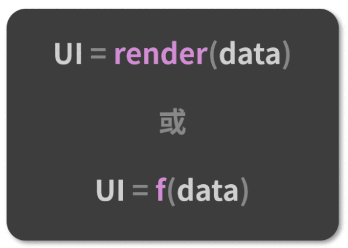
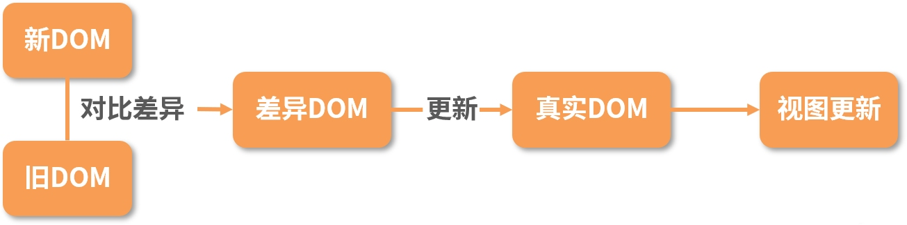
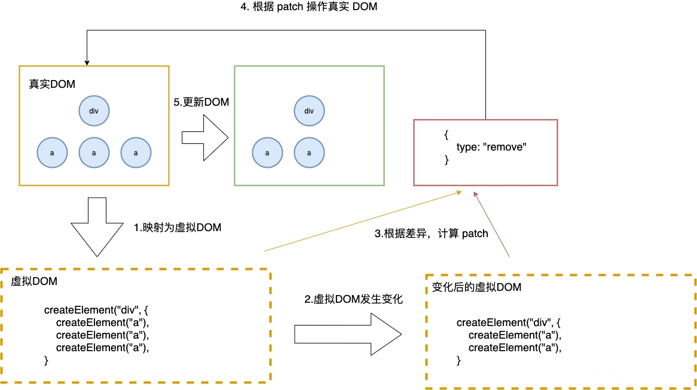
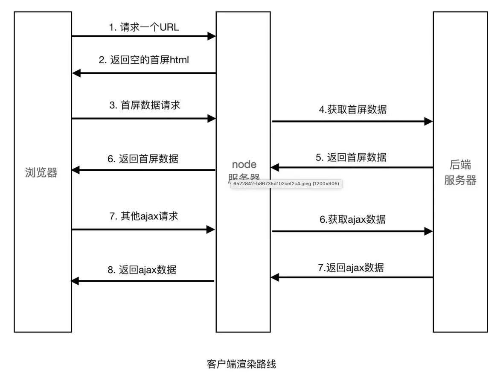
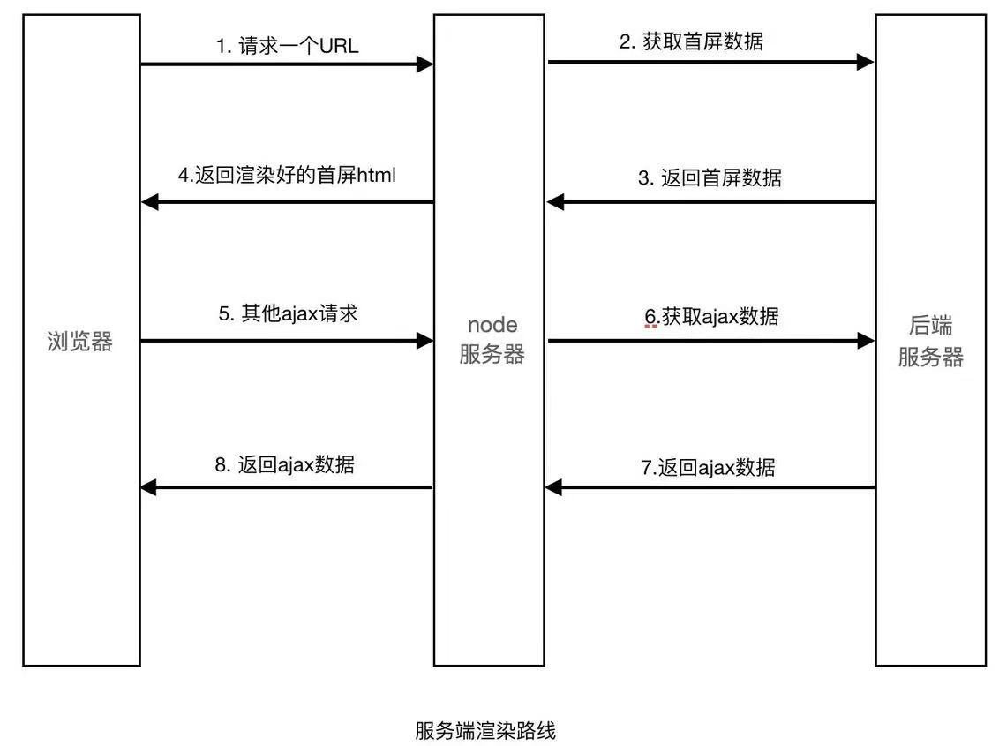
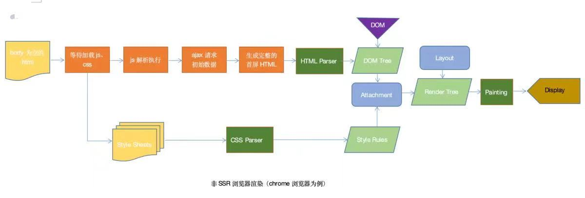
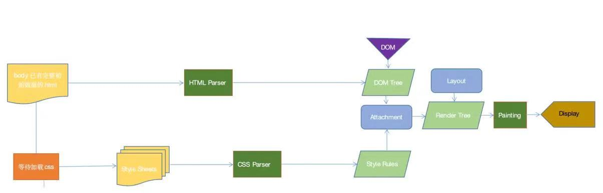

# React

## 一、组件基础

### 1. React 事件机制 & 2. React的事件和普通的HTML事件有什么不同？&3. React 组件中怎么做事件代理？它的原理是什么？

#### 一、事件是什么

**事件（Event）是浏览器对"用户操作或状态变化"的抽象。**

用户在网页上的任何操作（点击、输入、滚动、触摸），或浏览器自身的变化（加载完成、网络错误），都会触发事件。

浏览器**原生事件**有三个核心特征：

**1. 事件流**

事件不是只在目标元素上触发，而是会传播：

```
捕获阶段（从 window 向下）→ 目标阶段 → 冒泡阶段（从目标向上）
```

**2. 事件对象**

事件触发时，浏览器会生成一个事件对象，包含：

- `target`：实际触发事件的元素
- `type`：事件类型（click、keydown 等）
- 各种方法和属性（`preventDefault()`、`stopPropagation()` 等）

**3. 事件绑定**

开发者通过 `addEventListener` 或 HTML 属性（`onclick`）注册处理函数，事件触发时执行。

没有事件机制，网页就是静态的，无法响应用户操作。

---

#### 二、React 做了哪些

React 没有直接使用浏览器原生事件，而是在其之上构建了一套自己的事件系统。

##### 1. 事件委托

React 不在每个元素上单独绑定事件，而是**在根容器上统一监听**。

| 版本            | 绑定位置                                |
| :-------------- | :-------------------------------------- |
| React 16 及之前 | `document`                              |
| React 17 及之后 | React root 容器（如 `<div id="root">`） |

根容器上维护一个**事件监听器**，内部保存了所有组件的事件处理函数映射。事件触发时，React 根据 `e.target` 找到对应组件，分发处理。

##### 2. 合成事件（SyntheticEvent）

React 包装了原生事件对象，提供统一的跨浏览器接口。

```jsx
function handleClick(e) {
  console.log(e);              // SyntheticEvent（React 包装的）
  console.log(e.nativeEvent);  // 原生 MouseEvent
}
```

合成事件的特点：

- 符合 W3C 标准，接口与原生事件一致
- 抹平浏览器差异
- 支持冒泡机制（React 自己模拟）
- 通过 `e.nativeEvent` 可访问原生事件

##### 3. 模拟冒泡

React 在根容器收到原生事件后，**沿虚拟 DOM 树模拟出一套冒泡流程**。

```jsx
<div onClick={() => console.log('div')}>
  <button onClick={() => console.log('button')}>
    点击
  </button>
</div>
```

点击 button 时：

1. 原生事件冒泡到根容器。
2. React 通过 `e.target` 找到实际被点击的 DOM。
3. 从该 DOM 对应的虚拟 DOM 节点开始，沿虚拟 DOM 树向上，收集所有绑定的 onClick。
4. 依次调用：button 的 onClick → div 的 onClick。

##### 4. 事件池（React 16 及之前，React 17+ 已移除）

React 16 及以前，事件对象会被复用。回调执行完毕后，对象属性被清空，异步访问需要 `e.persist()`。

React 17 及之后移除了事件池，可以安全地在异步代码中访问事件对象。

##### 5. 自动绑定 this（类组件时代）

类组件中，React 在调用事件处理函数时，会自动将 `this` 绑定到组件实例。

```jsx
class Button extends React.Component {
  handleClick() {
    console.log(this); // 自动绑定到组件实例
  }
  render() {
    return <button onClick={this.handleClick}>点击</button>;
  }
}
```

函数组件没有 this 概念，不存在此问题。

##### 6. 事件命名与写法

| 对比项   | 原生 HTML                            | React                    |
| :------- | :----------------------------------- | :----------------------- |
| 命名     | 全小写 `onclick`                     | 小驼峰 `onClick`         |
| 值       | 字符串 `"handleClick()"`             | 函数对象 `{handleClick}` |
| 阻止默认 | `return false` 或 `preventDefault()` | 必须 `preventDefault()`  |

---

#### 三、为什么要这样做

##### 1. 性能优化

如果每个元素都单独绑定事件，1000 个按钮就是 1000 个监听器，内存开销大，动态增删元素还需手动绑定/解绑。

**解决：** 事件委托，只在根容器绑一个监听器，内部维护映射表分发：

- 减少监听器数量，内存友好
- 动态元素自动被委托覆盖，无需重新绑定

##### 2. 跨浏览器兼容

不同浏览器的事件 API 存在差异。

**解决：** 合成事件层抹平差异，提供统一接口。

##### 3. 符合开发者直觉

如果 React 不支持冒泡，亲组件的 onClick 永远不会触发，不符合开发者的预期。

**解决：** 在根容器收到事件后，沿虚拟 DOM 树模拟冒泡。事件行为与标准 DOM 事件一致，降低学习成本。

##### 4. 统一管理

原生事件分散在各处，难以统一控制事件流、优先级、清理逻辑。

**解决：** React 集中管理所有事件，在根容器统一监听和分发。

##### 5. 支持多版本共存与微前端（React 17 改绑 root 的原因）

React 16 将事件绑在 `document` 上，多个 React 版本共存时会互相干扰。

**解决：** React 17 改为绑定到各自的 root 容器。支持多版本 React 共存、微前端场景。

---

#### 四、完整流程

```
用户点击 <button>
    ↓
浏览器原生事件：捕获 → 目标 → 冒泡
    ↓
冒泡到 root 容器，触发 React 绑在根容器上的原生监听器
    ↓
React 创建 SyntheticEvent，包装原生事件
    ↓
通过 e.target 找到对应的真实 DOM ,再找到对应 fiber 节点
    ↓
沿 fiber 树：
  · 从根向下，收集 onClickCapture（模拟捕获）
  · 从目标向上，收集 onClick（模拟冒泡）
    ↓
按顺序依次调用这些处理函数，传入 SyntheticEvent
  （handleClick执行）
    ↓
若 handleClick 内调用了 setState → 标记更新
    ↓
进入 React 更新流程：
  Scheduler 调度 → Reconciler 重算 fiber（render 阶段）
    ↓
  Commit 阶段：Diff 新旧 fiber，更新真实 DOM
```

#### 五、总结

> React 事件机制 = **事件委托**（根容器统一监听）+ **合成事件**（跨浏览器包装）+ **模拟冒泡**（沿虚拟 DOM 树传播）。
>
> 核心目的：**性能优化、跨浏览器兼容、符合开发者直觉、统一管理。**

### 4. React 高阶组件、Render props、hooks 有什么区别，为什么要不断迭代

这三者是目前react解决代码复用的主要方式：

* 高阶组件（HOC-Higher-Order Component）是 React 中用于复用组件逻辑的一种高级技巧。HOC 自身不是 React API 的一部分，它是一种基于 React 的组合特性而形成的设计模式。具体而言，高阶组件是参数为组件，返回值为新组件的函数。
* render props是指一种在 React 组件之间使用一个值为函数的 prop 共享代码的简单技术，更具体的说，render prop 是一个用于告知组件需要渲染什么内容的函数 prop。
* 通常，render props 和高阶组件只渲染一个子节点。让 Hook 来服务这个使用场景更加简单。这两种模式仍有用武之地，（例如，一个虚拟滚动条组件或许会有一个 renderltem 属性，或是一个可见的容器组件或许会有它自己的 DOM 结构）。但在大部分场景下，Hook 足够了，并且能够帮助减少嵌套。

**（1）HOC**

官方解释∶

> 高阶组件（HOC）是 React 中用于复用组件逻辑的一种高级技巧。HOC 自身不是 React API 的一部分，它是一种基于 React 的组合特性而形成的设计模式。

简言之，HOC是一种组件的设计模式，HOC接受一个组件和额外的参数（如果需要），返回一个新的组件。HOC 是纯函数，没有副作用。

```javascript
// hoc的定义
function withSubscription(WrappedComponent, selectData) {
  return class extends React.Component {
    constructor(props) {
      super(props);
      this.state = {
        data: selectData(DataSource, props)
      };
    }
    // 一些通用的逻辑处理
    render() {
      // ... 并使用新数据渲染被包装的组件!
      return <WrappedComponent data={this.state.data} {...this.props} />;
    }
  };

// 使用————根据 props.id 取博客文章
const BlogPostWithSubscription = withSubscription(BlogPost,
  (DataSource, props) => DataSource.getBlogPost(props.id));
```

HOC的优缺点∶

* 优点∶ 逻辑复用、不影响被包裹组件的内部逻辑。
* 缺点∶ hoc传递给被包裹组件的props容易和被包裹后的组件重名，进而被覆盖

**（2）Render props**

官方解释∶

> "render prop"是指一种在 React 组件之间使用一个值为函数的 prop 共享代码的简单技术

具有render prop 的组件接受一个返回React元素的函数，将render的渲染逻辑注入到组件内部。在这里，"render"的命名可以是任何其他有效的标识符。

```javascript
// DataProvider组件内部的渲染逻辑如下
class DataProvider extends React.Components {
     state = {
    name: 'Tom'
  }

    render() {
    return (
        <div>
          <p>共享数据组件自己内部的渲染逻辑</p>
          { this.props.render(this.state) }
      </div>
    );
  }
}

// 调用方式
<DataProvider render={data => (
  <h1>Hello {data.name}</h1>
)}/>

```

由此可以看到，render props的优缺点也很明显∶

* 优点：数据共享、代码复用，将组件内的state作为props传递给调用者，将渲染逻辑交给调用者。
* 缺点：无法在 return 语句外访问数据、嵌套写法不够优雅

**（3）Hooks**

官方解释∶

> Hook是 React 16.8 的新增特性。它可以让你在不编写 class 的情况下使用 state 以及其他的 React 特性。通过自定义hook，可以复用代码逻辑。

```javascript
// 自定义一个获取订阅数据的hook
function useSubscription() {
  const data = DataSource.getComments();
  return [data];
}
// 
function CommentList(props) {
  const {data} = props;
  const [subData] = useSubscription();
    ...
}
// 使用
<CommentList data='hello' />
```

以上可以看出，hook解决了hoc的prop覆盖的问题，同时使用的方式解决了render props的嵌套地狱的问题。hook的优点如下∶

* 使用直观；
* 解决hoc的prop 重名问题；
* 解决render props 因共享数据 而出现嵌套地狱的问题；
* 能在return之外使用数据的问题。

需要注意的是：hook只能在组件顶层使用，不可在分支语句中使用。

**总结∶**

Hoc、render props和hook都是为了解决代码复用的问题，但是hoc和render props都有特定的使用场景和明显的缺点。hook是react16.8更新的新的API，让组件逻辑复用更简洁明了，同时也解决了hoc和render props的一些缺点。

### 5. 对React-Fiber的理解，它解决了什么问题？

**React 15** 在渲染时，会递归比对 VirtualDOM 树，找出需要变动的节点，然后同步更新它们， 一气呵成。这个过程期间， React 会占据浏览器资源，这会导致用户触发的事件得不到响应，并且会导致掉帧，**导致用户感觉到卡顿**。

React 通过Fiber 架构，让这个执行过程变成可被中断。它将复杂的渲染任务拆分成多个小的执行单元（Fiber 节点），通过时间切片（Time Slicing）机制，在浏览器空闲时执行任务，高优先级的用户交互（如输入、点击）可以打断渲染并优先得到响应，从而解决了页面卡顿的问题。

* 让浏览器及时地响应用户的交
* 分批延时对DOM进行操作，避免一次性操作大量 DOM 节点，可以得到更好的用户体验；
* 给浏览器一点喘息的机会，它会对代码进行编译优化（JIT）及进行热代码优化，或者对 reflow 进行修正。

**核心思想：**Fiber 也称协程或者纤程。它和线程并不一样，协程本身是没有并发或者并行能力的（需要配合线程），它只是一种控制流程的让出机制。让出 CPU 的执行权，让 CPU 能在这段时间执行其他的操作。渲染的过程可以被中断，可以将控制权交回浏览器，让位给高优先级的任务，浏览器空闲后再恢复渲染。

### 6. React.Component 和 React.PureComponent 的区别（基于类的面向对象写法）

`React.Component` 与 `React.PureComponent` 的核心区别在于**是否自动内置了基于浅比较的性能优化**：

* **`React.Component`**：
默认不进行性能优化。每次亲组件重新渲染或自身触发更新时，其 `shouldComponentUpdate` 默认总是返回 `true`，会**无条件**执行 `render` 函数。如果需要减少不必要的渲染，必须由开发者手动在 `shouldComponentUpdate` 中编写对比逻辑。


* **`React.PureComponent`**：
内置了自动执行的 `shouldComponentUpdate`，并会对新旧 `props` 和 `state` 自动进行**浅比较（基本类型比较值，引用类型比较引用地址）**。如果对比发现数据没有发生变化，它会直接跳过 `render` 以及虚拟 DOM 的生成与比对过程，从而达到提升性能的目的。

### 7. Component, Element, Instance 之间有什么区别和联系？

* **组件：**一个组件`component`可以通过多种方式声明。可以是带有一个`render()`方法的类，简单点也可以定义为一个函数。这两种情况下，它都把属性`props`作为输入，把返回的一棵元素树作为输出。
* **元素：**一个元素`element`是一个普通对象(plain object)，描述了对于一个DOM节点或者其他组件`component`，你想让它在屏幕上呈现成什么样子。元素`element`可以在它的属性`props`中包含其他元素(译注:用于形成元素树)。创建一个React元素`element`成本很低。元素`element`创建之后是不可变的。
* **实例：**一个实例`instance`是你在所写的组件类`component class`中使用关键字`this`所指向的东西(译注:组件实例)。它用来存储本地状态和响应生命周期事件很有用。

函数式组件(`Functional component`)根本没有实例`instance`。类组件(`Class component`)有实例`instance`，但是永远也不需要直接创建一个组件的实例，因为React帮我们做了这些。


### 9. React 高阶组件是什么，和普通组件有什么区别，适用什么场景

高阶组件（HOC）就是一个函数，且该函数接受一个组件作为参数，并返回一个新的组件，它只是一种组件的设计模式，这种设计模式是由react自身的组合性质必然产生的。我们将它们称为纯组件，因为它们可以接受任何动态提供的子组件，但它们不会修改或复制其输入组件中的任何行为。

```javascript
// hoc的定义
function withSubscription(WrappedComponent, selectData) {
  return class extends React.Component {
    constructor(props) {
      super(props);
      this.state = {
        data: selectData(DataSource, props)
      };
    }
    // 一些通用的逻辑处理
    render() {
      // ... 并使用新数据渲染被包装的组件!
      return <WrappedComponent data={this.state.data} {...this.props} />;
    }
  };

// 使用
const BlogPostWithSubscription = withSubscription(BlogPost,
  (DataSource, props) => DataSource.getBlogPost(props.id));
```

**1）HOC的优缺点**

* 优点∶ 逻辑复用、不影响被包裹组件的内部逻辑。
* 缺点∶hoc传递给被包裹组件的props容易和被包裹后的组件重名，进而被覆盖

**2）适用场景**

* 代码复用，逻辑抽象
* 渲染劫持
* State 抽象和更改
* Props 更改

**3）具体应用例子 **

* **权限控制：**利用高阶组件的 **条件渲染 **特性可以对页面进行权限控制，权限控制一般分为两个维度：页面级别和 页面元素级别

```javascript
function withAdminAuth(WrappedComponent) {
  return class extends React.Component {
    state = { isAdmin: false }
    async UNSAFE_componentWillMount() {
      const currentRole = await getCurrentUserRole();
      this.setState({ isAdmin: currentRole === 'Admin' });
    }
    render() {
      if (this.state.isAdmin) {
        return <WrappedComponent {...this.props} />;
      } else {
        return (<div>您没有权限查看该页面，请联系管理员！</div>);
      }
    }
  };
}
export default withAdminAuth(PageA);
```

* **组件渲染性能追踪：**用**反向继承**实现，计算被包裹组件的渲染时间

```javascript
function withTiming(WrappedComponent) {
  return class extends WrappedComponent {  // 继承被包装组件
    UNSAFE_componentWillMount() {
      super.componentWillMount && super.componentWillMount();
      this.start = Date.now();
    }
    componentDidMount() {
      super.componentDidMount && super.componentDidMount();
      this.end = Date.now();
      console.log(`${WrappedComponent.name} 组件渲染时间为 ${this.end - this.start} ms`);
    }
    render() {
      return super.render();
    }
  };
}
export default withTiming(Home);
```

注意：withTiming 是利用 反向继承 实现的一个高阶组件，功能是计算被包裹组件（这里是 Home 组件）的渲染时间。

* **页面复用**

```javascript
const withFetching = fetching => WrappedComponent => {
    /*function withFetching(fetching) {
  		return function(WrappedComponent) {
   		return class extends React.Component { ... };
 		};
	}*/
    return class extends React.Component {
        state = {
            data: [],
        }
        async UNSAFE_componentWillMount() {
            const data = await fetching();
            this.setState({
                data,
            });
        }
        render() {
            return <WrappedComponent data={this.state.data} {...this.props} />;
        }
    }
}

// pages/page-a.js
export default withFetching(fetching('science-fiction'))(MovieList);
// pages/page-b.js
export default withFetching(fetching('action'))(MovieList);
// pages/page-other.js
export default withFetching(fetching('some-other-type'))(MovieList);
```

### 10. 对componentWillReceiveProps 的理解

`componentWillReceiveProps` 是 React 16.3 之前用于在 props 变化时更新子组件 state（派生状态）的生命周期，初始化 render 时不执行。它已被废弃，原因是 Fiber 架构下 render 前可被打断，它可能被多次调用；且用它把 props 同步到 state 会破坏 state 的单一数据源。替代方案是静态的 `getDerivedStateFromProps`，纯函数、无副作用、用 prevState（旧state） 对比。

```
亲组件重新渲染，props 变化
        ↓
子组件的派生状态（从 props 算出的 state）需要更新
        ↓
旧方案：componentWillReceiveProps 里 setState 同步
        ├─ 问题 1：Fiber 下可能被多次调用
        └─ 问题 2：把 props 复制到 state，破坏单一数据源
        ↓
新方案：getDerivedStateFromProps(props, state)
        ├─ 静态纯函数，无副作用
        ├─ 用 props 和 state 算新的派生 state
        └─ 不复制，只"派生"```
```

### 11. 哪些方法会触发 React 重新渲染？重新渲染 render 会做些什么？

#### （1）哪些方法会触发 React 重新渲染？

#####  ① setState / useState 被调用

通常情况下，执行 `setState` 会触发 render。

但**执行 `setState` 不一定会重新渲染**。React 在 `setState` 时，会用 **`Object.is`** 比较新旧值，**新旧值相等时不触发 render**（bailout）。

```jsx
function App() {
    const [a, setA] = useState(1);
    console.log('render');
    return (
        <>
        <p>{a}</p>
        <button onClick={() => setA(1)}>Click me</button>//`Object.is(1, 1) === true` → 不触发 render
        <button onClick={() => setA(null)}>setState null</button>//`Object.is(1, null) === false` → 触发 render 
        <Child />
        </>
    );
}
```

##### ② 亲组件重新渲染

**默认情况下**，只要亲组件重新渲染了，即使传入子组件的 props 未发生变化，子组件也会重新渲染，进而触发 render。

```jsx
function Parent() {
  const [n, setN] = useState(0);
  return (
    <>
      <button onClick={() => setN(n + 1)}>+1</button>
      <Child />   {/* Parent渲染，Child 默认也渲染 */}
    </>
  );
}
```

但子组件如果做了**优化**，**props 没变**时可以跳过：

| 优化手段                | 行为                              |
| :---------------------- | :-------------------------------- |
| `React.memo`            | props 浅比较相等 → 跳过渲染       |
| `PureComponent`         | props/state 浅比较相等 → 跳过渲染 |
| `shouldComponentUpdate` | 返回 `false` → 跳过渲染           |

```jsx
const Child = React.memo(function Child({ x }) {
  return <div>{x}</div>;
});
// Parent 渲染，x 没变 → Child 不渲染
```


##### ③ Context 变化

使用了该 Context 的组件，Context 值变化时会重新渲染。

```jsx
const value = useContext(ThemeContext);  // value 变 → 组件渲染
```


##### ④ Hooks 相关

| Hook                      | 触发渲染？ | 说明                     |
| :------------------------ | :--------- | :----------------------- |
| `useState` / `useReducer` | ✅          | setter 调用且值变        |
| `useContext`              | ✅          | Context 值变时           |
| `useMemo`                 | ❌          | 只重算值，不触发渲染     |
| `useCallback`             | ❌          | 只重建函数，不触发渲染   |
| `useEffect`               | ❌          | 只执行副作用，不触发渲染 |

**注意**：`useMemo` / `useCallback` / `useEffect` **本身不触发渲染**，它们是在渲染过程中被调用的。

------

#### （2）重新渲染 render 会做些什么？

React 的更新分**两个阶段**：

##### 阶段 1：Reconciler（render 阶段，可中断）

- 从**触发更新的 fiber** 开始，沿 fiber 树向下协调
- **同层比较**，不跨层级
- **用 `key`** 判断元素是否可复用
- **类型不同** → 标记删除旧节点、插入新节点
- **类型相同** → 更新属性，递归子节点
- **标记 `effectTag`**（Placement、Update、Deletion）
- 这个阶段**可中断、可恢复**（Fiber 的核心能力）

**注意**：render 阶段**不操作真实 DOM**，只做计算和标记。

##### 阶段 2：Commit（提交阶段，不可中断）

- **遍历有 `effectTag` 的 fiber**
- **应用真实 DOM 操作**：
  - `appendChild` / `insertBefore`（插入）
  - `removeChild`（删除）
  - 更新属性、样式、事件
- **执行生命周期 / Hooks**：
  - `useLayoutEffect`、`componentDidMount` / `componentDidUpdate`
  - 然后浏览器绘制
  - 再执行 `useEffect`
- 这个阶段**不可中断**，必须一次完成

#### Diff 算法的三条策略

React 的 Diff 是 **O(n)** 的启发式算法，基于三条假设：

| 策略                  | 说明                              |
| :-------------------- | :-------------------------------- |
| **同层比较**          | 不跨层级比较，跨层直接删除重建    |
| **类型不同直接替换**  | `div` → `span`，整棵子树重建      |
| **用 `key` 标识元素** | 列表中用 `key` 判断复用，避免错位 |

```jsx
// ❌ 用 index 作 key，插入/删除会错位
items.map((item, i) => <li key={i}>{item}</li>);

// ✅ 用稳定 id
items.map(item => <li key={item.id}>{item}</li>);
```


### 12. React如何判断什么时候重新渲染组件？

React 判断是否重渲染，关键在于 **`shouldComponentUpdate`**。
当 state 变化、props 变化或亲组件重渲染时，React 会准备更新该组件，并调用 `shouldComponentUpdate(nextProps, nextState)`：默认返回 `true`，所以默认每次都重渲染；可以重写`shouldComponentUpdate`方法让它根据情况返回`true`或者`false`来告诉React什么时候重新渲染什么时候跳过重新渲染。。


### 13. React声明组件有哪几种方法，有什么不同？

目前React 声明组件的两种方式：

* 函数组件
* 类组件

**类组件**基于面向对象，有实例和 this，事件需手动绑定，用 `this.state` 和 `setState` 管理状态，靠生命周期方法（如 `componentDidMount`）处理副作用，性能优化用 `shouldComponentUpdate` 或 `PureComponent`。

**函数组件**基于函数式编程，无 this、无实例；Hooks 之前只是无状态展示组件，React 16.8 引入 Hooks 后，用 `useState` 获得 state、用 `useEffect` 等获得生命周期能力（可以在特定的时机执行逻辑），性能优化用 `React.memo`、`useMemo`，逻辑复用靠自定义 Hook。

当今更推崇函数组件 + Hooks，更轻量、逻辑复用更细粒度，也更适应未来的时间切片和并发模式（渲染可中断）。

### 15. 对React中Fragment的理解，它的使用场景是什么？

在React中，组件返回的元素只能有一个根元素。为了不添加多余的DOM节点，可以使用Fragment标签来包裹所有的元素，Fragment标签不会渲染出任何元素。React官方对Fragment的解释：

> React 中的一个常见模式是一个组件返回多个元素。Fragments 允许你将子列表分组，而无需向 DOM 添加额外节点。

```javascript
import React, { Component, Fragment } from 'react'

// 一般形式
render() {
  return (
    <React.Fragment>//可以添加属性
      <ChildA />
      <ChildB />
      <ChildC />
    </React.Fragment>
  );
}
// 也可以写成以下形式
render() {
  return (
    <>//不能接受任何属性
      <ChildA />
      <ChildB />
      <ChildC />
    </>
  );
}
```

### 16. React如何获取组件对应的DOM元素？ 

核心方式：ref

#### **类组件用 `React.createRef()`：**

```javascript
class MyComponent extends React.Component {
  constructor(props) {
    super(props)
    this.myRef = React.createRef()
  }
  render() {
    return <div ref={this.myRef} />
  }
}
// 通过 this.myRef.current 访问
```

#### **函数组件用 `useRef`：**

```javascript
function MyComponent() {
  const myRef = useRef(null)
  return <div ref={myRef} />
}
// 通过 myRef.current 访问
```

#### **回调 ref（函数格式）：**

```javascript
<p ref={ele => this.info = ele}></p>
```

ref 接收一个函数，参数就是对应的节点实例。

#### ref 的返回值取决于节点类型

- 用在 **HTML 元素**上 → `current` 是真实 DOM 节点
- 用在**类组件**上 → `current` 是组件实例
- 用在**函数组件**上直接写 ref **不生效**（函数组件没有实例），需用 `React.forwardRef` 转发

```javascript
const FancyButton = React.forwardRef((props, ref) => (
  <button ref={ref}>{props.children}</button>
))
```

`forwardRef` 的两个典型场景：转发 refs 到 DOM 组件、在高阶组件中转发 refs。

**注意：render 阶段拿不到 refs**

render 阶段 DOM 还没生成，`ref.current` 通常是 `null`。要在 **commit 之后**访问：


### 18. 对React的插槽(Portals)的理解，如何使用，有哪些使用场景

React 官方对 Portals 的定义：

> Portal 提供了一种将子节点渲染到存在于亲组件以外的 DOM 节点的优秀的方案

Portals 是React 16提供的官方解决方案，使得组件可以脱离亲组件层级挂载在DOM树的任何位置。通俗来讲，就是我们 render 一个组件，但这个组件的 DOM 结构并不在本组件内。

Portals语法如下：

```jsx
ReactDOM.createPortal(child, container);
```

* 第一个参数 child 是可渲染的 React 子项，比如元素，字符串或者片段等;
* 第二个参数 container 是一个 DOM 元素。

一般情况下，组件的render函数返回的元素会被挂载在它的上级组件上：

```javascript
import DemoComponent from './DemoComponent';

function Parent() {
    // DemoComponent元素会被挂载在id为parent的div的元素上
  return (
    <div id="parent">
      <DemoComponent />
    </div>
  );
}
```

然而，有些元素需要被挂载在更高层级的位置。最典型的应用场景：当亲组件具有`overflow: hidden`或者`z-index`的样式设置时，组件有可能被其他元素遮挡，这时就可以考虑要不要使用Portal使组件的挂载脱离亲组件。例如：对话框，模态窗。

```jsx
import DemoComponent from './DemoComponent';

function Parent() {
  // react会将DemoComponent组件直接挂载在真实的 dom 节点 domNode 上
  return ReactDOM.createPortal(
    <DemoComponent />,
    domNode,
  );
}
```

### 19. 在React中如何避免不必要的render？

React 基于虚拟 DOM 和高效 Diff 算法的完美配合，实现了对 DOM 最小粒度的更新。
大多数情况下，React 对 DOM 的渲染效率足以应对日常业务。但在个别复杂业务场景下，需要采取一些措施来提升运行性能，其很重要的一个方向，就是**避免不必要的渲染**（Render）。

**类组件：**

- **`shouldComponentUpdate`**：手动判断，返回 `false` 即跳过 render。
- **`PureComponent`**：内置 `shouldComponentUpdate`，自动对新旧 props 和 state 做**浅比较**，无变化则跳过 render。

**函数组件：**

- **`React.memo`**：高阶组件，对 props 做浅比较，无变化则跳过重渲染。只能用于函数组件，与 `PureComponent` 类似。
- **`useMemo`**：缓存计算结果，避免每次渲染重复执行昂贵计算。
- **`useCallback`**：缓存函数引用，避免传给子组件的回调每次都是新引用，导致被 `React.memo` 包裹的子组件无效重渲染。
- **高阶组件**：可封装一个类似 `PureComponent` 的功能。

**注意事项：**

浅比较只比引用地址，所以直接改引用类型数据（如 `push`、`splice`）不会触发更新，需要先拷贝再 `setState`：

```js
// 数组：用扩展运算符
setNums([...nums, 1])//setNums更新nums状态

// 对象：要改哪一层，那一层及其所有祖先层，都要创建新对象。

const [obj, setObj] = useState({
  a: 1,
  student: {
    name: 'Tom',
    info: { age: 18 },
  },
});

//只改第一层属性
setObj(prev => ({
  ...prev,
  a: 2,
}));

//改第二层属性
setObj(prev => ({
  ...prev,                          // 第一层新
  student: {
    ...prev.student,                // 第二层新
    name: 'Jerry',
  },
}));
```


### 21. 对 React context 的理解

在React中，数据传递一般使用props传递数据，维持单向数据流，这样可以让组件之间的关系变得简单且可预测，但是单项数据流在某些场景中并不适用。要是组件之间层层依赖深入，props就需要层层传递显然，这样做太繁琐了。

Context 提供了一种在组件之间共享此类值的方式，而不必显式地通过组件树的逐层传递 props。

可以把context当做是特定一个组件树内共享的store，用来做数据传递。**简单说就是，当你不想在组件树中通过逐层传递props的方式来传递数据时，可以使用Context来实现跨层级的组件数据传递。**


### 23. React中什么是受控组件和<font style="background-color:transparent;">非控组件？	</font>

**<font style="background-color:transparent;">（1）受控组件</font>**

使用表单来收集用户输入，例如<input><select><textearea>等元素

受控组件条件:

1. **`value`（或 `checked`）绑定到 state** —— 表单显示什么，由 state 决定。
2. **有 `onChange` 更新 state** —— 用户输入后，通过事件处理器把新值写回 state，触发重渲染，表单才更新。

受控组件更新state的流程：

* 可以通过初始state中设置表单的默认值
* 每当表单的值发生变化时，调用onChange事件处理器
* 事件处理器通过事件对象e拿到改变后的状态，并更新组件的state
* 一旦通过setState方法更新state，就会触发视图的重新渲染，完成表单组件的更新

**受控组件缺陷：**

表单元素的值都是由React组件进行管理，当有多个输入框，或者多个这种组件时，如果想同时获取到全部的值就必须每个都要编写事件处理函数，这会让代码看着很臃肿，所以为了解决这种情况，出现了非受控组件。

**（2）非受控组件**

如果一个表单组件没有把value绑定为state（单选和复选按钮对应的是checked）时，就可以称为非受控组件。在非受控组件中，可以使用一个**ref来从DOM获得表单值**。而不是为每个状态更新编写一个事件处理程序。

React官方的解释：

> 要编写一个非受控组件，而不是为每个状态更新都编写数据处理函数，你可以使用 ref来从 DOM 节点中获取表单数据。
>
> 因为非受控组件将真实数据储存在 DOM 节点中，所以在使用非受控组件时，有时候反而更容易同时集成 React 和非 React 代码。如果你不介意代码美观性，并且希望快速编写代码，使用非受控组件往往可以减少你的代码量。否则，你应该使用受控组件。

例如，下面的代码在非受控组件中接收单个属性：

```jsx
import { useRef } from 'react'

function NameForm() {
  const inputRef = useRef(null)

  const handleSubmit = (event) => {
    event.preventDefault()
    alert('A name was submitted: ' + inputRef.current.value)
  }

  return (
    <form onSubmit={handleSubmit}>
      <label>
        Name:
        <input type="text" ref={inputRef} />
      </label>
      <input type="submit" value="Submit" />
    </form>
  )
}

export default NameForm
```

**总结：**页面中所有输入类的DOM如果是现用现取的称为非受控组件，而通过setState将输入的值维护到了state中，需要时再从state中取出，这里的数据就受到了state的控制，称为受控组件。

### 24. React中refs的作用是什么？有哪些应用场景？

Refs 提供了一种方式，用于访问在 render 方法中创建的 React 元素或 DOM 节点。React 的核心思想是“数据驱动视图”，正常情况下不应该直接操作 DOM。Refs 在少数必须直接访问 DOM 或组件实例的场景下使用。：

* 处理焦点、文本选择或者媒体的控制
* 触发必要的动画
* 集成第三方 DOM 库

Refs 是使用 `React.createRef()` 方法创建的，他通过 `ref` 属性附加到 React 元素上。
类组件:要在整个组件中使用 Refs，需要将 `ref` 在构造函数中分配给其实例属性：

```javascript
class MyComponent extends React.Component {
  constructor(props) {
    super(props)
    this.myRef = React.createRef()
  }
  render() {
    return <div ref={this.myRef} />
  }
}
```

由于函数组件没有实例，因此不能在函数组件上直接使用 `ref`：
但可以通过useRef()：

```jsx
function CustomTextInput(props) {
  const textInput = useRef(null);   // ← 跨渲染保留的容器

  function handleClick() {
    textInput.current.focus();      // 用 .current 访问
  }

  return (
    <div>
      <input type="text" ref={textInput} />
      <input
        type="button"
        value="Focus the text input"
        onClick={handleClick}
      />
    </div>
  );
}
```

**注意：**

* 不应该过度的使用 Refs
* `ref` 的返回值取决于节点的类型：
  * 当 `ref` 属性被用于一个普通的 HTML 元素时，`React.createRef()` 将接收底层 DOM 元素作为他的 `current` 属性以创建 `ref`。
  * 当 `ref` 属性被用于一个自定义的类组件时，`ref` 对象将接收该组件已挂载的实例作为他的 `current`。
* 当在亲组件中需要访问子组件中的 `ref` 时可使用传递 Refs 或回调 Refs。


### 27. React.forwardRef是什么？它有什么作用？

React.forwardRef 会创建一个React组件，这个组件能够将其接受的 ref 属性转发到其组件树下的另一个组件中。这种技术并不常见，但在以下两种场景中特别有用：

* 转发 refs 到 DOM 组件
* 在高阶组件中转发 refs

### 28. 类组件与函数组件有什么异同？

**相同点：**

组件是 React 可复用的最小代码片段，返回要在页面中渲染的 React 元素。作为 React 的最小编码单位，函数组件和类组件在使用方式和最终呈现效果上完全一致，可以互相改写。从使用者角度很难从体验上区分两者，现代浏览器中闭包和类的性能差异也只在极端场景下才明显。

**不同点：**

- **心智模型**：类组件基于面向对象编程，主打继承、生命周期；函数组件基于函数式编程，主打 immutable(不可变)、无副作用、引用透明。
- **使用场景与设计模式**：Hooks 推出前，需要生命周期或用继承时主推类组件；Hooks 后函数组件可完全取代类组件。继承并非组件最佳设计模式，官方更推崇“组合优于继承”，类组件这方面的优势在淡出。
- **性能优化**：类组件靠 `shouldComponentUpdate` / `PureComponent` 阻断渲染；函数组件靠 `React.memo` 缓存渲染结果，并配合 `useMemo`、`useCallback` 优化。
- **逻辑复用**：类组件用 HOC / render props；函数组件用自定义 Hook，更细粒度、无嵌套问题。
- **上手程度与趋势**：Hooks 前类组件更易上手；Hooks 后函数组件更容易上手，且成为社区主推方案。
- **并发模式适应性**：类组件因生命周期带来的复杂度，在未来时间切片与并发模式中不易优化；函数组件轻量简单，Hooks 提供了更细粒度的逻辑组织与复用，更能适应 React 的未来发展。
- **React 19 视角**：函数组件 + Hooks 已是绝对主流，React 19 的 Server Components、Actions、`use()` 等新特性只面向函数组件，类组件无法使用，两者差距进一步拉大。


## 二、数据管理

### 1. React setState 原理与批量更新

#### 一、本质

`setState`（类组件）和 `useState` 的 setter（函数组件，如 `setCount`）底层是同一套机制：**把更新加入队列，而不是立即修改 state**。React 会在合适的时机批量处理队列中的更新，合并计算出最终 state，然后触发一次重新渲染。

#### 二、核心流程

**1. 入队**

调用 `setState` / `setCount` 时，React 不会立即改 state，而是生成一个**更新对象**放入组件的更新队列（`updateQueue`）：

```javascript
{
  payload: { count: 1 },   // 这次更新要应用的内容
  callback: callback,       // 可选回调
  next: null                // 指向下一个更新，形成链表
}
```

`payload` 就是你传入的参数，有两种形式：

```javascript
setState({ count: 1 })                       // payload 是对象
setState(prev => ({ count: prev.count + 1 })) // payload 是函数
```

**2. 批处理判断**

React 判断当前是否处于**批量更新上下文**（可理解为“一次任务”）：

- **处于批量更新中**：把组件标记为待更新，等当前任务结束后统一处理。
- **不处于批量更新中**：立即发起更新流程。

**3. 合并队列（把多条更新**归并成一份最终状态**），计算最终 state**

批量结束时，React 遍历更新队列，依次执行每个更新，算出新 state。这里的关键是 payload 的形式：

- **payload 是对象**：存的是固定值，同一属性被多次设置时，**后者覆盖前者**，所以“只有最后一次生效”。

```javascript
this.setState({ count: this.state.count + 1 }) // count=0，算出 1
this.setState({ count: this.state.count + 1 }) // state 还是 0，还是 1
this.setState({ count: this.state.count + 1 }) // 还是 1
// 最终 count = 1
```

- **payload 是函数**：函数不会提前执行，而是排队，在合并阶段**依次执行**，前一个的返回值作为后一个的参数，所以全部参与计算。

```javascript
this.setState(prev => ({ count: prev.count + 1 })) // prev=0，返回 1
this.setState(prev => ({ count: prev.count + 1 })) // prev=1，返回 2
this.setState(prev => ({ count: prev.count + 1 })) // prev=2，返回 3
// 最终 count = 3
```

**4. 触发渲染**

计算出新 state 后，React 进入调和（Reconciliation）过程：用新 state 构建新的虚拟 DOM 树，与旧树做 Diff，以最小代价更新真实 DOM。

**5. 执行回调**

如果传了第二个参数（回调函数），在组件重新渲染后执行。

#### 三、是同步还是异步

**既不是纯粹同步，也不是纯粹异步，更准确的表述是“批量合并、延迟更新”。**

- 调用后当前代码继续执行，不是 `await` 那种异步。
- 但 state 不会立即改变，也不是同步赋值。
- 本质是把更新排队，在合适时机统一处理。

这样设计的原因有两点：

- **性能**：如果每次 `setState` 都同步更新，一个同步代码块中多次调用就会触发多次 vnode diff + DOM 修改，效率很低。延迟合并后，同一批次的多个更新合并成一次组件更新，减少渲染次数。
- **一致性**：state 和用它算出来的 UI（以及 props）之间，要保持在同一个"版本"上。React 延迟更新，正是为了让"一次更新内的所有变化"**同时生效**，避免中间态。

#### 四、React 18+ 的重要变化：自动批处理

**React 18 之前**，批量更新的范围取决于调用场景：

- **React 能控制的地方**（合成事件、生命周期）：走批量合并，表现为“异步”。
- **React 无法控制的地方**（`addEventListener`、`setTimeout`、`setInterval` 等）：不走批量，表现为“同步”。

**React 18 起**，使用 `createRoot` 后，**所有场景默认自动批处理**，无论更新来自合成事件、生命周期，还是 `setTimeout`、Promise、原生事件，都会合并为一次渲染。

```javascript
// React 18 中，以下只会触发一次渲染
setTimeout(() => {
  setCount(c => c + 1);
  setFlag(f => !f);
}, 1000);
```

如需退出自动批处理、强制同步渲染，可以用 `flushSync`。

#### 五、关键：state 是快照

`setState` 的“异步”表现，本质是因为 **state 在每次渲染中是一个固定的快照**。事件处理函数中拿到的 state 始终是**那次渲染时的值**，不会因为调用了 `setState` 而立即改变。

```javascript
// 点击后 count 只 +1，不是 +3
setCount(count + 1); // count 是 0，所以是 setCount(1)
setCount(count + 1); // count 还是 0，还是 setCount(1)
setCount(count + 1); // count 还是 0，还是 setCount(1)
```

要基于前一个值连续更新，必须用**更新函数**：

```javascript
setCount(n => n + 1); // n 依次为 0 → 1 → 2，最终 3
```


### 8. state 是怎么注入到组件的，从 reducer 到组件经历了什么样的过程（状态管理）

> redux 数据流
>
> ```
> 1.调用 store.dispatch(action)
> Action 是一个描述“发生了什么”的普通对象，是数据进入 store 的唯一途径。
> 
> 2.Store 调用 Reducer 函数
> Store 将当前 state 树和 action 传给 reducer。Reducer 是纯函数，仅计算并返回新的 state，不产生副作用。
> 
> 3.根 Reducer 合并多个子 Reducer 的输出
> 若使用 combineReducers，根 reducer 会分别调用各子 reducer 处理 state 树的对应分支，并将结果合并为一个完整的 state 树。
> 
> 4.Store 保存新 state 并通知订阅者
> Store 保存根 reducer 返回的新 state 树，随后同步调用所有通过 store.subscribe(listener) 注册的监听器；监听器可调用 store.getState() 获取当前 state，UI 据此更新
> ```
>
> 

state 注入组件，经典方式是通过 react-redux 的 `connect`。整体链路是：

```
reducer 处理 action → 返回新 state 存回 store
        ↓
connect 包装组件，从 store 取 state	
        ↓
mapStateToProps 把全局 state 映射成 props
        ↓
store 变化时通知订阅者，重新计算 props
        ↓
通过 props 传给被包裹的组件，触发重新渲染
```

**1. reducer 处理 action**

reducer 接收当前 state 和 action，返回新的 state，存回 store。store 是唯一数据源，所有组件状态都集中在这里。

**2. connect 升级组件**

`connect(mapStateToProps, mapDispatchToProps)(Component)` 返回一个**包装组件**（HOC），它负责：

- 连接 store
- 调用 `mapStateToProps`，计算 props
- 订阅变化
- 把 props 传给真正的组件

这样业务组件(参数Component)不需要管理Store

**3. mapStateToProps 映射 state**

`mapStateToProps(state, ownProps)` 有两个参数：

- `state`：store 管理的全局状态对象
- `ownProps`：组件自身通过 props 传入的参数

它返回一个对象，对象的每个字段会成为被包裹组件的 props。

```javascript
const mapStateToProps = (state, ownProps) => ({
  active: ownProps.filter === state.visibilityFilter  //{active:true}或{active:false}
})
```

**4. mapDispatchToProps 映射派发方法**

`mapDispatchToProps(dispatch, ownProps)` 返回一个对象，里面是派发 action 的方法，同样会作为 props 传给组件。

```javascript
const mapDispatchToProps = (dispatch, ownProps) => ({
  setFilter: () => dispatch(setVisibilityFilter(ownProps.filter))
})
```

**5. 订阅 store，变化时更新**

包装组件通过 context 拿到 store，调用 `store.subscribe` 订阅变化。store 的 state 变化后，重新执行映射、计算新 props，并通过 `setState` 触发包装组件重新渲染。

**6. 透传给被包裹组件**

包装组件在 render 中把合并后的 props 传给原组件：

```javascript
<WrappedComponent {...this.state.allProps} />
```

#### 完整示例

```javascript
import { connect } from 'react-redux'
import { setVisibilityFilter } from '@/reducers/Todo/actions'
import Link from '@/containers/Todo/components/Link'

const mapStateToProps = (state, ownProps) => ({
  active: ownProps.filter === state.visibilityFilter
})

const mapDispatchToProps = (dispatch, ownProps) => ({
  setFilter: () => {
    dispatch(setVisibilityFilter(ownProps.filter))
  }
})

export default connect(
  mapStateToProps,
  mapDispatchToProps
)(Link)
```

这里 `active` 就是注入到 Link 组件中的状态。

#### connect 的高阶组件实现

```javascript
import React from 'react'
import PropTypes from 'prop-types'

export const connect = (mapStateToProps, mapDispatchToProps) => (WrappedComponent) => {
    class Connect extends React.Component {
        // 通过 context 获取 store
        static contextTypes = {
            store: PropTypes.object
        }

        constructor() {
            super()
            this.state = {
                allProps: {}
            }
        }

        componentDidMount() {
            const store = this.context.store
            this._updateProps()
            // 订阅 store，变化时更新 props
            store.subscribe(() => this._updateProps())
        }

        _updateProps() {
            const store = this.context.store
            let stateProps = mapStateToProps
                ? mapStateToProps(store.getState(), this.props)
                : {}
            let dispatchProps = mapDispatchToProps
                ? mapDispatchToProps(store.dispatch, this.props)
                : { dispatch: store.dispatch }
            this.setState({
                allProps: {
                    ...stateProps,
                    ...dispatchProps,
                    ...this.props
                }
            })
        }

        render() {
            return <WrappedComponent {...this.state.allProps} />
        }
    }
    return Connect
}
```

关键点：

- **通过 context 拿 store**：从 Provider 提供的 context 中取 store。
- **订阅 store**：`store.subscribe` 监听变化，触发 `_updateProps`。
- **映射 props**：`mapStateToProps` 把全局 state 映射成 props，`mapDispatchToProps` 生成派发方法。
- **setState 触发渲染**：把映射结果合并进 `allProps`，通过 `setState` 触发包装组件重新渲染。
- **透传**：把合并后的 props 传给被包裹的组件。

#### 当今写法：Hooks API

react-redux 现在推荐用 Hooks，不再需要 `connect` 包装：

```javascript
import { useSelector, useDispatch } from 'react-redux'

function Link({ filter }) {
  const active = useSelector(state => filter === state.visibilityFilter)
  const dispatch = useDispatch()

  const setFilter = () => dispatch(setVisibilityFilter(filter))

  return <a className={active ? 'active' : ''} onClick={setFilter}>...</a>
}
```

- **`useSelector`**：从 store 读取 state，等价于 `mapStateToProps`。
- **`useDispatch`**：拿到 `dispatch`，等价于 `mapDispatchToProps` 提供的派发能力。

底层机制不变，仍是“订阅 store、state 变化时重新读取并触发渲染”，只是从 HOC 换成了 Hook，写法更直接。


### 9. React组件的state和props有什么区别？

**（1）props**

props是一个从外部传进组件的参数，主要作用就是从亲组件向子组件传递数据，它具有可读性和不变性，亲组件不传新 props，子组件收到的 props 就不变。。

**（2）state**

state的主要作用是用于组件保存、控制以及修改自己的状态，不可通过外部访问和修改，只能通过setState/this.setState来修改，修改state属性会导致组件的重新渲染。
函数组件：用 `useState`初始化
类组件：在 constructor/类属性 中 初始化不

**（3）区别**

* props 是传递给组件的（类似于函数的形参），而state 是在组件内被组件自己管理的（类似于在一个函数内声明的变量）。
* props 是不可修改的，state 可以修改，每次setState都异步更新的。

### 10. React中的props为什么是只读的？

`props`是组件之间沟通的一个接口。React具有浓重的函数式编程的思想。

提到函数式编程就要提一个概念：纯函数。它有几个特点：

* 给定相同的输入，总是返回相同的输出。
* 过程没有副作用。
* 不依赖外部状态。

`props`就是汲取了纯函数的思想。props的不可变性就保证的相同的输入，页面显示的内容是一样的，并且不会产生副作用

### 11. 在React中组件的props改变时更新组件的有哪些方法？

#### **（1）getDerivedStateFromProps（16.3引入）** 

用于类组件， 挂载时 更新前自动调用，只需定义无需手动调用

在 props 变化时把新 props 映射到 state，返回对象更新、返回 null 不更新

```javascript
static getDerivedStateFromProps(nextProps, prevState) { //静态函数，不需访问组件实例
    const {type} = nextProps; //从props取出某个字段值
    // 当传入的type发生变化的时候，更新state
    if (type !== prevState.type) {
        return {
            type,
        };
    }
    // 否则，对于state不进行任何操作
    return null;
}
```

#### **(2)useEffect（函数组件，推荐）**

函数组件没有生命周期，用 `useEffect` 监听 props 变化并执行副作用：

```jsx
useEffect(() => {
  fetchData(id)
}, [id]) // id（props）变化时执行
```

React 官方建议：**能不用派生 state 就不用**。因为把 props 同步到 state 会破坏 state 的单一数据源，更推荐：

- 直接**用 props 渲染**，而不是复制到 state。
- 需要在 props 变化时做副作用，用 `componentDidUpdate` 或 `useEffect`。
- 确实需要根据 props 计算值，用**记忆化**（`useMemo`）而不是存进 state。


## 三、生命周期

### 1. React的生命周期有哪些？（类组件）

React 通常将组件生命周期分为三个阶段：

* 装载阶段（Mount），组件第一次在DOM树中被渲染的过程；
* 更新过程（Update），组件状态发生变化，重新更新渲染的过程；
* 卸载过程（Unmount），组件从DOM树中被移除的过程；

#### 1）组件挂载阶段

挂载阶段组件被创建，然后组件实例插入到 DOM 中，完成组件的第一次渲染，该过程只会发生一次，在此阶段会依次调用以下这些方法：

* constructor
* getDerivedStateFromProps
* render
* componentDidMount

##### （1）constructor

组件的构造函数，第一个被执行，若没有显式定义它，会有一个默认的构造函数，但若显式定义了，必须在构造函数中执行 `super(props)`，否则无法在构造函数中拿到this。

如果不初始化 state 或不进行方法绑定，则不需要为 React 组件实现构造函数**Constructor**。

constructor中通常只做两件事：

* 初始化组件的 state
* 给事件处理方法绑定 this

```javascript
constructor(props) {
  super(props);
  // 不要在构造函数中调用 setState，可以直接给 state 设置初始值
  this.state = { counter: 0 }
  this.handleClick = this.handleClick.bind(this)
}
```

##### （2）getDerivedStateFromProps

```javascript
static getDerivedStateFromProps(props, state)
```

静态方法（属于类本身，不属于实例），不能在这个函数里使用 `this`，有两个参数 `props` 和 `state`，分别指接收到的新参数和当前组件的 `state` 对象，这个函数会返回一个对象用来更新当前的 `state` 对象，如果不需要更新可以返回 `null`。

该函数会在装载时，接收到新的 `props` 或者调用了 `setState` 和 `forceUpdate` 时被调用。如当接收到新的属性想修改 `state` ，就可以使用。

```javascript
// 当 props.counter 变化时，赋值给 state 
class App extends React.Component {
  constructor(props) {
    super(props)
    this.state = {
      counter: 0
    }
  }
  static getDerivedStateFromProps(props, state) {
    if (props.counter !== state.counter) {
      return {
        counter: props.counter
      }
    }
    return null
  }
  
  handleClick = () => {
    this.setState({
      counter: this.state.counter + 1
    })
  }
  render() {
    return (
      <div>
        <h1 onClick={this.handleClick}>Hello, world!{this.state.counter}</h1>
      </div>
    )
  }
}
```

现在可以显式传入 `counter` ，但是这里有个问题，如果想要通过点击实现 `state.counter` 的增加，但这时会发现值不会发生任何变化，一直保持 `props` 传进来的值。
这是由于在 React 16.4^ 的版本中 `setState` 和 `forceUpdate` 也会触发这个生命周期，所以当组件内部 `state` 变化后，就会重新走这个方法，同时会把 `state` 值赋值为 `props` 的值。因此需要多加一个字段来记录之前的 `props` 值，这样就会解决上述问题。具体如下：

```javascript
// 这里只列出需要变化的地方
class App extends React.Component {
  constructor(props) {
    super(props)
    this.state = {
      // 增加一个 preCounter 来记录之前的 props 传来的值
      preCounter: 0,
      counter: 0
    }
  }
  static getDerivedStateFromProps(props, state) {
    // 跟 state.preCounter 进行比较
    if (props.counter !== state.preCounter) {
      return {
        counter: props.counter,
        preCounter: props.counter
      }
    }
    return null
  }
  handleClick = () => {
    this.setState({
      counter: this.state.counter + 1
    })
  }
  render() {
    return (
      <div>
        <h1 onClick={this.handleClick}>Hello, world!{this.state.counter}</h1>
      </div>
    )
  }
}
```

##### （3）render

render是React 中最核心的方法，一个组件中必须要有这个方法，它会根据状态 `state` 和属性 `props` 渲染组件。这个函数只做一件事，就是返回需要渲染的内容，所以不要在这个函数内做其他业务逻辑，通常调用该方法会返回以下类型中一个：

* **React 元素**：这里包括原生的 DOM 以及 React 组件；
* **数组和 Fragment（片段）**：可以返回多个元素；
* **Portals（插槽）**：可以将子元素渲染到不同的 DOM 子树种；
* **字符串和数字**：被渲染成 DOM 中的 text 节点；
* **布尔值或 null**：不渲染任何内容。

```
render() → 真实 DOM 创建 → 挂载到页面 → componentDidMount 执行
```


##### （4）componentDidMount()

componentDidMount()会在组件挂载后（插入 DOM 树中）立即调用。该阶段通常进行以下操作：

* 执行依赖于DOM的操作；
* 发送网络请求；（官方建议）
* 添加订阅消息（会在componentWillUnmount取消订阅）；

如果在 `componentDidMount` 中调用 `setState` ，就会触发一次额外的渲染，多调用了一次 `render` 函数，由于它是在浏览器刷新屏幕前执行的( *JS 执行 → 计算样式 → 布局 → 绘制（paint）→ 用户看到* )，所以用户对此是没有感知的，但应当避免这样使用，这样会带来一定的性能问题，尽量在 `constructor` 中初始化 `state` 对象。

在组件装载之后，将计数数字变为1：

```jsx
class App extends React.Component  {
  constructor(props) {
    super(props)
    this.state = {
      counter: 0
    }
  }
    
  componentDidMount () {
    this.setState({
      counter: 1
    })
  }
  
  render ()  {
    return (
      <div className="counter">
        counter值: { this.state.counter }
      </div>
    )
  }
}
```

#### 2）组件更新阶段

当组件的 `props` 改变了，或组件内部调用了`setState/forceUpdate`，会触发更新重新渲染，这个过程可能会发生多次。这个阶段会**依次调用**下面这些方法：

* getDerivedStateFromProps
* shouldComponentUpdate
* render
* getSnapshotBeforeUpdate
* componentDidUpdate

对部分方法的解释：

##### （1）shouldComponentUpdate

```javascript
shouldComponentUpdate(nextProps, nextState)
```

在说这个生命周期函数之前，来看两个问题：

* **setState 函数在任何情况下都会导致组件重新渲染吗？例如下面这种情况：**

```javascript
this.setState({number: this.state.number})
```

* **如果没有调用 setState，props 值也没有变化，是不是组件就不会重新渲染？**

第一个问题答案是 **会** ，第二个问题如果是亲组件重新渲染时，不管传入的 props 有没有变化，都会引起子组件的重新渲染。

那么有没有什么方法解决在这两个场景下不让组件重新渲染进而提升性能呢？

答：`shouldComponentUpdate` ，这个生命周期函数是用来提升速度的，它是在重新渲染组件开始前触发的，默认返回 `true`，可以比较 `this.props` 和 `nextProps` ，`this.state` 和 `nextState` 值是否变化，来确认返回 true 或者 `false`。当返回 `false` 时，组件的更新过程停止，后续的 `render`、`componentDidUpdate` 也不会被调用。

**注意：**添加 `shouldComponentUpdate` 方法时，不建议使用深度相等检查（如 `JSON.stringify()`），因为深比较效率很低，可能会比重新渲染组件效率还低。而且该方法维护比较困难，建议使用该方法会产生明显的性能提升时使用。

##### （2）getSnapshotBeforeUpdate

```javascript
getSnapshotBeforeUpdate(prevProps, prevState)
```

在 `render` 之后，`componentDidUpdate` 之前调用，有两个参数 `prevProps` 和 `prevState`，表示更新之前的 `props` 和 `state`，这个函数必须要和 `componentDidUpdate` 一起使用，并且要有一个返回值，默认是 `null`，这个返回值作为第三个参数传给 `componentDidUpdate`。用于在 DOM 更新前捕获一些信息

##### （3）componentDidUpdate

componentDidUpdate() 会在更新后会被立即调用，首次渲染不会执行此方法。 该阶段通常进行以下操作：

* 当组件更新后，对 DOM 进行操作；
* 比较更新前后的 props，决定是否发请求

```javascript
componentDidUpdate(prevProps, prevState, snapshot){}
```

该方法有三个参数：

* prevProps: 更新前的props
* prevState: 更新前的state
* snapshot: getSnapshotBeforeUpdate()生命周期的返回值

#### 3）组件卸载阶段

卸载阶段只有一个生命周期函数，componentWillUnmount() 会在组件卸载及销毁之前直接调用。在此方法中执行必要的清理操作：

* 清除 timer，取消网络请求
* 取消在 componentDidMount() 中创建的订阅等；

这个生命周期在一个组件被卸载和销毁之前被调用，因此不应该在这个方法中使用 `setState`，因为组件一旦被卸载，就不会再装载，也就不会重新渲染。

#### 4）错误处理阶段

componentDidCatch(error, info)，此生命周期在后代组件抛出错误后被调用。 它接收两个参数∶

* error：抛出的错误。
* info：带有 componentStack key 的对象，其中包含有关组件引发错误的栈信息

React的生命周期如下：


* **Render 阶段**：用于计算一些必要的状态信息。这个阶段可能会被 React 暂停，这一点和 React16 引入的 Fiber 架构是有关的；
* **Pre-commit阶段**：所谓“commit”，这里指的是“更新真正的 DOM 节点”这个动作。所谓 Pre-commit，就是说我在这个阶段其实还并没有去更新真实的 DOM，不过 DOM 信息已经是可以读取的了；
* **Commit 阶段**：在这一步，React 会完成真实 DOM 的更新工作。Commit 阶段，我们可以拿到真实 DOM（包括 refs）。


#### 常见生命周期流程总结

* 挂载过程：
  * **constructor**
  * **getDerivedStateFromProps**
  * **render**
  * **componentDidMount**
* 更新过程：
  * **getDerivedStateFromProps**
  * **shouldComponentUpdate**
  * **render**
  * **getSnapshotBeforeUpdate**
  * **componentDidUpdate**
* 卸载过程：
  * **componentWillUnmount**

> [!NOTE]
>
> refs是 所有的ref引用
> **state 是"驱动 UI 的数据"，改了会重新渲染；ref 是"跨渲染保留的容器"，改了不重新渲染。普通变量在函数组件每次渲染时候被重置**

### 2. React 废弃了哪些生命周期？为什么？

被废弃的三个函数（ componentWillMount 、componentWillReceiveProps 、componentWillUpdate  ）都是在render方法之前，render阶段之内

1. 因为fiber的出现（更新拆为 render阶段（可中断）和commit阶段（不可中断）），很可能因为高优先级任务的出现而打断现有任务导致它们会被执行多次。

2. 为了更容易维护和扩展

   

### 4. React 性能优化及优化的原理是什么？

类组件的性能优化

-  `shouldComponentUpdate` 生命周期。它在重新渲染前触发，默认返回 `true`，可以通过比较 props，state 决定是否更新。返回 `false` 时跳过 render 和 componentDidUpdate，从而避免不必要的重渲染。

- `PureComponent`：内置浅比较 props 和 state，无需手写

当今函数组件主流，对应的优化手段：

- `React.memo`：对 props 浅比较，等价于函数组件的 PureComponent
- `useMemo`：缓存计算结果
- `useCallback`：缓存函数引用，避免传给被 `React.memo` 包裹的子组件时因引用变化触发无效更新


### 6. React中发起网络请求应该在哪个生命周期中进行？为什么？

类组件中发起网络请求放在 `componentDidMount`。原因是：此时组件已挂载完成，可以安全 setState 并触发渲染；能避免 SSR 下请求执行两次；也避免在 componentWillMount 中请求导致的白屏和状态不一致问题。

函数组件里对应的是 `useEffect`，空依赖数组相当于 componentDidMount，只执行一次；依赖某个值时，把它加入依赖数组，变化时重新请求。


## 四、组件通信

React组件间通信常见的几种情况:

* 亲组件向子组件通信
* 子组件向亲组件通信
* 跨级组件通信
* 非嵌套关系的组件通信

### 1. 亲子组件的通信方式？

**亲组件向子组件通信**：亲组件通过 props 向子组件传递需要的信息。

```jsx
// Child
const Child = props =>{
  return <p>{props.name}</p>
}
// Parent
const Parent = ()=>{
    return <Child name="react"></Child>
}
```

**子组件向亲组件通信**：props+回调的方式。

```jsx
// 亲组件
function Parent() {
  const [text, setText] = useState('');

  const handleChange = (value) => {
    setText(value);   // 亲组件收到子传来的值，更新自己的 state
  };

  return (
    <div>
      <p>亲组件收到：{text}</p>
     <!--向子组件传递{ onChange: handleChange }的props对象-->
      <Child onChange={handleChange} />
    </div>
  );
}

// 子组件
function Child(props) {
  const [input, setInput] = useState('');

  const handleInput = (e) => {
    const value = e.target.value;
    setInput(value);      // 子组件自己的 state
    props.onChange(value);      // ← 把值传给亲
  };

  return <input value={input} onChange={handleInput} />;
}
```

### 2. 跨级组件的通信方式？

亲组件向子组件的子组件通信，向更深层子组件通信：

* 使用props，利用中间组件层层传递
* 使用context，context相当于一个大容器，可以把要通信的内容放在这个容器中，这样不管嵌套多深，都可以随意取用，对于**跨越多层的全局数据**可以使用context实现。

```javascript
//函数组件写法
import { createContext, useContext } from 'react'

const BatteryContext = createContext()

// 亲组件
function Parent() {
  return (
    <BatteryContext value="red">
      <Child />
    </BatteryContext>
  )
}

// 中间组件不用传
function Child() {
  return <GrandChild />
}
  
// 深层子组件
function GrandChild() {
  const color = useContext(BatteryContext)
  return <h1 style={{ color }}>我是红色的:{color}</h1>
}
```

用 `createContext` 创建一个 Context 对象（相当于一条共享通道）。提供数据的亲组件用 `<Context value={...}>` 把值放进去，所有后代组件都能读到。消费数据的深层子组件用 `useContext(Context)` 取出这个值，中间组件不需要参与传递。

### 3. 非嵌套关系组件的通信方式？

即没有任何包含关系的组件，包括同一个亲组件的子组件（同级组件）以及不同亲组件中的组件。

* 可以使用自定义事件通信（发布订阅模式）
* 可以通过redux等进行全局状态管理。维护一个全局状态中心 Store，组件从 Store 读数据、通过 action 改数据。任何组件都能访问同一份状态
* 如果是同级组件通信，可以找到共同的亲组件, 结合亲子间通信方式进行通信。

### 5. 组件通信的方式有哪些

* **<font style="background-color:transparent;">亲组件向⼦组件通讯</font>**<font style="background-color:transparent;">: </font><font style="background-color:transparent;">亲组件可以向⼦组件通过传 </font><font style="background-color:transparent;">props </font><font style="background-color:transparent;">的⽅式，向⼦组件进⾏通讯 </font>
* **⼦组件向亲组件通讯**: props+回调的⽅式，亲组件向⼦组件传递props进⾏通讯，此props为作⽤域为亲组件⾃身的函 数，⼦组件调⽤该函数，将⼦组件想要传递的信息，作为参数，传递到⽗组件的作⽤域中
* **同级组件通信**: 找到共同的亲组件，结合上⾯两种⽅式由亲组件转发信息进⾏通信
* **跨层级通信**: Context 设计⽬的是为了共享那些对于⼀个组件树⽽⾔是“全局”的数据，例如当前认证的⽤户、主题或⾸选语⾔
* **发布订阅模式**: 发布者发布事件，订阅者监听事件并做出反应,我们可以通过引⼊event模块进⾏通信
* **全局状态管理⼯具**: 借助Redux或者Mobx等全局状态管理⼯具进⾏通信,这种⼯具会维护⼀个全局状态中⼼Store,并根据不同的事件产⽣新的状态

## 五、路由

### 1. React-Router的实现原理是什么？

客户端路由（单页面应用）实现的思想：

* 基于 **hash** 的路由：通过监听`hashchange`事件，感知 hash 的变化
  * 改变 hash 可以直接通过 location.hash=xxx
* 基于 HTML 5 **history** 路由：
  * 改变 url 可以通过 history.pushState 和 resplaceState 等，会将URL压入堆栈，同时能够应用 `history.go()` 等 API
  * 监听 url 的变化可以通过自定义事件触发实现

**react-router 实现的思想：**

* 基于 **`history` 库**来实现上述不同的客户端路由实现思想，并且能够保存历史记录等，磨平浏览器差异，上层无感知
* 实现思路是：维护一张“路径 → 组件”的路由表，监听 URL 变化，变化时用当前 pathname 去匹配路由表，匹配到就渲染对应组件，匹配不到就渲染 null 或重定向。

简而言之：“监听 URL、匹配路由、渲染组件”

### 2. 如何配置 React-Router 实现路由切换

#### 声明式导航（组件路由）

**使用 `<Routes>` 和 `<Route>` 配置路由**，`<Routes>` 遍历所有子 `<Route>`，仅渲染与当前 URL 匹配的第一个元素。

```jsx
import { BrowserRouter, Routes, Route } from 'react-router-dom';

function App() {
  return (
    <BrowserRouter><!--提供路由上下文-->
      <Routes>
        <Route path="/" element={<Home />} />
        <Route path="/about" element={<About />} />
        <Route path="/contact" element={<Contact />} />
      </Routes>
    </BrowserRouter>
  );
}
```

`path` 指定匹配的路径模式，`element` 指定匹配时渲染的 React 元素。

**使用 `<Link>` 和 `<NavLink>` 创建导航链接**，点击后由路由接管，不刷新页面。

```jsx
import { Link, NavLink } from 'react-router';

// 普通链接
<Link to="/about">About</Link>

// 带活跃状态的链接（自动计算 isActive）
<NavLink
  to="/messages"
  className={({ isActive }) =>
    isActive ? "text-red-500" : "text-black"
  }
>
  Messages
</NavLink>
```

`<NavLink>` 是特殊的 `<Link>`，`className`、`style`、`children` 都可接收回调函数，根据 `isActive` 状态自定义样式。

#### 编程式导航

**在组件中使用 `useNavigate` Hook 进行导航**。

```jsx
import { useNavigate } from 'react-router';

function SomeComponent() {
  const navigate = useNavigate();

  return (
    <button onClick={() => navigate('/some/route')}>
      跳转
    </button>
  );
}
```

`useNavigate` 返回一个函数，可用于跳转到指定路径、返回上一页、替换当前历史记录等。

```jsx
// 跳转到指定路径
navigate('/some/route');

// 返回上一页
navigate(-1);

// 替换当前历史记录（类似服务端重定向：服务器没有直接返回请求的资源，而是告诉客户端"去别的地方，客户端（浏览器）自动采取行动服务器）
navigate('/some/route', { replace: true }); //没有中间页
```

#### 数据路由

**使用 `createBrowserRouter` 和 `RouterProvider` 定义路由**，支持 loader 数据预加载、action 表单处理等能力。

```jsx
import { createBrowserRouter, RouterProvider } from 'react-router';

const router = createBrowserRouter([
  { path: '/', element: <Home /> },
  { path: '/about', element: <About /> },
  {
    path: '/products',
    element: <Products />,
    loader: async () => {
      const res = await fetch('/api/products');
      return res.json();
    },//数据加载写在 loader 里，在渲染组件之前完成
  },
]);

function App() {
  return <RouterProvider router={router} />;
}

//Products.jsx
import { useLoaderData } from 'react-router-dom';

function Products() {
  const data = useLoaderData();   // 拿到 loader 返回的数据
  return <div>{data.length} 个商品</div>;
}
```

该方法与`BrowserRouter + Routes + Route` 区别：该方法中组件中使用 `useLoaderData` 获取 loader 预加载的数据。，而后者数据加载在**组件内部**用 `useEffect` 做

### 3. React-Router怎么设置重定向？

**（1）使用 `<Navigate>` 组件（声明式重定向）**

```jsx
import { Navigate } from 'react-router';

<Navigate to="/login" replace />
```

- `to`：重定向的目标路径。
- `replace`：为 `true` 时替换当前历史记录，而不是新增一条（用户点返回不会回到被重定向的页面）。默认不写时候为 false

**（2）路由配置中的重定向**

```jsx
import { Routes, Route, Navigate } from 'react-router';

<Routes>
  <Route path="/" element={<Navigate to="/home" replace />} />
  <Route path="/home" element={<Home />} />
  <Route path="/old-path" element={<Navigate to="/new-path" replace />} />
  <Route path="/new-path" element={<NewPage />} />
</Routes>
```

**（3）带参数的动态重定向**

```jsx
<Route path="/users/:id" element={<Navigate to="/users/profile/:id" replace />} />
```

访问 `/users/:id` 时被重定向到 `/users/profile/:id`。

**（4）编程式重定向**

```jsx
import { useNavigate } from 'react-router';

function SomeComponent() {
  const navigate = useNavigate();

  const handleClick = () => {
    // replace: true 表示替换当前历史记录
    navigate('/login', { replace: true });
  };

  return <button onClick={handleClick}>去登录</button>;
}
```


### 4. react-router 里的 Link 标签和 a 标签的区别

功能上都是链接，最终都被渲染成HTML的 `<a>`标签，区别是∶

<Link>是react-router 里实现路由跳转的链接，一般配合<Route> 使用，react-router接管了其默认的链接跳转行为，与传统的页面跳转不同：<Link> 的“跳转”行为只会触发相匹配的<Route>对应的页面内容更新，而**不会刷新整个页面**。

<Link>做了3件事情:

* **有 `onClick` 就执行**：如果传了 `onClick`，先执行它。
* **阻止 `<a>` 的默认行为**：`event.preventDefault()`，防止浏览器按传统方式跳转、刷新页面。
* **用 history 跳转**：根据 `to` 属性，用 history API（`pushState` 等）改变 URL，只是链接变了，**不刷新页面**，再由路由匹配渲染对应组件。

而 **`<a>` 标签**默认行为就是**导航到 `href` 指定的地址，会发起请求、整页重载**。


### 5. React-Router如何获取URL的参数和历史对象？

#### 获取 URL 的参数

**（1）动态路由参数（路径参数）**

路由配置成动态路由，如 `path="/admin/:id"`，访问 `admin/111`。

用 **`useParams`** 获取：

```jsx
import { useParams } from 'react-router';

function Admin() {
  const { id } = useParams(); // 获取 :id 的值
  return <div>{id}</div>;
}
```

**（2）查询参数（search / query）**

URL 形如 `admin?id=1111`，参数在 `?` 后面。

用 **`useSearchParams`** 获取，它返回一个类似 `[searchParams, setSearchParams]` 的数组：

```jsx
import { useSearchParams } from 'react-router';

function Admin() {
  const [searchParams, setSearchParams] = useSearchParams();
  const id = searchParams.get('id'); // '1111'
  return <div>{id}</div>;
}
```

**（3）通过 state 传值**

用 **`useLocation`** 获取：

```jsx
import { useLocation } from 'react-router';

function Admin() {
  const location = useLocation();
  const state = location.state; // 通过 navigate 时传入的 state
  return <div>{state?.id}</div>;
}
```

传值时用 `navigate`：

```jsx
navigate('/admin', { state: { id: 111 } });
```

注意：state 传值只要刷新页面就会丢失。

#### 获取历史对象

用 **`useNavigate`** 获取导航能力：

```jsx
import { useNavigate } from 'react-router';

function SomeComponent() {
  const navigate = useNavigate();

  return (
    <>
      <button onClick={() => navigate('/home')}>去首页</button>
      <button onClick={() => navigate(-1)}>返回上一页</button>
      <button onClick={() => navigate('/login', { replace: true })}>替换跳转</button>
    </>
  );
}
```

`useNavigate` 返回的函数可以：

- `navigate('/home')`：跳转到指定路径
- `navigate(-1)`：返回上一页
- `navigate(1)`：前进一页
- `navigate('/login', { replace: true })`：替换当前历史记录

#### useLocation 的常用属性

`useLocation` 返回当前 location 对象（描述**当前路由地址的信息**），常用字段：

- `pathname`：路径，如 `/admin`
- `search`：查询字符串，如 `?id=1111`
- `hash`：hash 值
- `state`：通过 navigate 传的 state

### 7. React-Router的路由有几种模式？

按**URL存放位置**分为：

- History（`BrowserRouter`，URL 干净需配置（让服务器把所有路径都返回同一个 `index.html`。））
- Hash（`HashRouter`，带 `#` 免配置（#后内容不会发给服务器））
- Memory（`MemoryRouter`，无 URL，用于非浏览器/测试）

按照**API 用法 / 功能层次**分为：

- **Declarative（声明式）**：最基础的模式，路由写在 **JSX** 里，用 `<Routes>`、`<Route>`、`<Link>`，数据加载在**组件内**用 `useEffect`。适合小型 SPA、原型项目，或不想引入数据加载能力的场景。

- **Data（数据）**：将路由配置移出 React 渲染，通过 `createBrowserRouter` 定义路由对象数组。新增 `loader` 数据预加载、`action` 表单处理、`useFetcher` 等能力。数据在**渲染前**加载。适合需要数据加载但想自己控制打包和抽象层的中型项目。

- **Framework（框架）**：在 Data 模式基础上包裹 Vite 插件，提供类型安全的 href、Route Module API、智能代码分割、SPA/SSR（服务端渲染，react默认为客户端渲染）/静态渲染策略等。是功能最完整的模式，适合全栈应用或从 Remix 迁移的项目


## 六、Redux

### 1. 对 Redux 的理解，主要解决什么问题

Redux 是一个用来管理全局状态的 JavaScript 工具

工作流程：**组件（View）发起 `dispatch(action)` → Store 将 action 和当前 state 传给 Reducer → Reducer 返回新 state → Store 更新自身 state → Store 通知订阅者 → View 获取新 state ，重新渲染。**

**主要解决的问题：**

- **组件间通信复杂** : React 是单向数据流，跨层级、同级组件传数据很麻烦，Redux 提供统一的 store，组件都从 store 读写，不用互相传递；
- **state 变化不可预测** : 当多个数据模块互相影响时，state 何时、为何变化难以追踪，Redux 用“单一数据源 + action + reducer 纯函数”让状态变化可预测、可追踪。

单纯的Redux只是一个状态机，是没有UI呈现的，react- redux作用是将Redux的状态机和React的UI呈现绑定在一起，当你dispatch action改变state的时候，会自动更新页面。


### 4. Redux 怎么实现属性传递，介绍下原理

```
组件触发事件 → dispatch(action) → reducer 处理返回新 state → store 更新 state
    → 通知订阅者 → 组件重新读取 state → 重新渲染
```

即：View → action → reducer → store → View，形成单向闭环。

#### 原理拆解

**1. Provider 提供 store**

`<Provider store={store}>` 把 store 放到 React 的 context 中，所有后代组件都能通过 context 拿到 store，不用逐层传递。

**2. 组件读取 state：useSelector**

```javascript
const text = useSelector(state => state.text)
```

`useSelector` 接收一个选择函数，参数是 store 的 state，返回选中的部分。react-redux 内部订阅 store，store 变化时重新执行选择函数，若选中的值变了，组件就重新渲染。

**3. 组件派发 action：useDispatch**

```javascript
const dispatch = useDispatch()
dispatch({ type: 'ADD' })
```

`useDispatch` 返回 store 的 dispatch，用于派发 action，触发 reducer 更新 state。

**4. 组件使用**

组件里直接读 `text`、调用 `dispatch`，不用直接接触 store。

#### 完整示例

```javascript
import { createStore } from 'redux'
import { Provider, useSelector, useDispatch } from 'react-redux'

const initialState = { text: 5 }

function reducer(state = initialState, action) {
  switch (action.type) {
    case 'ADD':
      return { text: state.text + 1 }
    case 'REMOVE':
      return { text: state.text - 1 }
    default:
      return state
  }
}

const store = createStore(reducer)

function App() {
  const text = useSelector(state => state.text)
  const dispatch = useDispatch()

  return (
    <div>
      <div>数据:已有人{text}</div>
      <div onClick={() => dispatch({ type: 'ADD' })}>加人</div>
      <div onClick={() => dispatch({ type: 'REMOVE' })}>减人</div>
    </div>
  )
}

function Root() {
  return (
    <Provider store={store}>
      <App />
    </Provider>
  )
}
```

#### 总结

> react-redux 通过 Provider 把 store 放到 context 中，组件用 `useSelector` 从 store 选 state 作为数据、用 `useDispatch` 拿 dispatch 派发 action。store 变化时，react-redux 自动通知订阅的组件重新读取 state 并渲染，实现属性传递。


### 5. Redux 中间件是什么？接受几个参数？柯里化函数两端的参数具体是什么？

Redux 的中间件提供的是位于 action 被发起之后，到达 reducer 之前的扩展点，换而言之，原本 view -→> action -> reducer -> store 的数据流加上中间件后变成了 view -> action -> middleware -> reducer -> store ，在这一环节可以做一些"副作用"的操作，如异步请求、打印日志等。

applyMiddleware源码：

```javascript
export default function applyMiddleware(...middlewares) {
    return createStore => (...args) => {
        // 利用传入的createStore和reducer和创建一个store
        const store = createStore(...args)
        let dispatch = () => {
            throw new Error()
        }
        const middlewareAPI = {
            getState: store.getState,
            dispatch: (...args) => dispatch(...args)
        }
        // 让每个 middleware 带着 middlewareAPI 这个参数分别执行一遍
        const chain = middlewares.map(middleware => middleware(middlewareAPI))
        // 接着 compose 将 chain 中的所有匿名函数，组装成一个新的函数，即新的 dispatch
        dispatch = compose(...chain)(store.dispatch)
        return {
            ...store,
            dispatch
        }
    }
}
```

从applyMiddleware中可以看出∶

* redux中间件接受一个对象作为参数，对象的参数上有两个字段 dispatch 和 getState，分别代表着 Redux Store 上的两个同名函数。
* 柯里化函数两端一个是 middewares，一个是store.dispatch

### 6. Redux 请求中间件如何处理并发

**使用redux-Saga**

redux-saga是一个管理redux应用异步操作的中间件，用于代替 redux-thunk 的。它通过创建 Sagas 将所有异步操作逻辑存放在一个地方进行集中处理，以此将react中的同步操作与异步操作区分开来，以便于后期的管理与维护。 redux-saga如何处理并发：

* **takeEvery**

可以让多个 saga 任务并行被 fork 执行。

```javascript
import {
    fork,
    take
} from "redux-saga/effects"

const takeEvery = (pattern, saga, ...args) => fork(function*() {
    while (true) {
        const action = yield take(pattern)
        yield fork(saga, ...args.concat(action))
    }
})
```

* **takeLatest**

takeLatest 不允许多个 saga 任务并行地执行。一旦接收到新的发起的 action，它就会取消前面所有 fork 过的任务（如果这些任务还在执行的话）。

在处理 AJAX 请求的时候，如果只希望获取最后那个请求的响应， takeLatest 就会非常有用。

```javascript
import {
    cancel,
    fork,
    take
} from "redux-saga/effects"

const takeLatest = (pattern, saga, ...args) => fork(function*() {
    let lastTask
    while (true) {
        const action = yield take(pattern)
        if (lastTask) {
            yield cancel(lastTask) // 如果任务已经结束，则 cancel 为空操作
        }
        lastTask = yield fork(saga, ...args.concat(action))
    }
```


### 10. Redux 中间件是怎么拿到store 和 action? 然后怎么处理?

redux中间件本质就是一个函数柯里化。redux applyMiddleware Api 源码中每个middleware 接受2个参数， Store 的getState 函数和dispatch 函数，分别获得store和action，最终返回一个函数。该函数会被传入 next 的下一个 middleware 的 dispatch 方法，并返回一个接收 action 的新函数，这个函数可以直接调用 next（action），或者在其他需要的时刻调用，甚至根本不去调用它。调用链中最后一个 middleware 会接受真实的 store的 dispatch 方法作为 next 参数，并借此结束调用链。所以，middleware 的函数签名是（{ getState，dispatch })=> next => action。

### 11. Redux中的connect有什么作用

connect负责连接React和Redux

**（1）获取state**

connect 通过 context获取 Provider 中的 store，通过` store.getState()` 获取整个store tree 上所有state

**（2）包装原组件**

将state和action通过props的方式传入到原组件内部 wrapWithConnect 返回—个 ReactComponent 对 象 Connect，Connect 重 新 render 外部传入的原组件 WrappedComponent ，并把 connect 中传入的 mapStateToProps，mapDispatchToProps与组件上原有的 props合并后，通过属性的方式传给WrappedComponent

**（3）监听store tree变化**

connect缓存了store tree中state的状态，通过当前state状态 和变更前 state 状态进行比较，从而确定是否调用 `this.setState()`方法触发Connect及其子组件的重新渲染


## 七、Hooks

### 1. 对 React Hook 的理解，它的实现原理是什么

React-Hooks 是 React 团队在 React 组件开发实践中，逐渐认知到的一个改进点，这背后其实涉及对**类组件**和**函数组****件**两种组件形式的思考和侧重。

**（1）类组件：**所谓类组件，就是基于 ES6 Class 这种写法，通过继承 React.Component 得来的 React 组件。以下是一个类组件：

```javascript
class DemoClass extends React.Component {
  state = {
    text: ""
  };
  componentDidMount() {
    //...
  }
  changeText = (newText) => {
    this.setState({
      text: newText
    });
  };

  render() {
    return (
      <div className="demoClass">
        <p>{this.state.text}</p>
        <button onClick={this.changeText}>修改</button>
      </div>
    );
  }
}

```

可以看出，React 类组件内部预置了相当多的“现成的东西”等着我们去调度/定制，state 和生命周期就是这些“现成东西”中的典型。要想得到这些东西，难度也不大，只需要继承一个 React.Component 即可。

当然，这也是类组件的一个不便，它太繁杂了，对于解决许多问题来说，编写一个类组件实在是一个过于复杂的姿势。复杂的姿势必然带来高昂的理解成本，这也是我们所不想看到的。除此之外，由于开发者编写的逻辑在封装后是和组件粘在一起的，这就使得**类组件内部的逻辑难以实现拆分和复用。**

**（2）函数组件**：函数组件就是以函数的形态存在的 React 组件。早期并没有 React-Hooks，函数组件内部无法定义和维护 state，因此它还有一个别名叫“无状态组件”。以下是一个函数组件：

```javascript
function DemoFunction(props) {
  const { text } = props
  return (
    <div className="demoFunction">
      <p>{`函数组件接收的内容：[${text}]`}</p>
    </div>
  );
}
```

相比于类组件，函数组件肉眼可见的特质自然包括轻量、灵活、易于组织和维护、较低的学习成本等。

通过对比，从形态上可以对两种组件做区分，它们之间的区别如下：

* 类组件需要继承 class，函数组件不需要；
* 类组件可以访问生命周期方法，函数组件不能；
* 类组件中可以获取到实例化后的 this，并基于这个 this 做各种各样的事情，而函数组件不可以；
* 类组件中可以定义并维护 state（状态），而函数组件不可以；

除此之外，还有一些其他的不同。通过上面的区别，我们不能说谁好谁坏，它们各有自己的优势。在 React-Hooks 出现之前，**类组件的能力边界明显强于函数组件。**

实际上，类组件和函数组件之间，是面向对象和函数式编程这两套不同的设计思想之间的差异。而函数组件更加契合 React 框架的设计理念：



React 组件本身的定位就是函数，一个输入数据、输出 UI 的函数。作为开发者，我们编写的是声明式的代码，而 React 框架的主要工作，就是及时地把声明式的代码转换为命令式的 DOM 操作，把数据层面的描述映射到用户可见的 UI 变化中去。这就意味着从原则上来讲，React 的数据应该总是紧紧地和渲染绑定在一起的，而类组件做不到这一点。**函数组件就真正地将数据和渲染绑定到了一起。****函数组件是一个更加匹配其设计理念、也更有利于逻辑拆分与重用的组件表达形式。**

为了能让开发者更好的的去编写函数式组件。于是，React-Hooks 便应运而生。

React-Hooks 是一套能够使函数组件更强大、更灵活的“钩子”。

函数组件比起类组件少了很多东西，比如生命周期、对 state 的管理等。这就给函数组件的使用带来了非常多的局限性，导致我们并不能使用函数这种形式，写出一个真正的全功能的组件。而React-Hooks 的出现，就是为了帮助函数组件补齐这些（相对于类组件来说）缺失的能力。

如果说函数组件是一台轻巧的快艇，那么 React-Hooks 就是一个内容丰富的零部件箱。“重装战舰”所预置的那些设备，这个箱子里基本全都有，同时它还不强制你全都要，而是允许你自由地选择和使用你需要的那些能力，然后将这些能力以 Hook（钩子）的形式“钩”进你的组件里，从而定制出一个最适合你的“专属战舰”。

### 2. 为什么 useState 要使用数组而不是对象

useState 的用法：

```javascript
const [count, setCount] = useState(0)
```

可以看到 useState 返回的是一个数组，那么为什么是返回数组而不是返回对象呢？

这里用到了解构赋值，所以先来看一下ES6 的解构赋值：

##### 数组的解构赋值

```javascript
const foo = [1, 2, 3];
const [one, two, three] = foo;
console.log(one);	// 1
console.log(two);	// 2
console.log(three);	// 3
```

##### 对象的解构赋值

```javascript
const user = {
  id: 888,
  name: "xiaoxin"
};
const { id, name } = user;
console.log(id);	// 888
console.log(name);	// "xiaoxin"
```

看完这两个例子，答案应该就出来了：

* 如果 useState 返回的是数组，那么使用者可以对数组中的元素命名，代码看起来也比较干净
* 如果 useState 返回的是对象，在解构对象的时候必须要和 useState 内部实现返回的对象同名，想要使用多次的话，必须得设置别名才能使用返回值

下面来看看如果 useState 返回对象的情况：

```javascript
// 第一次使用
const { state, setState } = useState(false);
// 第二次使用
const { state: counter, setState: setCounter } = useState(0) 
```

这里可以看到，返回对象的使用方式还是挺麻烦的，更何况实际项目中会使用的更频繁。

**总结：**useState 返回的是 array 而不是 object 的原因就是为了**降低使用的复杂度**，返回数组的话可以直接根据顺序解构，而返回对象的话要想使用多次就需要定义别名了。

### 3. <font style="background-color:transparent;">React </font><font style="background-color:transparent;">Hooks </font><font style="background-color:transparent;">解决了哪些问题？</font>

React Hooks 主要解决了以下问题：

**（1）在组件之间复用状态逻辑很难**

React 没有提供将可复用性行为“附加”到组件的途径（例如，把组件连接到 store）解决此类问题可以使用 render props 和 高阶组件。但是这类方案需要重新组织组件结构，这可能会很麻烦，并且会使代码难以理解。由 providers，consumers，高阶组件，render props 等其他抽象层组成的组件会形成“嵌套地狱”。尽管可以在 DevTools 过滤掉它们，但这说明了一个更深层次的问题：React 需要为共享状态逻辑提供更好的原生途径。

可以使用 Hook 从组件中提取状态逻辑，使得这些逻辑可以单独测试并复用。Hook 使我们在无需修改组件结构的情况下复用状态逻辑。 这使得在组件间或社区内共享 Hook 变得更便捷。

**（2）复杂组件变得难以理解**

在组件中，每个生命周期常常包含一些不相关的逻辑。例如，组件常常在 componentDidMount 和 componentDidUpdate 中获取数据。但是，同一个 componentDidMount 中可能也包含很多其它的逻辑，如设置事件监听，而之后需在 componentWillUnmount 中清除。相互关联且需要对照修改的代码被进行了拆分，而完全不相关的代码却在同一个方法中组合在一起。如此很容易产生 bug，并且导致逻辑不一致。

在多数情况下，不可能将组件拆分为更小的粒度，因为状态逻辑无处不在。这也给测试带来了一定挑战。同时，这也是很多人将 React 与状态管理库结合使用的原因之一。但是，这往往会引入了很多抽象概念，需要你在不同的文件之间来回切换，使得复用变得更加困难。

为了解决这个问题，Hook 将组件中相互关联的部分拆分成更小的函数（比如设置订阅或请求数据），而并非强制按照生命周期划分。你还可以使用 reducer 来管理组件的内部状态，使其更加可预测。

**（3）难以理解的 class**

除了代码复用和代码管理会遇到困难外，class 是学习 React 的一大屏障。我们必须去理解 JavaScript 中 this 的工作方式，这与其他语言存在巨大差异。还不能忘记绑定事件处理器。没有稳定的语法提案，这些代码非常冗余。大家可以很好地理解 props，state 和自顶向下的数据流，但对 class 却一筹莫展。即便在有经验的 React 开发者之间，对于函数组件与 class 组件的差异也存在分歧，甚至还要区分两种组件的使用场景。

为了解决这些问题，Hook 使你在非 class 的情况下可以使用更多的 React 特性。 从概念上讲，React 组件一直更像是函数。而 Hook 则拥抱了函数，同时也没有牺牲 React 的精神原则。Hook 提供了问题的解决方案，无需学习复杂的函数式或响应式编程技术

### 4. React Hook 的使用限制有哪些？

React Hooks 的限制主要有两条：

* 不要在循环、条件或嵌套函数中调用 Hook；
* 在 React 的函数组件中调用 Hook。

那为什么会有这样的限制呢？Hooks 的设计初衷是为了改进 React 组件的开发模式。在旧有的开发模式下遇到了三个问题。

* 组件之间难以复用状态逻辑。过去常见的解决方案是高阶组件、render props 及状态管理框架。
* 复杂的组件变得难以理解。生命周期函数与业务逻辑耦合太深，导致关联部分难以拆分。
* 人和机器都很容易混淆类。常见的有 this 的问题，但在 React 团队中还有类难以优化的问题，希望在编译优化层面做出一些改进。

这三个问题在一定程度上阻碍了 React 的后续发展，所以为了解决这三个问题，Hooks **基于函数组件**开始设计。然而第三个问题决定了 Hooks 只支持函数组件。

那为什么不要在循环、条件或嵌套函数中调用 Hook 呢？因为 Hooks 的设计是基于数组实现。在调用时按顺序加入数组中，如果使用循环、条件或嵌套函数很有可能导致数组取值错位，执行错误的 Hook。当然，实质上 React 的源码里不是数组，是链表。

这些限制会在编码上造成一定程度的心智负担，新手可能会写错，为了避免这样的情况，可以引入 ESLint 的 Hooks 检查插件进行预防。

### 5. useEffect 与 useLayoutEffect 的区别

**（1）共同点**

* **运用效果：**useEffect 与 useLayoutEffect 两者都是用于处理副作用，这些副作用包括改变 DOM、设置订阅、操作定时器等。在函数组件内部操作副作用是不被允许的，所以需要使用这两个函数去处理。
* **使用方式：**useEffect 与 useLayoutEffect 两者底层的函数签名是完全一致的，都是调用的 mountEffectImpl方法，在使用上也没什么差异，基本可以直接替换。

**（2）不同点**

* **使用场景：**useEffect 在 React 的渲染过程中是被异步调用的，用于绝大多数场景；而 useLayoutEffect 会在所有的 DOM 变更之后同步调用，主要用于处理 DOM 操作、调整样式、避免页面闪烁等问题。也正因为是同步处理，所以需要避免在 useLayoutEffect 做计算量较大的耗时任务从而造成阻塞。
* **使用效果：**useEffect是按照顺序执行代码的，改变屏幕像素之后执行（先渲染，后改变DOM），当改变屏幕内容时可能会产生闪烁；useLayoutEffect是改变屏幕像素之前就执行了（会推迟页面显示的事件，先改变DOM后渲染），不会产生闪烁。**useLayoutEffect总是比useEffect先执行。**

在未来的趋势上，两个 API 是会长期共存的，暂时没有删减合并的计划，需要开发者根据场景去自行选择。React 团队的建议非常实用，如果实在分不清，先用 useEffect，一般问题不大；如果页面有异常，再直接替换为 useLayoutEffect 即可。

### 6. React Hooks在平时开发中需要注意的问题和原因

<font style="background-color:transparent;">（1）</font>**<font style="background-color:transparent;">不要在循环，条件或嵌套函数中调用Hook，必须始终在 React函数的顶层使用Hook</font>**

这是因为React需要利用调用顺序来正确更新相应的状态，以及调用相应的钩子函数。一旦在循环或条件分支语句中调用Hook，就容易导致调用顺序的不一致性，从而产生难以预料到的后果。

**（2）使用useState时候，使用push，pop，splice等直接更改数组对象的坑**

使用push直接更改数组无法获取到新值，应该采用析构方式，但是在class里面不会有这个问题。代码示例：

```javascript
function Indicatorfilter() {
  let [num,setNums] = useState([0,1,2,3])
  const test = () => {
    // 这里坑是直接采用push去更新num
    // setNums(num)是无法更新num的
    // 必须使用num = [...num ,1]
    num.push(1)
    // num = [...num ,1]
    setNums(num)
  }
return (
    <div className='filter'>
      <div onClick={test}>测试</div>
        <div>
          {num.map((item,index) => (
              <div key={index}>{item}</div>
          ))}
      </div>
    </div>
  )
}

class Indicatorfilter extends React.Component<any,any>{
  constructor(props:any){
      super(props)
      this.state = {
          nums:[1,2,3]
      }
      this.test = this.test.bind(this)
  }

  test(){
      // class采用同样的方式是没有问题的
      this.state.nums.push(1)
      this.setState({
          nums: this.state.nums
      })
  }

  render(){
      let {nums} = this.state
      return(
          <div>
              <div onClick={this.test}>测试</div>
                  <div>
                      {nums.map((item:any,index:number) => (
                          <div key={index}>{item}</div>
                      ))}
                  </div>
          </div>

      )
  }
}
```

（3）**useState设置状态的时候，只有第一次生效，后期需要更新状态，必须通过useEffect**

TableDeail是一个公共组件，在调用它的父组件里面，我们通过set改变columns的值，以为传递给TableDeail 的 columns是最新的值，所以tabColumn每次也是最新的值，但是实际tabColumn是最开始的值，不会随着columns的更新而更新：

```javascript
const TableDeail = ({
    columns,
}:TableData) => {
    const [tabColumn, setTabColumn] = useState(columns) 
}

// 正确的做法是通过useEffect改变这个值
const TableDeail = ({
    columns,
}:TableData) => {
    const [tabColumn, setTabColumn] = useState(columns) 
    useEffect(() =>{setTabColumn(columns)},[columns])
}

```

**（4）善用useCallback**

父组件传递给子组件事件句柄时，如果我们没有任何参数变动可能会选用useMemo。但是每一次父组件渲染子组件即使没变化也会跟着渲染一次。

**（5）不要滥用useContext**

可以使用基于 useContext 封装的状态管理工具。

### 7. React Hooks 和生命周期的关系？

**函数组件** 的本质是函数，没有 state 的概念的，因此**不存在生命周期**一说，仅仅是一个 **render 函数**而已。

但是引入 **Hooks** 之后就变得不同了，它能让组件在不使用 class 的情况下拥有 state，所以就有了生命周期的概念，所谓的生命周期其实就是 `useState`、 `useEffect()` 和 `useLayoutEffect()` 。

即：**Hooks 组件（使用了Hooks的函数组件）有生命周期，而函数组件（未使用Hooks的函数组件）是没有生命周期的**。

下面是具体的 class 与 Hooks 的**生命周期对应关系**：

* `constructor`：函数组件不需要构造函数，可以通过调用 <code>**useState**** 来初始化 state**</code>。如果计算的代价比较昂贵，也可以传一个函数给 `useState`。

```javascript
const [num, UpdateNum] = useState(0)
```

* `getDerivedStateFromProps`：一般情况下，我们不需要使用它，可以在**渲染过程中更新 state**，以达到实现 `getDerivedStateFromProps` 的目的。

```javascript
function ScrollView({row}) {
  let [isScrollingDown, setIsScrollingDown] = useState(false);
  let [prevRow, setPrevRow] = useState(null);
  if (row !== prevRow) {
    // Row 自上次渲染以来发生过改变。更新 isScrollingDown。
    setIsScrollingDown(prevRow !== null && row > prevRow);
    setPrevRow(row);
  }
  return `Scrolling down: ${isScrollingDown}`;
}
```

React 会立即退出第一次渲染并用更新后的 state 重新运行组件以避免耗费太多性能。

* `shouldComponentUpdate`：可以用 <code>**React.memo**</code> 包裹一个组件来对它的 `props` 进行浅比较

```javascript
const Button = React.memo((props) => {
  // 具体的组件
});
```

注意：<code>**React.memo**** 等效于 **``**PureComponent**</code>，它只浅比较 props。这里也可以使用 `useMemo` 优化每一个节点。

* `render`：这是函数组件体本身。
* `componentDidMount`, `componentDidUpdate`： `useLayoutEffect` 与它们两的调用阶段是一样的。但是，我们推荐你**一开始先用 useEffect**，只有当它出问题的时候再尝试使用 `useLayoutEffect`。`useEffect` 可以表达所有这些的组合。

```javascript
// componentDidMount
useEffect(()=>{
  // 需要在 componentDidMount 执行的内容
}, [])
useEffect(() => { 
  // 在 componentDidMount，以及 count 更改时 componentDidUpdate 执行的内容
  document.title = `You clicked ${count} times`; 
  return () => {
    // 需要在 count 更改时 componentDidUpdate（先于 document.title = ... 执行，遵守先清理后更新）
    // 以及 componentWillUnmount 执行的内容       
  } // 当函数中 Cleanup 函数会按照在代码中定义的顺序先后执行，与函数本身的特性无关
}, [count]); // 仅在 count 更改时更新
```

**请记得 React 会等待浏览器完成画面渲染之后才会延迟调用 ，因此会使得额外操作很方便**

* `componentWillUnmount`：相当于 `useEffect `里面返回的 `cleanup` 函数

```javascript
// componentDidMount/componentWillUnmount
useEffect(()=>{
  // 需要在 componentDidMount 执行的内容
  return function cleanup() {
    // 需要在 componentWillUnmount 执行的内容      
  }
}, [])
```

* `componentDidCatch` and `getDerivedStateFromError`：目前**还没有**这些方法的 Hook 等价写法，但很快会加上。

| **class 组件**           | **Hooks 组件**            |
| ------------------------ | ------------------------- |
| constructor              | useState                  |
| getDerivedStateFromProps | useState 里面 update 函数 |
| shouldComponentUpdate    | useMemo                   |
| render                   | 函数本身                  |
| componentDidMount        | useEffect                 |
| componentDidUpdate       | useEffect                 |
| componentWillUnmount     | useEffect 里面返回的函数  |
| componentDidCatch        | 无                        |
| getDerivedStateFromError | 无                        |


## 八、虚拟DOM

### 1. 对虚拟 DOM 的理解？虚拟 DOM 主要做了什么？虚拟 DOM 本身是什么？

从本质上来说，Virtual Dom是一个JavaScript对象，通过对象的方式来表示DOM结构。将页面的状态抽象为JS对象的形式，配合不同的渲染工具，使跨平台渲染成为可能。通过事务处理机制，将多次DOM修改的结果一次性的更新到页面上，从而有效的减少页面渲染的次数，减少修改DOM的重绘重排次数，提高渲染性能。

虚拟DOM是对DOM的抽象，这个对象是更加轻量级的对DOM的描述。它设计的最初目的，就是更好的跨平台，比如node.js就没有DOM，如果想实现SSR，那么一个方式就是借助虚拟dom，因为虚拟dom本身是js对象。 在代码渲染到页面之前，vue或者react会把代码转换成一个对象（虚拟DOM）。以对象的形式来描述真实dom结构，最终渲染到页面。在每次数据发生变化前，虚拟dom都会缓存一份，变化之时，现在的虚拟dom会与缓存的虚拟dom进行比较。在vue或者react内部封装了diff算法，通过这个算法来进行比较，渲染时修改改变的变化，原先没有发生改变的通过原先的数据进行渲染。

另外现代前端框架的一个基本要求就是无须手动操作DOM，一方面是因为手动操作DOM无法保证程序性能，多人协作的项目中如果review不严格，可能会有开发者写出性能较低的代码，另一方面更重要的是省略手动DOM操作可以大大提高开发效率。

**为什么要用 Virtual DOM：**

**（1）保证性能下限，在不进行手动优化的情况下，提供过得去的性能**

下面对比一下修改DOM时真实DOM操作和Virtual DOM的过程，来看一下它们重排重绘的性能消耗∶

* 真实DOM∶ 生成HTML字符串＋ 重建所有的DOM元素
* Virtual DOM∶ 生成vNode＋ DOMDiff＋必要的DOM更新

Virtual DOM的更新DOM的准备工作耗费更多的时间，也就是JS层面，相比于更多的DOM操作它的消费是极其便宜的。尤雨溪在社区论坛中说道∶ 框架给你的保证是，你不需要手动优化的情况下，我依然可以给你提供过得去的性能。

**（2）跨平台**

Virtual DOM本质上是JavaScript的对象，它可以很方便的跨平台操作，比如服务端渲染、uniapp等。

### 2. React diff 算法的原理是什么？

实际上，diff 算法探讨的就是虚拟 DOM 树发生变化后，生成 DOM 树更新补丁的方式。它通过对比新旧两株虚拟 DOM 树的变更差异，将更新补丁作用于真实 DOM，以最小成本完成视图更新。



具体的流程如下：

* 真实的 DOM 首先会映射为虚拟 DOM；
* 当虚拟 DOM 发生变化后，就会根据差距计算生成 patch，这个 patch 是一个结构化的数据，内容包含了增加、更新、移除等；
* 根据 patch 去更新真实的 DOM，反馈到用户的界面上。



一个简单的例子：

```javascript
import React from 'react'
export default class ExampleComponent extends React.Component {
  render() {
    if(this.props.isVisible) {
       return <div className="visible">visbile</div>;
    }
     return <div className="hidden">hidden</div>;
  }
}
```

这里，首先假定 ExampleComponent 可见，然后再改变它的状态，让它不可见 。映射为真实的 DOM 操作是这样的，React 会创建一个 div 节点。

```javascript
<div class="visible">visbile</div>
```

当把 visbile 的值变为 false 时，就会替换 class 属性为 hidden，并重写内部的 innerText 为 hidden。**这样一个生成补丁、更新差异的过程统称为 diff 算法。**

diff算法可以总结为三个策略，分别从树、组件及元素三个层面进行复杂度的优化：

**策略一：忽略节点跨层级操作场景，提升比对效率。（基于树进行对比）**

这一策略需要进行树比对，即对树进行分层比较。树比对的处理手法是非常“暴力”的，即两棵树只对同一层次的节点进行比较，如果发现节点已经不存在了，则该节点及其子节点会被完全删除掉，不会用于进一步的比较，这就提升了比对效率。

**策略二：如果组件的 class 一致，则默认为相似的树结构，否则默认为不同的树结构。****（基于组件进行对比）**

在组件比对的过程中：

* 如果组件是同一类型则进行树比对；
* 如果不是则直接放入补丁中。

只要父组件类型不同，就会被重新渲染。这也就是为什么 shouldComponentUpdate、PureComponent 及 React.memo 可以提高性能的原因。

**策略三：同一层级的子节点，可以通过标记 key 的方式进行列表对比。****（基于节点进行对比）**

元素比对主要发生在同层级中，通过标记节点操作生成补丁。节点操作包含了插入、移动、删除等。其中节点重新排序同时涉及插入、移动、删除三个操作，所以效率消耗最大，此时策略三起到了至关重要的作用。通过标记 key 的方式，React 可以直接移动 DOM 节点，降低内耗。

### 3. React key 是干嘛用的 为什么要加？key 主要是解决哪一类问题的

Keys 是 React 用于追踪哪些列表中元素被修改、被添加或者被移除的辅助标识。在开发过程中，我们需要保证某个元素的 key 在其同级元素中具有唯一性。

在 React Diff 算法中 React 会借助元素的 Key 值来判断该元素是新近创建的还是被移动而来的元素，从而减少不必要的元素重渲染此外，React 还需要借助 Key 值来判断元素与本地状态的关联关系。

注意事项：

* key值一定要和具体的元素—一对应；
* 尽量不要用数组的index去作为key；
* 不要在render的时候用随机数或者其他操作给元素加上不稳定的key，这样造成的性能开销比不加key的情况下更糟糕。

### 4. 虚拟 DOM 的引入与直接操作原生 DOM 相比，哪一个效率更高，为什么

虚拟DOM相对原生的DOM不一定是效率更高，如果只修改一个按钮的文案，那么虚拟 DOM 的操作无论如何都不可能比真实的 DOM 操作更快。在首次渲染大量DOM时，由于多了一层虚拟DOM的计算，虚拟DOM也会比innerHTML插入慢。它能保证性能下限，在真实DOM操作的时候进行针对性的优化时，还是更快的。所以要根据具体的场景进行探讨。

在整个 DOM 操作的演化过程中，其实主要矛盾并不在于性能，而在于开发者写得爽不爽，在于研发体验/研发效率。虚拟 DOM 不是别的，正是前端开发们为了追求更好的研发体验和研发效率而创造出来的高阶产物。虚拟 DOM 并不一定会带来更好的性能，React 官方也从来没有把虚拟 DOM 作为性能层面的卖点对外输出过。**虚拟 DOM 的优越之处在于，它能够在提供更爽、更高效的研发模式（也就是函数式的 UI 编程方式）的同时，仍然保持一个还不错的性能。**

### 5. React 与 Vue 的 diff 算法有何不同？

diff 算法是指生成更新补丁的方式，主要应用于虚拟 DOM 树变化后，更新真实 DOM。所以 diff 算法一定存在这样一个过程：触发更新 → 生成补丁 → 应用补丁。

React 的 diff 算法，触发更新的时机主要在 state 变化与 hooks 调用之后。此时触发虚拟 DOM 树变更遍历，采用了深度优先遍历算法。但传统的遍历方式，效率较低。为了优化效率，使用了分治的方式。将单一节点比对转化为了 3 种类型节点的比对，分别是树、组件及元素，以此提升效率。

* 树比对：由于网页视图中较少有跨层级节点移动，两株虚拟 DOM 树只对同一层次的节点进行比较。
* 组件比对：如果组件是同一类型，则进行树比对，如果不是，则直接放入到补丁中。
* 元素比对：主要发生在同层级中，通过标记节点操作生成补丁，节点操作对应真实的 DOM 剪裁操作。

以上是经典的 React diff 算法内容。自 React 16 起，引入了 Fiber 架构。为了使整个更新过程可随时暂停恢复，节点与树分别采用了 FiberNode 与 FiberTree 进行重构。fiberNode 使用了双链表的结构，可以直接找到兄弟节点与子节点。整个更新过程由 current 与 workInProgress 两株树双缓冲完成。workInProgress 更新完成后，再通过修改 current 相关指针指向新节点。

Vue 的整体 diff 策略与 React 对齐，虽然缺乏时间切片能力，但这并不意味着 Vue 的性能更差，因为在 Vue 3 初期引入过，后期因为收益不高移除掉了。除了高帧率动画，在 Vue 中其他的场景几乎都可以使用防抖和节流去提高响应性能。


## 九、其他

### 1. React组件命名推荐的方式是哪个？

通过引用而不是使用来命名组件displayName。

使用displayName命名组件：

```javascript
export default React.createClass({
  displayName: 'TodoApp',
  // ...
})
```

React推荐的方法：

```javascript
export default class TodoApp extends React.Component {
  // ...
}
```

### 2. react 最新版本解决了什么问题，增加了哪些东西

React 16.x的三大新特性 Time Slicing、Suspense、 hooks

* **Time Slicing（解决CPU速度问题**）使得在执行任务的期间可以随时暂停，跑去干别的事情，这个特性使得react能在性能极其差的机器跑时，仍然保持有良好的性能
* **Suspense （解决网络IO问题）**和lazy配合，实现异步加载组件。 能暂停当前组件的渲染， 当完成某件事以后再继续渲染，解决从react出生到现在都存在的「异步副作用」的问题，而且解决得非的优雅，使用的是 T异步但是同步的写法，这是最好的解决异步问题的方式
* 提供了一个**内置函数componentDidCatch**，当有错误发生时，可以友好地展示 fallback 组件; 可以捕捉到它的子元素（包括嵌套子元素）抛出的异常; 可以复用错误组件。

**（1）React16.8**

加入hooks，让React函数式组件更加灵活，hooks之前，React存在很多问题：

* 在组件间复用状态逻辑很难
* 复杂组件变得难以理解，高阶组件和函数组件的嵌套过深。
* class组件的this指向问题
* 难以记忆的生命周期

hooks很好的解决了上述问题，hooks提供了很多方法

* useState 返回有状态值，以及更新这个状态值的函数
* useEffect 接受包含命令式，可能有副作用代码的函数。
* useContext 接受上下文对象（从 React.createContext返回的值）并返回当前上下文值，
* useReducer useState 的替代方案。接受类型为 （state，action）=> newState的reducer，并返回与dispatch方法配对的当前状态。
* useCalLback 返回一个回忆的memoized版本，该版本仅在其中一个输入发生更改时才会更改。纯函数的输入输出确定性 o useMemo 纯的一个记忆函数 o useRef 返回一个可变的ref对象，其Current 属性被初始化为传递的参数，返回的 ref 对象在组件的整个生命周期内保持不变。
* useImperativeMethods 自定义使用ref时公开给父组件的实例值
* useMutationEffect 更新兄弟组件之前，它在React执行其DOM改变的同一阶段同步触发
* <font style="background-color:transparent;">useLayoutEffect DOM改变后同步触</font>发。使用它来从DOM读取布局并同步重新渲染

**（2）React16.9**

* 重命名 Unsafe 的生命周期方法。新的 UNSAFE\_前缀将有助于在代码 review 和 debug 期间，使这些有问题的字样更突出
* 废弃 javascrip:形式的 URL。以javascript:开头的URL 非常容易遭受攻击，造成安全漏洞。
* 废弃"Factory"组件。 工厂组件会导致 React 变大且变慢。
* act（）也支持异步函数，并且你可以在调用它时使用 await。
* 使用 \<React.ProfiLer> 进行性能评估。在较大的应用中追踪性能回归可能会很方便

**（3）React16.13.0**

* 支持在渲染期间调用setState，但仅适用于同一组件
* 可检测冲突的样式规则并记录警告
* 废弃 unstable\_createPortal，使用CreatePortal
* 将组件堆栈添加到其开发警告中，使开发人员能够隔离bug并调试其程序，这可以清楚地说明问题所在，并更快地定位和修复错误。

### 3. react 实现一个全局的 dialog

```javascript
import React, { Component } from 'react';
import { is, fromJS } from 'immutable';
import ReactDOM from 'react-dom';
import ReactCSSTransitionGroup from 'react-addons-css-transition-group';
import './dialog.css';
let defaultState = {
  alertStatus:false,
  alertTip:"提示",
  closeDialog:function(){},
  childs:''
}
class Dialog extends Component{
  state = {
    ...defaultState
  };
  // css动画组件设置为目标组件
  FirstChild = props => {
    const childrenArray = React.Children.toArray(props.children);
    return childrenArray[0] || null;
  }
  //打开弹窗
  open =(options)=>{
    options = options || {};
    options.alertStatus = true;
    var props = options.props || {};
    var childs = this.renderChildren(props,options.childrens) || '';
    console.log(childs);
    this.setState({
      ...defaultState,
      ...options,
      childs
    })
  }
  //关闭弹窗
  close(){
    this.state.closeDialog();
    this.setState({
      ...defaultState
    })
  }
  renderChildren(props,childrens) {
    //遍历所有子组件
    var childs = [];
    childrens = childrens || [];
    var ps = {
        ...props,  //给子组件绑定props
        _close:this.close  //给子组件也绑定一个关闭弹窗的事件    
       };
    childrens.forEach((currentItem,index) => {
        childs.push(React.createElement(
            currentItem,
            {
                ...ps,
                key:index
            }
        ));
    })
    return childs;
  }
  shouldComponentUpdate(nextProps, nextState){
    return !is(fromJS(this.props), fromJS(nextProps)) || !is(fromJS(this.state), fromJS(nextState))
  }
   
  render(){
    return (
      <ReactCSSTransitionGroup
        component={this.FirstChild}
        transitionName='hide'
        transitionEnterTimeout={300}
        transitionLeaveTimeout={300}>
        <div className="dialog-con" style={this.state.alertStatus? {display:'block'}:{display:'none'}}>
            {this.state.childs}
        </div>
      </ReactCSSTransitionGroup>
    );
  }
}
let div = document.createElement('div');
let props = {
   
};
document.body.appendChild(div);
let Box = ReactD
```

子类：

```javascript
//子类jsx
import React, { Component } from 'react';
class Child extends Component {
    constructor(props){
        super(props);
        this.state = {date: new Date()};
  }
  showValue=()=>{
    this.props.showValue && this.props.showValue()
  }
  render() {
    return (
      <div className="Child">
        <div className="content">
           Child
           <button onClick={this.showValue}>调用父的方法</button>
        </div>
      </div>
    );
  }
}
export default Child;
```

css：

```css
.dialog-con{
    position: fixed;
    top: 0;
    left: 0;
    width: 100%;
    height: 100%;
    background: rgba(0, 0, 0, 0.3);
}
```

### 4. React 数据持久化有什么实践吗？

封装数据持久化组件：

```javascript
】let storage={
    // 增加
    set(key, value){
        localStorage.setItem(key, JSON.stringify(value));
    },
    // 获取
    get(key){
        return JSON.parse(localStorage.getItem(key));
    },
    // 删除
    remove(key){
        localStorage.removeItem(key);
    }
};
export default Storage;
```

在React项目中，通过redux存储全局数据时，会有一个问题，如果用户刷新了网页，那么通过redux存储的全局数据就会被全部清空，比如登录信息等。这时就会有全局数据持久化存储的需求。首先想到的就是localStorage，localStorage是没有时间限制的数据存储，可以通过它来实现数据的持久化存储。

但是在已经使用redux来管理和存储全局数据的基础上，再去使用localStorage来读写数据，这样不仅是工作量巨大，还容易出错。那么有没有结合redux来达到持久数据存储功能的框架呢？当然，它就是**redux-persist**。redux-persist会将redux的store中的数据缓存到浏览器的localStorage中。其使用步骤如下：

**（1）首先要安装redux-persist：**

```javascript
npm i redux-persist
```

**（2）对于reducer和action的处理不变，只需修改store的生成代码，修改如下：**

```javascript
import {createStore} from 'redux'
import reducers from '../reducers/index'
import {persistStore, persistReducer} from 'redux-persist';
import storage from 'redux-persist/lib/storage';
import autoMergeLevel2 from 'redux-persist/lib/stateReconciler/autoMergeLevel2';
const persistConfig = {
    key: 'root',
    storage: storage,
    stateReconciler: autoMergeLevel2 // 查看 'Merge Process' 部分的具体情况
};
const myPersistReducer = persistReducer(persistConfig, reducers)
const store = createStore(myPersistReducer)
export const persistor = persistStore(store)
export default store
```

**（3）在index.js中，将PersistGate标签作为网页内容的父标签：**

```javascript
import React from 'react';
import ReactDOM from 'react-dom';
import {Provider} from 'react-redux'
import store from './redux/store/store'
import {persistor} from './redux/store/store'
import {PersistGate} from 'redux-persist/lib/integration/react';
ReactDOM.render(<Provider store={store}>
            <PersistGate loading={null} persistor={persistor}>
                {/*网页内容*/}
            </PersistGate>
        </Provider>, document.getElementById('root'));
```

这就完成了通过redux-persist实现React持久化本地数据存储的简单应用。

### 5. 对 React 和 Vue 的理解，它们的异同

**相似之处：**

* 都将注意力集中保持在核心库，而将其他功能如路由和全局状态管理交给相关的库
* 都有自己的构建工具，能让你得到一个根据最佳实践设置的项目模板。
* 都使用了Virtual DOM（虚拟DOM）提高重绘性能
* 都有props的概念，允许组件间的数据传递
* 都鼓励组件化应用，将应用分拆成一个个功能明确的模块，提高复用性

**不同之处： **

**1）数据流**

Vue默认支持数据双向绑定，而React一直提倡单向数据流

**2）虚拟DOM**

Vue2.x开始引入"Virtual DOM"，消除了和React在这方面的差异，但是在具体的细节还是有各自的特点。

* Vue宣称可以更快地计算出Virtual DOM的差异，这是由于它在渲染过程中，会跟踪每一个组件的依赖关系，不需要重新渲染整个组件树。
* 对于React而言，每当应用的状态被改变时，全部子组件都会重新渲染。当然，这可以通过 PureComponent/shouldComponentUpdate这个生命周期方法来进行控制，但Vue将此视为默认的优化。

**3）组件化**

React与Vue最大的不同是模板的编写。

* Vue鼓励写近似常规HTML的模板。写起来很接近标准 HTML元素，只是多了一些属性。
* React推荐你所有的模板通用JavaScript的语法扩展——JSX书写。

具体来讲：React中render函数是支持闭包特性的，所以我们import的组件在render中可以直接调用。但是在Vue中，由于模板中使用的数据都必须挂在 this 上进行一次中转，所以 import 完组件之后，还需要在 components 中再声明下。

**4）监听数据变化的实现原理不同**

* Vue 通过 getter/setter 以及一些函数的劫持，能精确知道数据变化，不需要特别的优化就能达到很好的性能
* React 默认是通过比较引用的方式进行的，如果不优化（PureComponent/shouldComponentUpdate）可能导致大量不必要的vDOM的重新渲染。这是因为 Vue 使用的是可变数据，而React更强调数据的不可变。

**5）高阶组件**

react可以通过高阶组件（Higher Order Components-- HOC）来扩展，而vue需要通过mixins来扩展。

原因高阶组件就是高阶函数，而React的组件本身就是纯粹的函数，所以高阶函数对React来说易如反掌。相反Vue.js使用HTML模板创建视图组件，这时模板无法有效的编译，因此Vue不采用HOC来实现。

**6）构建工具**

两者都有自己的构建工具

* React ==> Create React APP
* Vue ==> vue-cli

**7）跨平台**

* React ==> React Native
* Vue ==> Weex

### 6. 可以使用TypeScript写React应用吗？怎么操作？

**（1）如果还未创建 Create React App 项目**

* 直接创建一个具有 typescript 的 Create React App 项目：

```javascript
 npx create-react-app demo --typescript
```

**（2）如果已经创建了 Create React App 项目，需要将 typescript 引入到已有项目中**

* <font style="background-color:transparent;">通过命令将 typescript 引入项目：</font>

```javascript
npm install --save typescript @types/node @types/react @types/react-dom @types/jest
```

* 将项目中任何 后缀名为 ‘.js’ 的 JavaScript 文件重命名为 TypeScript 文件即后缀名为 ‘.tsx’（例如 src/index.js 重命名为 src/index.tsx ）

### 7. React 设计思路，它的理念是什么？

**（1）编写简单直观的代码**

React最大的价值不是高性能的虚拟DOM、封装的事件机制、服务器端渲染，而是声明式的直观的编码方式。react文档第一条就是声明式，React 使创建交互式 UI 变得轻而易举。为应用的每一个状态设计简洁的视图，当数据改变时 React 能有效地更新并正确地渲染组件。 以声明式编写 UI，可以让代码更加可靠，且方便调试。

**（2）简化可复用的组件**

React框架里面使用了简化的组件模型，但更彻底地使用了组件化的概念。React将整个UI上的每一个功能模块定义成组件，然后将小的组件通过组合或者嵌套的方式构成更大的组件。React的组件具有如下的特性∶

* 可组合：简单组件可以组合为复杂的组件
* 可重用：每个组件都是独立的，可以被多个组件使用
* 可维护：和组件相关的逻辑和UI都封装在了组件的内部，方便维护
* 可测试：因为组件的独立性，测试组件就变得方便很多。

**（3) Virtual DOM**

真实页面对应一个 DOM 树。在传统页面的开发模式中，每次需要更新页面时，都要手动操作 DOM 来进行更新。 DOM 操作非常昂贵。在前端开发中，性能消耗最大的就是 DOM 操作，而且这部分代码会让整体项目的代码变得难 以维护。React 把真实 DOM 树转换成 JavaScript 对象树，也就是 Virtual DOM，每次数据更新后，重新计算 Virtual DOM，并和上一次生成的 Virtual DOM 做对比，对发生变化的部分做批量更新。React 也提供了直观的 shouldComponentUpdate 生命周期回调，来减少数据变化后不必要的 Virtual DOM 对比过程，以保证性能。

**（4）函数式编程**

React 把过去不断重复构建 UI 的过程抽象成了组件，且在给定参数的情况下约定渲染对应的 UI 界面。React 能充分利用很多函数式方法去减少冗余代码。此外，由于它本身就是简单函数，所以易于测试。

**（5）一次学习，随处编写**

无论现在正在使用什么技术栈，都可以随时引入 React来开发新特性，而不需要重写现有代码。

React 还可以使用 Node 进行服务器渲染，或使用 React Native 开发原生移动应用。因为 React 组件可以映射为对应的原生控件。在输出的时候，是输出 Web DOM，还是 Android 控件，还是 iOS 控件，就由平台本身决定了。所以，react很方便和其他平台集成

### 8. React中props.children和React.Children的区别

在React中，当涉及组件嵌套，在父组件中使用`props.children`把所有子组件显示出来。如下：

```javascript
function ParentComponent(props){
	return (
		<div>
			{props.children}
		</div>
	)
}
```

如果想把父组件中的属性传给所有的子组件，需要使用`React.Children`方法。

比如，把几个Radio组合起来，合成一个RadioGroup，这就要求所有的Radio具有同样的name属性值。可以这样：把Radio看做子组件，RadioGroup看做父组件，name的属性值在RadioGroup这个父组件中设置。

首先是子组件：

```javascript
//子组件
function RadioOption(props) {
  return (
    <label>
      <input type="radio" value={props.value} name={props.name} />
      {props.label}
    </label>
  )
}
```

然后是父组件，不仅需要把它所有的子组件显示出来，还需要为每个子组件赋上name属性和值：

```javascript
//父组件用,props是指父组件的props
function renderChildren(props) {
    
  //遍历所有子组件
  return React.Children.map(props.children, child => {
    if (child.type === RadioOption)
      return React.cloneElement(child, {
        //把父组件的props.name赋值给每个子组件
        name: props.name
      })
    else
      return child
  })
}
//父组件
function RadioGroup(props) {
  return (
    <div>
      {renderChildren(props)}
    </div>
  )
}
function App() {
  return (
    <RadioGroup name="hello">
      <RadioOption label="选项一" value="1" />
      <RadioOption label="选项二" value="2" />
      <RadioOption label="选项三" value="3" />
    </RadioGroup>
  )
}
export default App;
```

以上，`React.Children.map`让我们对父组件的所有子组件又更灵活的控制。

### 9. React的状态提升是什么？使用场景有哪些？

React的状态提升就是用户对子组件操作，子组件不改变自己的状态，通过自己的props把这个操作改变的数据传递给父组件，改变父组件的状态，从而改变受父组件控制的所有子组件的状态，这也是React单项数据流的特性决定的。官方的原话是：共享 state(状态) 是通过将其移动到需要它的组件的最接近的共同祖先组件来实现的。 这被称为“状态提升(Lifting State Up)”。

概括来说就是**将多个组件需要共享的状态提升到它们最近的父组件上**，**在父组件上改变这个状态然后通过props分发给子组件。**

一个简单的例子，父组件中有两个input子组件，如果想在第一个输入框输入数据，来改变第二个输入框的值，这就需要用到状态提升。

```javascript
class Father extends React.Component {
    constructor(props) {
        super(props)
        this.state = {
            Value1: '',
            Value2: ''
        }
    }
    value1Change(aa) {
        this.setState({
            Value1: aa
        })
    }
    value2Change(bb) {
        this.setState({
            Value2: bb
        })
    }
    render() {
        return (
            <div style={{ padding: "100px" }}>
                <Child1 value1={this.state.Value1} onvalue1Change={this.value1Change.bind(this)} />
                <br />
                <Child2 value2={this.state.Value1} />
            </div>
        )
    }
}
class Child1 extends React.Component {
    constructor(props) {
        super(props)
    }
    changeValue(e) {
        this.props.onvalue1Change(e.target.value)
    }
    render() {
        return (
            <input value={this.props.Value1} onChange={this.changeValue.bind(this)} />
        )
    }
}
class Child2 extends React.Component {
    constructor(props) {
        super(props)
    }
    render() {
        return (
            <input value={this.props.value2} />
        )
    }
}
 
ReactDOM.render(
    <Father />,
    document.getElementById('root')
)
```

### 10. React中constructor和getInitialState的区别?

两者都是用来初始化state的。前者是ES6中的语法，后者是ES5中的语法，新版本的React中已经废弃了该方法。

getInitialState是ES5中的方法，如果使用createClass方法创建一个Component组件，可以自动调用它的getInitialState方法来获取初始化的State对象，

```javascript
var APP = React.creatClass ({
  getInitialState() {
    return { 
        userName: 'hi',
        userId: 0
     };
　}
})
```

React在ES6的实现中去掉了getInitialState这个hook函数，规定state在constructor中实现，如下：

```javascript
Class App extends React.Component{
    constructor(props){
      super(props);
      this.state={};
    }
  }
```


### 11. React的严格模式如何使用，有什么用处？

`StrictMode` 是一个用来突出显示应用程序中潜在问题的工具。与 `Fragment` 一样，`StrictMode` 不会渲染任何可见的 UI。它为其后代元素触发额外的检查和警告。

可以为应用程序的任何部分启用严格模式。例如：

```javascript
import React from 'react';
function ExampleApplication() {
  return (
    <div>
      <Header />
      <React.StrictMode>        
        <div>
          <ComponentOne />
          <ComponentTwo />
        </div>
      </React.StrictMode>      
      <Footer />
    </div>
  );
}
```

在上述的示例中，\_不\_会对 `Header` 和 `Footer` 组件运行严格模式检查。但是，`ComponentOne` 和 `ComponentTwo` 以及它们的所有后代元素都将进行检查。

`StrictMode` 目前有助于：

* 识别不安全的生命周期
* 关于使用过时字符串 ref API 的警告
* 关于使用废弃的 findDOMNode 方法的警告
* 检测意外的副作用
* 检测过时的 context API

### 12. 在React中遍历的方法有哪些？

**（1）遍历数组：map && forEach**

```javascript
import React from 'react';

class App extends React.Component {
  render() {
    let arr = ['a', 'b', 'c', 'd'];
    return (
      <ul>
        {
          arr.map((item, index) => {
            return <li key={index}>{item}</li>
          })
        }
      </ul>
    )
  }
}

class App extends React.Component {
  render() {
    let arr = ['a', 'b', 'c', 'd'];
    return (
      <ul>
        {
          arr.forEach((item, index) => {
            return <li key={index}>{item}</li>
          })
        }
      </ul>
    )
  }
}
```

**（2）遍历对象：map && for in**

```javascript
class App extends React.Component {
  render() {
    let obj = {
      a: 1,
      b: 2,
      c: 3
    }
    return (
      <ul>
        {
          (() => {
            let domArr = [];
            for(const key in obj) {
              if(obj.hasOwnProperty(key)) {
                const value = obj[key]
                domArr.push(<li key={key}>{value}</li>)
              }
            }
            return domArr;
          })()
        }
      </ul>
    )
  }
}

// Object.entries() 把对象转换成数组
class App extends React.Component {
  render() {
    let obj = {
      a: 1,
      b: 2,
      c: 3
    }
    return (
      <ul>
        {
          Object.entries(obj).map(([key, value], index) => {   // item是一个数组，把item解构，写法是[key, value]
            return <li key={key}>{value}</li>
          }) 
        }
      </ul>
    )
  }
}
```

### 13. 在React中页面重新加载时怎样保留数据？

这个问题就设计到了**数据持久化，**主要的实现方式有以下几种：

* **Redux：**将页面的数据存储在redux中，在重新加载页面时，获取Redux中的数据；
* **data.js：**使用webpack构建的项目，可以建一个文件，data.js，将数据保存data.js中，跳转页面后获取；
* **sessionStorge：**在进入选择地址页面之前，componentWillUnMount的时候，将数据存储到sessionStorage中，每次进入页面判断sessionStorage中有没有存储的那个值，有，则读取渲染数据；没有，则说明数据是初始化的状态。返回或进入除了选择地址以外的页面，清掉存储的sessionStorage，保证下次进入是初始化的数据
* **history API：**History API 的 `pushState` 函数可以给历史记录关联一个任意的可序列化 `state`，所以可以在路由 `push` 的时候将当前页面的一些信息存到 `state` 中，下次返回到这个页面的时候就能从 `state` 里面取出离开前的数据重新渲染。react-router 直接可以支持。这个方法适合一些需要临时存储的场景。

### 14. 同时引用这三个库react.js、react-dom.js和babel.js它们都有什么作用？

* react：包含react所必须的核心代码
* react-dom：react渲染在不同平台所需要的核心代码
* babel：将jsx转换成React代码的工具

### 15. React必须使用JSX吗？

React 并不强制要求使用 JSX。当不想在构建环境中配置有关 JSX 编译时，不在 React 中使用 JSX 会更加方便。

每个 JSX 元素只是调用 `React.createElement(component, props, ...children)` 的语法糖。因此，使用 JSX 可以完成的任何事情都可以通过纯 JavaScript 完成。

例如，用 JSX 编写的代码：

```javascript
class Hello extends React.Component {
  render() {
    return <div>Hello {this.props.toWhat}</div>;
  }
}
ReactDOM.render(
  <Hello toWhat="World" />,
  document.getElementById('root')
);
```

可以编写为不使用 JSX 的代码：

```javascript
class Hello extends React.Component {
  render() {
    return React.createElement('div', null, `Hello ${this.props.toWhat}`);
  }
}
ReactDOM.render(
  React.createElement(Hello, {toWhat: 'World'}, null),
  document.getElementById('root')
);
```

### 16. 为什么使用jsx的组件中没有看到使用react却需要引入react？

本质上来说JSX是`React.createElement(component, props, ...children)`方法的语法糖。在React 17之前，如果使用了JSX，其实就是在使用React， `babel` 会把组件转换为 `CreateElement` 形式。在React 17之后，就不再需要引入，因为 `babel` 已经可以帮我们自动引入react。

### 17. 在React中怎么使用async/await？

async/await是ES7标准中的新特性。如果是使用React官方的脚手架创建的项目，就可以直接使用。如果是在自己搭建的webpack配置的项目中使用，可能会遇到 **regeneratorRuntime is not defined** 的异常错误。那么我们就需要引入babel，并在babel中配置使用async/await。可以利用babel的 transform-async-to-module-method 插件来转换其成为浏览器支持的语法，虽然没有性能的提升，但对于代码编写体验要更好。

### 18. React.Children.map和js的map有什么区别？

JavaScript中的map不会对为null或者undefined的数据进行处理，而React.Children.map中的map可以处理React.Children为null或者undefined的情况。

### 19. 对React SSR的理解

服务端渲染是数据与模版组成的html，即 HTML = 数据 ＋ 模版。将组件或页面通过服务器生成html字符串，再发送到浏览器，最后将静态标记"混合"为客户端上完全交互的应用程序。页面没使用服务渲染，当请求页面时，返回的body里为空，之后执行js将html结构注入到body里，结合css显示出来;

**SSR的优势：**

* 对SEO友好
* 所有的模版、图片等资源都存在服务器端
* 一个html返回所有数据
* 减少HTTP请求
* 响应快、用户体验好、首屏渲染快

**1）更利于SEO**

不同爬虫工作原理类似，只会爬取源码，不会执行网站的任何脚本使用了React或者其它MVVM框架之后，页面大多数DOM元素都是在客户端根据js动态生成，可供爬虫抓取分析的内容大大减少。另外，浏览器爬虫不会等待我们的数据完成之后再去抓取页面数据。服务端渲染返回给客户端的是已经获取了异步数据并执行JavaScript脚本的最终HTML，网络爬中就可以抓取到完整页面的信息。

**2）更利于首屏渲染**

首屏的渲染是node发送过来的html字符串，并不依赖于js文件了，这就会使用户更快的看到页面的内容。尤其是针对大型单页应用，打包后文件体积比较大，普通客户端渲染加载所有所需文件时间较长，首页就会有一个很长的白屏等待时间。

**SSR的局限：**

**1）服务端压力较大**

本来是通过客户端完成渲染，现在统一到服务端node服务去做。尤其是高并发访问的情况，会大量占用服务端CPU资源;

**2）开发条件受限**

在服务端渲染中，只会执行到componentDidMount之前的生命周期钩子，因此项目引用的第三方的库也不可用其它生命周期钩子，这对引用库的选择产生了很大的限制;

**3）学习成本相对较高**

除了对webpack、MVVM框架要熟悉，还需要掌握node、 Koa2等相关技术。相对于客户端渲染，项目构建、部署过程更加复杂。

**时间耗时比较：**

**1）数据请求**

由服务端请求首屏数据，而不是客户端请求首屏数据，这是"快"的一个主要原因。服务端在内网进行请求，数据响应速度快。客户端在不同网络环境进行数据请求，且外网http请求开销大，导致时间差

* 客户端数据请求



* 服务端数据请求



**2）html渲染**

服务端渲染是先向后端服务器请求数据，然后生成完整首屏 html返回给浏览器；而客户端渲染是等js代码下载、加载、解析完成后再请求数据渲染，等待的过程页面是什么都没有的，就是用户看到的白屏。就是服务端渲染不需要等待js代码下载完成并请求数据，就可以返回一个已有完整数据的首屏页面。

* 非ssr html渲染



* ssr html渲染



### 20. 为什么 React 要用 JSX？

JSX 是一个 JavaScript 的语法扩展，或者说是一个类似于 XML 的 ECMAScript 语法扩展。它本身没有太多的语法定义，也不期望引入更多的标准。

其实 React 本身并不强制使用 JSX。在没有 JSX 的时候，React 实现一个组件依赖于使用 React.createElement 函数。代码如下：

```javascript
class Hello extends React.Component {
  render() {
    return React.createElement(
        'div',
        null, 
        `Hello ${this.props.toWhat}`
      );
  }
}
ReactDOM.render(
  React.createElement(Hello, {toWhat: 'World'}, null),
  document.getElementById('root')
);
```

而 JSX 更像是一种语法糖，通过类似 XML 的描述方式，描写函数对象。在采用 JSX 之后，这段代码会这样写：

```javascript
class Hello extends React.Component {
  render() {
    return <div>Hello {this.props.toWhat}</div>;
  }
}
ReactDOM.render(
  <Hello toWhat="World" />,
  document.getElementById('root')
);
```

通过对比，可以清晰地发现，代码变得更为简洁，而且代码结构层次更为清晰。

因为 React 需要将组件转化为虚拟 DOM 树，所以在编写代码时，实际上是在手写一棵结构树。而**XML 在树结构的描述上天生具有可读性强的优势。**

但这样可读性强的代码仅仅是给写程序的同学看的，实际上在运行的时候，会使用 Babel 插件将 JSX 语法的代码还原为 React.createElement 的代码。

**总结：**

JSX 是一个 JavaScript 的语法扩展，结构类似 XML。JSX 主要用于声明 React 元素，但 React 中并不强制使用 JSX。即使使用了 JSX，也会在构建过程中，通过 Babel 插件编译为 React.createElement。所以 JSX 更像是 React.createElement 的一种语法糖。

React 团队并不想引入 JavaScript 本身以外的开发体系。而是希望通过合理的关注点分离保持组件开发的纯粹性。

### 21. React 中的高阶组件运用了什么设计模式？

使用了装饰模式，高阶组件的运用：

```javascript
function withWindowWidth(BaseComponent) {
  class DerivedClass extends React.Component {
    state = {
      windowWidth: window.innerWidth,
    }
    onResize = () => {
      this.setState({
        windowWidth: window.innerWidth,
      })
    }
    componentDidMount() {
      window.addEventListener('resize', this.onResize)
    }
    componentWillUnmount() {
      window.removeEventListener('resize', this.onResize);
    }
    render() {
      return <BaseComponent {...this.props} {...this.state}/>
    }
  }
  return DerivedClass;
}
const MyComponent = (props) => {
  return <div>Window width is: {props.windowWidth}</div>
};
export default withWindowWidth(MyComponent);
```

装饰模式的特点是不需要改变 被装饰对象 本身，而只是在外面套一个外壳接口。JavaScript 目前已经有了原生装饰器的提案，其用法如下：

```javascript
@testable
   class MyTestableClass {
}
```


